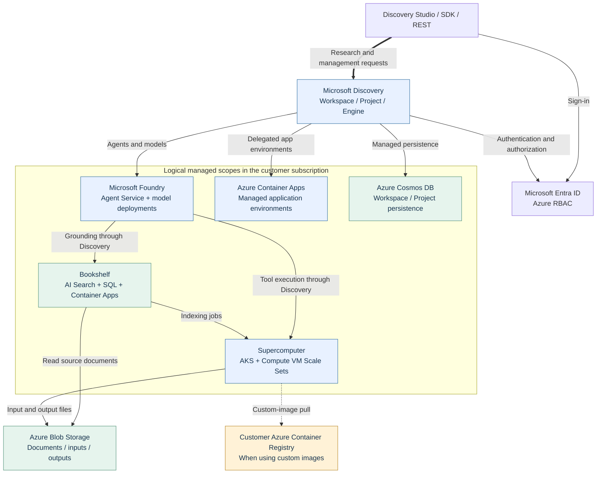
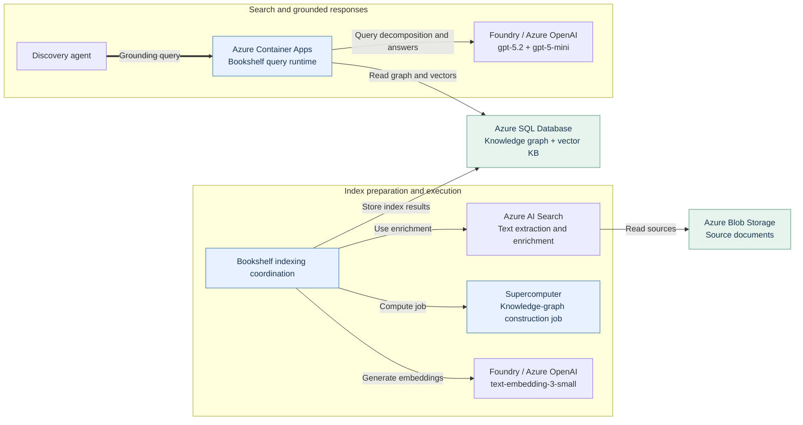
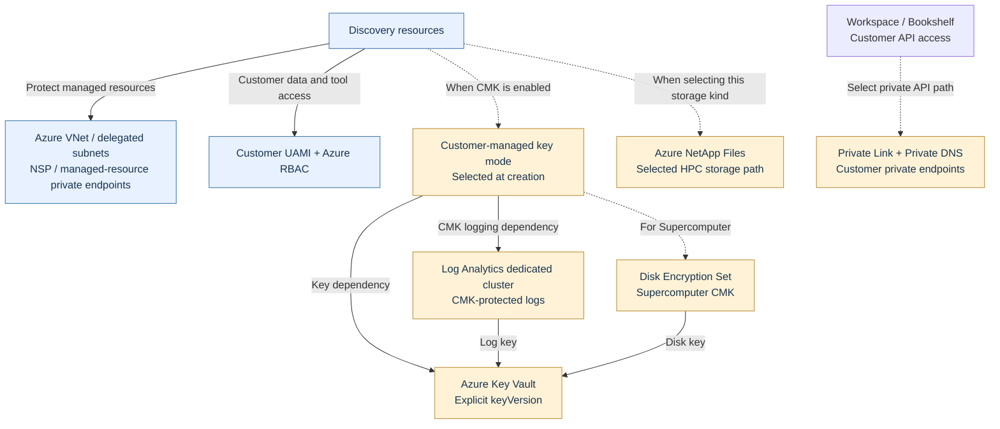

# Microsoft Discovery — Azure Architecture and Version Dependencies

**English · Checked 2026-09-25 · Cloud service**

[한국어](MICROSOFT-DISCOVERY-ARCHITECTURE.ko.md) · [English hands-on guide](../labs/MICROSOFT-DISCOVERY-LAB.en.md)

**Bottom line:** Discovery connects Foundry agents/models, the AKS-based Supercomputer, and Bookshelf's knowledge stack. **Within Bookshelf, Azure AI Search handles document enrichment, Azure SQL Database stores the knowledge graph/vectors, and Azure Container Apps serves search.** Workspaces/Projects use Cosmos DB; file inputs/outputs use linked storage such as Blob Storage.[R01][] [R02][] [R04][] [R05][] [R06][]

This is a **documentation-based reference architecture**, not an inventory of an inspected Azure subscription or a fixed internal software BOM. Where public documentation does not specify an exact Kubernetes, database-engine, or service-build dependency, this document does not invent one.

<a id="reading"></a>
## 1. Separate the meanings of “version”

| Category | Example | Meaning |
|---|---|---|
| Management API contract | `2026-06-01` | ARM request/response schema, not an internal service build |
| Model name | `gpt-5.4` | Selected model; the provider revision is separate |
| Deployment name | `gpt-5-4` | Logical name referenced by Discovery, not a model version |
| Model revision | `modelVersion`, `model.version` | Provider-published version to inspect and record on the deployment |
| SKU/hardware generation | `S1`, `E4`, `Gen5`, `Standard_D4s_v6` | Billing/performance/hardware configuration, not a service or Kubernetes version |
| Runtime/artifact version | Kubernetes, node image, container digest | Directly affects execution compatibility; inspect the deployment/image |
| Encryption-key version | `keyVersion` | A particular Key Vault key version, not the Key Vault service version |

Tables use **D = documented contract/relationship**, **E = example/configuration**, and **O = deployment observation required**. “Unconfirmed” does not mean “latest” or “unrestricted.”

<a id="architecture"></a>
## 2. Overall architecture



<details>
<summary>Mermaid source</summary>



</details>

**Arrows express logical usage/dependency**, not exact packet routes, process-call order, or resource counts. Dashed edges are conditional. A conditional customer-owned ACR does not mean a container image is unnecessary. Foundry represents logical service/model deployments, not a claim that inference GPUs reside inside the customer's VNet.

Discovery documentation describes **managed resource groups (MRGs)** for Workspace, Bookshelf, and Supercomputer. Actual deployments can have additional groups such as an AKS node resource group. Do not infer exact group names, counts, or resource counts from this diagram.[R02][] [R07][]

<a id="bookshelf"></a>
## 3. Bookshelf indexing and querying have different dependencies



<details>
<summary>Mermaid source</summary>



</details>

This is also a **logical dependency view**. It does not claim that a particular indexing process writes directly to SQL rather than through an intermediate service.[R04][] [R05][] [R06][]

- **Indexing:** Blob sources, extraction/enrichment, embeddings/high-memory computation, and SQL graph/vector storage are linked.
- **Querying:** Search runtime and models use an existing KB. Check an indexing-pool failure and an existing-KB query failure **separately**.
- **Opening citations:** Obtaining a search response and a user opening the source Blob have different access/network paths.
- **Do not confuse graph stores:** A “knowledge graph” does not imply a mandatory Cosmos DB Gremlin or Neo4j deployment. The cited Bookshelf documentation explicitly places its KB in Azure SQL DB.

<a id="services"></a>
## 4. Azure components, roles and version evidence

“Required” means **required within the selected capability**, not that every Workspace always creates all these resources in the same counts/SKUs.

| ID | Azure component | Role and applicability | Published version/SKU evidence and remaining checks |
|---|---|---|---|
| D01 | Microsoft Foundry Agent Service / Azure OpenAI | Agents, cognition/validation, Bookshelf model calls | **D:** Default model/deployment names in section 5. **O:** Provider revision/upgrade policy. The cited material does not pin Foundry's internal service build.[R04][] [R17][] |
| D02 | Azure Container Apps (`Microsoft.App`) | Delegated Workspace/agent environments and Bookshelf search | **E:** Bookshelf Small/Medium/Large profiles `E4`/`E8`/`E16`. **O:** Actual profiles, replicas, images. These are not internal ACA/Kubernetes version pins.[R02][] [R04][] [R14][] |
| D03 | Azure Cosmos DB (`Microsoft.DocumentDB`) | Managed persistence associated with Workspaces/Projects | **E:** Quota guidance lists minimum 2,400 RU/s per Workspace and 400 per Project. **O:** Actual account/API type/throughput. RU/s is not a version; collections/internal schemas are not established here.[R02][] [R04][] |
| D04 | Azure Kubernetes Service | Supercomputer's Kubernetes execution/orchestration foundation | **D:** AKS-based. The cited Discovery contracts do not mandate a specific Kubernetes semver. **O:** Actual control-plane/pool versions and node images. Do not substitute generic AKS “latest” for a Discovery requirement.[R01][] [R07][] [R12][] |
| D05 | Azure Compute / Virtual Machine Scale Sets | System, tool, and indexing CPU/GPU nodes | **D:** Supercomputer `systemSku` schema allows D4s_v4/v5/v6. **E:** Sample tool pool `Standard_D4s_v6`. **O:** VM/OS/image/driver compatibility. `v6` is not a Kubernetes version.[R07][] [R12][] [R14][] |
| D06 | Azure AI Search (`Microsoft.Search`) | Bookshelf document enrichment | **E:** The how-to specifies Standard `S1`, 2 replicas. **O:** Actual configuration and API usage. No Discovery-specific internal Search data-plane API pin is established by the cited material.[R04][] [R05][] [R06][] |
| D07 | Azure SQL Database (`Microsoft.Sql`) | Bookshelf knowledge-graph and vector KB storage | **E:** The how-to specifies Hyperscale Standard-series `(Gen5)`, 20 vCores, zone redundancy. `Gen5` is not an engine version. **O:** Actual DB SKU/compatibility settings; no fixed SQL engine-build requirement is established here.[R05][] [R06][] |
| D08 | Azure Blob Storage | Source documents, tool inputs/outputs, physical Asset files | **E:** Public sample uses `StorageV2`, `Standard_GRS`, `TLS1_2`. The lab's `Standard_LRS` is a separate choice; the hardened example also uses LRS. **O:** Redundancy, firewall, key-auth policy. Kind/SKU/TLS are not Storage's internal version.[R09][] [R14][] [R16][] |
| D09 | Azure Container Registry | Custom container-image path | Customer ACR is **conditional** on image strategy. **O:** Digest, CPU architecture and package versions—not just image tag. ACR's service version does not pin the tool version.[R07][] [R25][] [R26][] |
| D10 | Microsoft Entra ID, Managed Identities, Azure RBAC | User authentication, platform operations and tool data access | **D:** UAMIs, roles and scopes; distinguish the three identity layers in section 6. **O:** Actual bindings/permissions. Identity IDs and role names are not software versions.[R02][] |
| D11 | VNet, NSP, Private Link, Private DNS, network egress | Managed-resource protection and API/storage connectivity | **D:** Workspace/Bookshelf hardening is documented as default from `2026-02-01-preview`; customer API PEs are separate. **O:** Actual publicNetworkAccess/DNS/egress. An API date is not a network-engine version.[R08][] [R09][] [R12][] |
| D12 | Azure Key Vault | Service-managed resources and customer CMK storage | Key Vault can be among documented MRG resources; a **customer CMK vault is optional**. **D:** Explicit CMK `keyVersion`; RSA 2048/3072/4096 support. These are key settings, not service versions.[R02][] [R10][] |
| D13 | Azure Monitor / Log Analytics | Diagnostics and CMK-protected logs | **D:** CMK-enabled Workspace/Bookshelf/Supercomputer requires a Log Analytics **dedicated cluster**. **O:** Actual cluster/workspace/capacity/retention. A regular workspace is not a dedicated cluster.[R10][] [R11][] [R12][] |
| D14 | Azure NetApp Files | Conditional high-performance HPC file storage | **D:** `AzureNetAppFiles` storage kind is supported. **O:** Actual volume/protocol/tier. The cited material does not establish a universal Discovery ANF/NFS version pin.[R07][] [R16][] |
| D15 | Disk Encryption Set (Azure Compute resource) | Supercomputer CMK disk-key binding | **D:** Supercomputer CMK requires `diskEncryptionSetId`. This is a resource/key binding, not a separate product version; coordinate its lifecycle with Key Vault.[R10][] [R12][] |

**Provider registration is not a deployment BOM.** Prerequisites include providers such as `Microsoft.Web`, `Microsoft.ContainerInstance`, `Microsoft.MachineLearningServices`, `Microsoft.Bing`, `Microsoft.ResourceGraph`, and `Microsoft.Insights`. Registration alone does not establish that every deployment contains an instance of each service or depends on a particular runtime version. Inspect the actual inventory.[R03][] [R24][]

<a id="versions"></a>
## 5. Which versions are actually specified?

### Models and APIs

| ID | Item | Documented value | Interpretation |
|---|---|---|---|
| V01 | Discovery management API | `2026-06-01` — checked Workspace, Supercomputer, ChatModelDeployment schemas | Management contracts for those resource types; not a universal data-plane API version.[R11][] [R12][] [R13][] |
| V02 | Tool-job data-plane example | `2026-02-01-preview` | The cited how-to's example contract. Cloud GA does not remove its Preview designation.[R15][] |
| V03 | Default cognition/agent/validation path | `gpt-5.4`; validation deployment name `gpt-5-4` | Distinguish automatic cognition and validation deployments. Adding another agent model does not justify arbitrarily replacing validation.[R04][] |
| V04 | Bookshelf models | `gpt-5.2`, `gpt-5-mini`, `text-embedding-3-small` | Documented defaults for decomposition/answers, search, and embeddings. Inspect actual provider revisions.[R04][] [R05][] |
| V05 | ChatModelDeployment configuration | `modelFormat`, `modelName`, optional `modelVersion`, `skuName`, `capacity` | GA schema supports revision selection, but the public quickstart does not set `modelVersion`. Do not convert capacity units to TPM identically for every model.[R13][] [R14][] |
| V06 | Model upgrade policy | `versionUpgradeOption` | Varies by model/provider/deployment type. Do not apply documented Standard policies indiscriminately to Provisioned or partner deployments.[R19][] [R20][] |
| V07 | Actual AKS runtime | `currentKubernetesVersion`, pool `currentOrchestratorVersion`, `nodeImageVersion` | **O:** No deployment has been inspected, so no actual values are supplied here. Requested, latest-supported, and currently running versions differ.[R21][] [R22][] |
| V08 | Internal Bookshelf GraphRAG implementation | GraphRAG/LazyGraphRAG is described | Do not equate it to a particular open-source `graphrag` package version. An internal build/schema pin is not established by these public sources.[R05][] [R06][] |
| V09 | Tool version | Definition content version + container digest | Customer-controlled contract/artifact. An immutable agent version does not automatically freeze referenced model revisions, tools, or mutable image tags.[R17][] [R25][] [R26][] |

For example, **creating `gpt-5.4` under deployment name `gpt-5-4` using API `2026-06-01`** combines a model name, a deployment name, and an API contract. **The effective model revision and upgrade policy still require separate inspection.**

### Public Bicep example API versions—not product-wide minimum requirements

| Example resource | Example API version |
|---|---|
| `Microsoft.Discovery/workspaces`, `supercomputers`, `supercomputers/nodePools`, `workspaces/projects`, `workspaces/chatModelDeployments`, `storageContainers` | `2026-06-01` |
| `Microsoft.Network/virtualNetworks` | `2024-05-01` |
| `Microsoft.ManagedIdentity/userAssignedIdentities` | `2024-11-30` |
| `Microsoft.Storage/storageAccounts` and Blob child resources | `2023-05-01` |
| `Microsoft.Authorization/roleAssignments` | `2022-04-01` |

These are **E values** read from the [public example][R14], not evidence that Discovery internally calls all managed services using the same API versions. The observed file's SHA-256 is `7092563897d47b4870797236d90d84dc65635f2bb87c398591f16174e48b29aa`. `master` is mutable; this is an **observed-file checksum, not a commit pin**.

<a id="security"></a>
## 6. Conditional security and CMK dependencies



<details>
<summary>Mermaid source</summary>



</details>

**There are three identity layers:** user Entra ID/RBAC, customer UAMIs for data/image access, and Discovery service principals/internal managed identities for MRG operations. Do not say every Azure call uses one UAMI. Workspace and Supercomputer cluster-identity bindings are documented as immutable after creation; kubelet/workload identities have separate update paths.[R02][]

**CMK means more than adding a Key Vault.** Workspace/Bookshelf needs key references and a Log Analytics dedicated cluster; Supercomputer additionally needs a Disk Encryption Set. MMK↔CMK switching after creation is documented as unsupported. During rotation, update Workspace/Bookshelf references and the Supercomputer DES through their respective paths, and do not disable an old key until its dependents have been checked.[R10][]

**Separate these network controls:**

| Control | What it does—and does not—establish |
|---|---|
| Default network hardening | Protects MRG backends; it is not the same switch as disabling public customer API access |
| Workspace/Bookshelf `publicNetworkAccess` | Documented default Enabled allows public and PE paths; Disabled rejects the public path |
| Supercomputer API-server VNet Integration | Configures node→API-server connectivity; do not equate it to a fully private cluster or removal of a public FQDN |
| Supercomputer `outboundType` | The public schema defaults to `LoadBalancer`. With `None`, the customer must provide required outbound connectivity; inspect image, storage, and external-tool paths separately |
| Blob `allowBlobPublicAccess=false` | Disables anonymous access, not every public-network path used by an authorized identity |
| Model `GlobalStandard` / `DataZoneStandard` | Affects processing location, quota and billing. **Private Link or the Workspace region alone does not pin inference geography** |

The hardening articles include “zero public exposure” summaries alongside separate public-access/API-server conditions. Therefore **inspect actual DNS, publicNetworkAccess, AKS API access profile, outboundType, Blob firewall, and model deployment type independently**. The sample Bicep also combines `NetworkIsolation=true` with customer Storage `networkAcls.defaultAction='Allow'` and Preview Workbench defaults. Do not treat the sample as a completed security-hardening assessment.[R08][] [R09][] [R12][] [R14][] [R18][]

<a id="impact"></a>
## 7. Cross-service change and failure impacts

These are **operational implications derived from documented dependencies**, not failure-test results or SLA guarantees. Verify scope and probe each actual path.

| ID | Change/problem | Potential impact | Important distinction |
|---|---|---|---|
| I01 | Model revision or upgrade-policy change | Planning, tool selection, answers, and Task validation can change | API and model-weight changes are separate. Standard NoAutoUpgrade does not guarantee continued use after retirement |
| I02 | Missing/misconfigured `gpt-5-4`, insufficient model quota | Engine startup/validation or agent calls can fail | Do not conclude every already-running pure-compute job immediately terminates |
| I03 | AKS/node image/CPU-GPU architecture change | Image/library/driver compatibility and new-job startup can change | Do not independently apply a generic AKS upgrade to a Discovery-managed cluster |
| I04 | Insufficient indexing memory/vCPU | New KB indexing/updates can fail | Test existing KB queries separately through SQL/ACA/models |
| I05 | AI Search enrichment failure | Document extraction and new indexing-input preparation can fail | This does not mean an existing SQL KB was immediately lost |
| I06 | SQL/ACA search-layer problem | Bookshelf queries/grounding can slow or fail | Separate from retention of original Blob files |
| I07 | Blob RBAC/CORS/firewall change | Inputs, outputs, or opening citations can fail | Managed-identity file creation and user file access are separate probes |
| I08 | ACR access or image-tag change | New containers can fail to start or behave differently | Distinguish running jobs, cached images, and the effective digest |
| I09 | Old CMK disabled or key permission revoked | Dependent data, disk, or logging paths can fail | Check Workspace/Bookshelf keyVersion, DES, and Log Analytics together |
| I10 | Identity/network/CMK creation-time binding change | Some changes require recreation and relinking | A property existing in an ARM schema does not make it freely mutable after creation |
| I11 | Management API or SDK change | Request schema, defaults, and supported properties can change | GET with a newer API does not migrate an existing deployment to a new security/runtime configuration |
| I12 | Engine Stop or node scale-to-zero | Reduces new cognition work or compute-node consumption | Existing work and always-on SQL/Search/ACA costs remain separate; runtime User Messages and infrastructure billing are also separate |

Minimum post-change probes: **basic agent call → KB search with actual citations → small tool run and readable output → Engine validation → stop/remaining-work/cost checks**. Change managed resources only through supported Discovery procedures; do not independently delete, upgrade, or downsize MRG components.[R04][] [R07][] [R10][] [R17][] [R19][] [R27][]

<a id="observe"></a>
## 8. Inspect an actual deployment's versions/BOM

These are **post-deployment examples for authorized read access**. They were not executed for this document. Use actual IDs/MRG names; do not replace `null` or an access denial with “latest/absent.” Inspect the Workspace/Bookshelf/Supercomputer MRGs and any discovered node resource group separately.

Run the blocks in the same Bash session after setting the first block's variables. Replace every `<...>` placeholder; the examples do not use `az account set` to change the default subscription.

### Inventory

```bash
SUBSCRIPTION_ID='<subscription-id>'
MRG='<actual-managed-resource-group>'
az resource list --subscription "$SUBSCRIPTION_ID" --resource-group "$MRG" \
  --query "[].{id:id,type:type,region:location,sku:sku.name,kind:kind}" \
  --output json
```

Follow up with the individual resource GET if the list omits SKU/details. Do not dump secrets, keys, or full connection strings.

### Discovery model contract and effective Foundry deployments

```bash
CHAT_MODEL_ID='<actual-discovery-chatModelDeployment-resource-id>'
az resource show --subscription "$SUBSCRIPTION_ID" --ids "$CHAT_MODEL_ID" \
  --api-version 2026-06-01 \
  --query "{name:name,model:properties.modelName,revision:properties.modelVersion,sku:properties.skuName,capacity:properties.capacity}" \
  --output json

FOUNDRY_NAME='<actual-managed-foundry-account-name>'
az cognitiveservices account deployment list \
  --subscription "$SUBSCRIPTION_ID" --resource-group "$MRG" --name "$FOUNDRY_NAME" \
  --query "[].{name:name,model:properties.model.name,revision:properties.model.version,sku:sku.name,capacity:sku.capacity,upgradePolicy:properties.versionUpgradeOption}" \
  --output json
```

These inspect different resource representations. Include the automatically provisioned cognition deployment in the actual inventory. An exposed `modelVersion` property does not authorize arbitrary customer changes to every service-managed model revision.[R13][] [R19][] [R20][] [R23][]

### AKS and node pools

```bash
AKS_RG='<actual-aks-resource-group>'
AKS_NAME='<actual-aks-cluster-name>'
az aks show --subscription "$SUBSCRIPTION_ID" --resource-group "$AKS_RG" --name "$AKS_NAME" \
  --query "{requestedVersion:kubernetesVersion,runningVersion:currentKubernetesVersion,nodeResourceGroup:nodeResourceGroup}" \
  --output json

az aks nodepool list --subscription "$SUBSCRIPTION_ID" \
  --resource-group "$AKS_RG" --cluster-name "$AKS_NAME" \
  --query "[].{name:name,requestedVersion:orchestratorVersion,runningVersion:currentOrchestratorVersion,nodeImage:nodeImageVersion,vmSize:vmSize}" \
  --output json
```

Pool metadata alone does not prove every node is identical during a rolling upgrade. Where necessary, an authorized operator verifies per-node runtime/image/driver state. No cluster-admin credential retrieval or upgrade command is included here.[R21][] [R22][]

**Record in the final BOM:** Observation time/resource IDs; effective model revisions and policies; Kubernetes/node images; SKUs/capacity; image digests/tool libraries; CMK keyVersion/DES/log bindings; network/identity bindings. Internal service versions not exposed through authorized reads remain questions for Microsoft support/service owners.

<a id="sources"></a>
## 9. Sources and evidence boundary

API/model/SKU values were checked against these sources. Examples/recommendations, supported contracts, and actual deployment observations are distinguished. Structure, diagram topology, and row IDs match the Korean edition.

| ID | Official source |
|---|---|
| R01 | [Discovery service architecture][R01] |
| R02 | [Managed identities and managed resource groups][R02] |
| R03 | [Infrastructure quickstart][R03] |
| R04 | [Discovery quota requirements][R04] |
| R05 | [Bookshelf deployment and indexing requirements][R05] |
| R06 | [Bookshelf and graph/vector storage][R06] |
| R07 | [Supercomputer architecture and node pools][R07] |
| R08 | [Network security model and limitations][R08] |
| R09 | [Network-hardened deployment example][R09] |
| R10 | [CMK dependencies and key rotation][R10] |
| R11 | [Workspace ARM schema 2026-06-01][R11] |
| R12 | [Supercomputer ARM schema 2026-06-01][R12] |
| R13 | [ChatModelDeployment ARM schema 2026-06-01][R13] |
| R14 | [Official public Bicep example, observed snapshot][R14] |
| R15 | [Supercomputer data-plane job API example][R15] |
| R16 | [Storage Containers and Assets][R16] |
| R17 | [Discovery agents on Foundry][R17] |
| R18 | [Foundry deployment types and processing locations][R18] |
| R19 | [Model revisions and upgrade policies][R19] |
| R20 | [Inspecting model upgrade configuration][R20] |
| R21 | [AKS requested versus current Kubernetes version][R21] |
| R22 | [AKS node image version inspection][R22] |
| R23 | [Cognitive Services deployment list/show CLI][R23] |
| R24 | [Resource-provider registration prerequisites][R24] |
| R25 | [Scientific tools and model integration patterns][R25] |
| R26 | [Tool definition content/version and registration][R26] |
| R27 | [Discovery billing model][R27] |

[R01]: https://learn.microsoft.com/en-us/azure/microsoft-discovery/overview-service-architecture
[R02]: https://learn.microsoft.com/en-us/azure/microsoft-discovery/concept-managed-identities
[R03]: https://learn.microsoft.com/en-us/azure/microsoft-discovery/quickstart-infrastructure
[R04]: https://learn.microsoft.com/en-us/azure/microsoft-discovery/concept-quota-reservation
[R05]: https://learn.microsoft.com/en-us/azure/microsoft-discovery/how-to-index-bookshelf-knowledgebase
[R06]: https://learn.microsoft.com/en-us/azure/microsoft-discovery/concept-bookshelf-knowledge-bases
[R07]: https://learn.microsoft.com/en-us/azure/microsoft-discovery/concept-supercomputer
[R08]: https://learn.microsoft.com/en-us/azure/microsoft-discovery/concept-network-security
[R09]: https://learn.microsoft.com/en-us/azure/microsoft-discovery/how-to-deploy-network-hardened-stack
[R10]: https://learn.microsoft.com/en-us/azure/microsoft-discovery/howto-data-encryption-at-rest
[R11]: https://learn.microsoft.com/en-us/azure/templates/microsoft.discovery/2026-06-01/workspaces
[R12]: https://learn.microsoft.com/en-us/azure/templates/microsoft.discovery/2026-06-01/supercomputers
[R13]: https://learn.microsoft.com/en-us/azure/templates/microsoft.discovery/2026-06-01/workspaces/chatmodeldeployments
[R14]: https://raw.githubusercontent.com/Azure/azure-quickstart-templates/master/quickstarts/microsoft.discovery/discovery-infra-deployment/main.bicep
[R15]: https://learn.microsoft.com/en-us/azure/microsoft-discovery/how-to-run-jobs-supercomputer-rest-api
[R16]: https://learn.microsoft.com/en-us/azure/microsoft-discovery/concept-storage-containers-assets
[R17]: https://learn.microsoft.com/en-us/azure/microsoft-discovery/concept-discovery-agent
[R18]: https://learn.microsoft.com/en-us/azure/foundry/foundry-models/concepts/deployment-types
[R19]: https://learn.microsoft.com/en-us/azure/foundry/foundry-models/concepts/model-versions
[R20]: https://learn.microsoft.com/en-us/azure/foundry/openai/how-to/working-with-models
[R21]: https://learn.microsoft.com/en-us/azure/aks/supported-kubernetes-versions
[R22]: https://learn.microsoft.com/en-us/azure/aks/upgrade-node-image
[R23]: https://learn.microsoft.com/en-us/cli/azure/cognitiveservices/account/deployment
[R24]: https://learn.microsoft.com/en-us/azure/microsoft-discovery/concept-resource-provider-registration
[R25]: https://learn.microsoft.com/en-us/azure/microsoft-discovery/concept-tools-model-integration
[R26]: https://learn.microsoft.com/en-us/azure/microsoft-discovery/how-to-deploy-tool-to-discovery
[R27]: https://learn.microsoft.com/en-us/azure/microsoft-discovery/concept-discovery-billing
