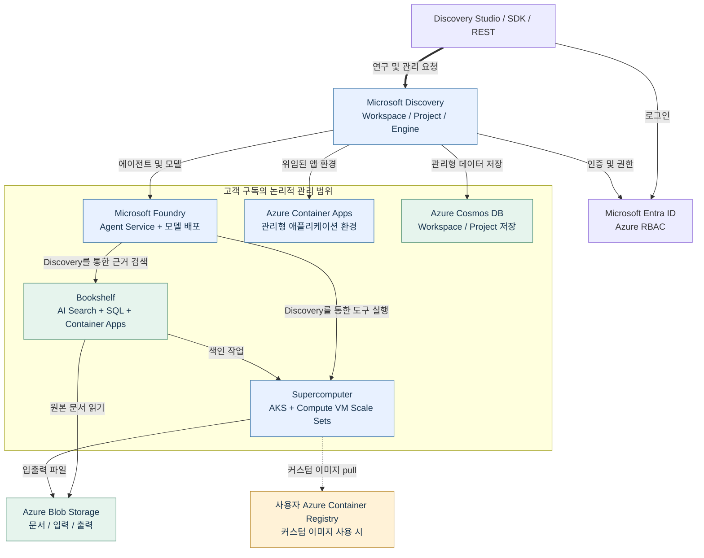
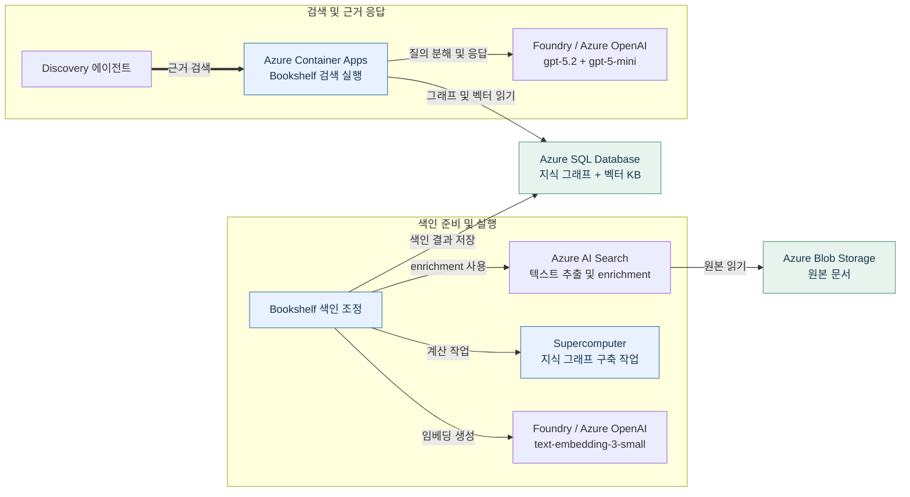
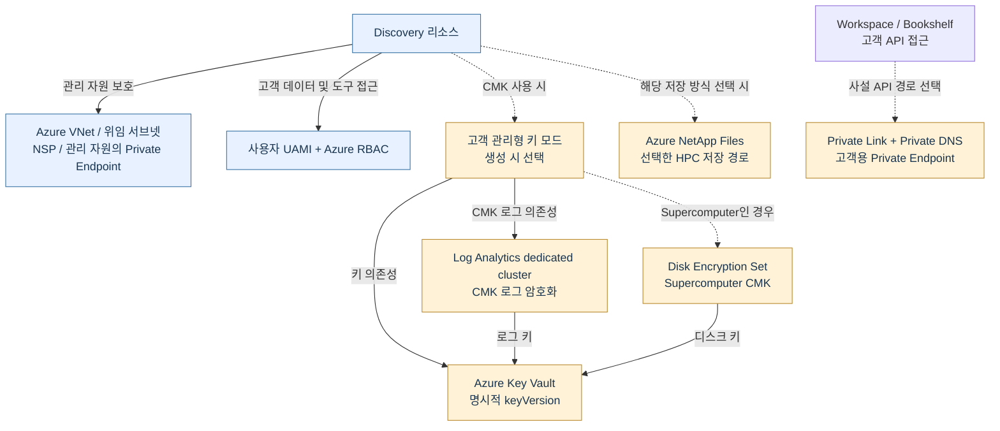

# Microsoft Discovery — Azure 아키텍처와 버전 의존성

**국문 · 기술 근거 확인 2026-09-25 · 문서 정리 2026-10-02 · 클라우드 서비스 기준**

[English](MICROSOFT-DISCOVERY-ARCHITECTURE.en.md) · [국문 실습 가이드](../labs/MICROSOFT-DISCOVERY-LAB.ko.md)

**핵심:** Discovery는 Foundry의 에이전트·모델, AKS 기반 Supercomputer, Bookshelf의 검색·지식 저장 계층을 연결한다. **Bookshelf에서 Azure AI Search는 문서 enrichment, Azure SQL Database는 지식 그래프·벡터 저장, Azure Container Apps는 검색 실행**을 담당한다. Workspace/Project는 Cosmos DB를 사용하고, 파일 입출력은 Blob Storage 등 연결 저장소를 사용한다.[R01][] [R02][] [R04][] [R05][] [R06][]

이 문서는 **공식 문서 기반 참조 구조**다. 실제 Azure 구독을 조사한 자원 목록이나 고정된 내부 소프트웨어 BOM이 아니다. 공개 문서가 특정 Kubernetes·DB 엔진·서비스 내부 빌드 버전을 명시하지 않으면 임의로 채우지 않는다.

**처음 읽는 순서:** [전체 구조](#architecture) → [Bookshelf의 색인·검색](#bookshelf) → [네트워크·ID](#security). 버전 검토가 필요하면 아래 구분표와 [변경 영향](#impact)을 확인한다. 고객 공통 구성 절차는 [실습 가이드 S00](../labs/MICROSOFT-DISCOVERY-LAB.ko.md#s00), 특정 환경의 시도·관측값은 [설치·운영 참고 자료](../deployment-reference/README.ko.md)에서 별도로 다룬다. 그림에 포함됐다는 이유로 모든 구성요소가 배포·검증됐다고 해석하지 않는다.

<a id="reading"></a>
## 1. “버전”을 먼저 구분하기

| 구분 | 예 | 의미 |
|---|---|---|
| 관리 API 계약 | `2026-06-01` | ARM 요청·응답 스키마. 내부 서비스 빌드 버전이 아님 |
| 모델 이름 | `gpt-5.4` | 선택하는 모델. 실제 provider revision은 별도 |
| 배포 이름 | `gpt-5-4` | Discovery가 참조하는 논리 이름. 모델 버전이 아님 |
| 모델 revision | `modelVersion`, `model.version` | 실제 배포에서 확인·기록해야 하는 provider-published 버전 |
| SKU·하드웨어 세대 | `S1`, `E4`, `Gen5`, `Standard_D4s_v6` | 요금·성능·하드웨어 구성. 서비스나 Kubernetes 버전이 아님 |
| 런타임·아티팩트 버전 | Kubernetes, node image, 컨테이너 digest | 실행 호환성에 직접 영향. 실제 배포/이미지에서 확인 |
| 암호화 키 버전 | `keyVersion` | Key Vault 키의 특정 버전. Key Vault 서비스 버전이 아님 |

표에서 **D = 문서에 명시된 계약/관계**, **E = 문서 예시·구성값**, **O = 실제 배포에서 확인할 값**이다. “미확인”은 “최신 버전”이나 “제약 없음”이라는 뜻이 아니다.

<a id="architecture"></a>
## 2. 전체 구조



<details>
<summary>Mermaid 원본</summary>



</details>

**화살표는 논리적 사용·의존 관계**이며 실제 패킷 경로·프로세스 호출 순서·리소스 개수를 확정하지 않는다. 점선은 조건부 경로다. 사용자 ACR이 조건부라는 것은 컨테이너 이미지가 필요 없다는 뜻이 아니다. Foundry 노드는 구독의 서비스/모델 배포를 나타내며 추론 GPU가 고객 VNet 안에 있다는 뜻이 아니다.

Discovery 문서는 Workspace·Bookshelf·Supercomputer의 **관리 리소스 그룹**(MRG)을 설명한다. 실제 환경은 AKS node resource group 등 추가 그룹을 가질 수 있다. 그룹 수·이름·자원 개수를 이 그림으로 단정하지 않는다.[R02][] [R07][]

<a id="bookshelf"></a>
## 3. Bookshelf: 색인과 검색은 다른 경로다



<details>
<summary>Mermaid 원본</summary>



</details>

위 그림도 **논리적 의존 관계**다. 특정 인덱싱 프로세스가 SQL에 직접 연결하는지, 중간 서비스가 대신 쓰는지까지 공개된 것으로 간주하지 않는다.[R04][] [R05][] [R06][]

- **색인:** Blob → 문서 추출/enrichment → 임베딩·고메모리 계산 → SQL의 그래프/벡터 KB가 연결된다.
- **검색:** 이미 만든 KB를 검색 런타임과 모델이 사용한다. 따라서 색인 풀의 장애와 기존 KB 검색 장애는 **별도 확인**해야 한다.
- **인용 열기:** 검색 응답을 받는 것과 사용자가 원본 Blob을 여는 것은 다른 권한·네트워크 경로다.
- **저장소 혼동 금지:** “지식 그래프”라는 이유로 Cosmos DB Gremlin이나 Neo4j를 필수 구성요소로 추가하지 않는다. 인용한 Bookshelf 문서는 KB 저장 위치를 Azure SQL DB로 명시한다.

<a id="services"></a>
## 4. Azure 구성요소별 역할과 버전 근거

“필수”는 **선택한 기능 안에서의 의존성**이다. 모든 Workspace에 아래 자원이 항상 같은 개수·SKU로 생긴다는 뜻은 아니다.

| ID | Azure 구성요소 | 역할·적용 범위 | 확인 가능한 버전/SKU와 남는 확인 사항 |
|---|---|---|---|
| D01 | Microsoft Foundry Agent Service / Azure OpenAI | 에이전트, cognition·검증, Bookshelf 모델 호출 | **D:** 기본 모델/배포 이름은 5절. **O:** provider revision·업그레이드 정책. Foundry 내부 서비스 빌드는 인용 문서에 고정되지 않음.[R04][] [R17][] |
| D02 | Azure Container Apps (`Microsoft.App`) | Workspace/agent의 위임 환경, Bookshelf 검색 실행 | **E:** Bookshelf Small/Medium/Large에 `E4`/`E8`/`E16`. **O:** 실제 profile·replica·이미지. 내부 ACA/Kubernetes 버전 pin으로 해석하지 않음.[R02][] [R04][] [R14][] |
| D03 | Azure Cosmos DB (`Microsoft.DocumentDB`) | Workspace/Project 관련 관리형 저장 | **E:** quota 문서의 Workspace 최소 2,400 RU/s, Project 최소 400 RU/s. **O:** 실제 account/API 종류·throughput. RU/s는 버전이 아니며 컬렉션·내부 스키마는 여기서 확정 불가.[R02][] [R04][] |
| D04 | Azure Kubernetes Service | Supercomputer의 Kubernetes 실행·조정 기반 | **D:** AKS 기반. 인용 Discovery 계약에 특정 Kubernetes semver 요구는 없음. **O:** 실제 control-plane·pool 버전, node image. 일반 AKS 최신 버전을 Discovery 요구 버전으로 쓰지 않음.[R01][] [R07][] [R12][] |
| D05 | Azure Compute / VM Scale Sets | 시스템·도구·색인용 CPU/GPU 노드 | **D:** Supercomputer `systemSku` 스키마에 D4s_v4/v5/v6. **E:** 샘플 도구 풀 `Standard_D4s_v6`. **O:** 실제 VM/OS/이미지·드라이버 호환성. `v6`은 Kubernetes 버전이 아님.[R07][] [R12][] [R14][] |
| D06 | Azure AI Search (`Microsoft.Search`) | Bookshelf 문서 enrichment | **E:** how-to는 Standard `S1`, 2 replicas. **O:** 실제 서비스 설정과 호출 계약. Discovery 내부의 Search data-plane API 버전은 공개된 pin으로 확인되지 않음.[R04][] [R05][] [R06][] |
| D07 | Azure SQL Database (`Microsoft.Sql`) | Bookshelf 지식 그래프와 벡터 KB 저장 | **E:** how-to는 Hyperscale Standard-series `(Gen5)`, 20 vCore, zone redundancy. `Gen5`는 엔진 버전이 아님. **O:** 실제 DB SKU·호환성 설정. 특정 SQL 엔진 빌드 요구는 인용 자료에 없음.[R05][] [R06][] |
| D08 | Azure Blob Storage | 문서 원본·도구 입출력·Asset의 실제 파일 | **E:** 샘플은 `StorageV2`, `Standard_GRS`, `TLS1_2`. 실습의 `Standard_LRS`는 별도 선택이며 하드닝 예제도 LRS를 사용. **O:** redundancy·방화벽·키 인증 정책. 종류/SKU/TLS를 Storage 내부 버전과 구분.[R09][] [R14][] [R16][] |
| D09 | Azure Container Registry | 커스텀 컨테이너 이미지 경로 | 사용자 ACR은 이미지 전략에 따른 **조건부** 구성. **O:** 이미지 tag뿐 아니라 digest·CPU 아키텍처·패키지 버전. ACR 서비스 버전이 도구 버전을 고정하지 않음.[R07][] [R25][] [R26][] |
| D10 | Microsoft Entra ID, Managed Identities, Azure RBAC | 사용자 인증, 서비스의 관리 작업, 도구의 데이터 접근 | **D:** UAMI와 역할·scope. 세 종류의 주체를 6절에서 구분. **O:** 실제 바인딩과 권한. identity ID나 역할 이름은 소프트웨어 버전이 아님.[R02][] |
| D11 | VNet, NSP, Private Link, Private DNS, 네트워크 egress | 관리 자원 보호와 API/스토리지 연결 | **D:** Workspace/Bookshelf 하드닝은 `2026-02-01-preview` 이후 기본으로 설명됨. 고객 API PE는 별도 선택. **O:** 실제 publicNetworkAccess·DNS·egress. API 날짜는 네트워크 엔진 버전이 아님.[R08][] [R09][] [R12][] |
| D12 | Azure Key Vault | 서비스가 관리하는 자원 및 고객 CMK 키 저장 | MRG 문서에 Key Vault가 포함될 수 있으며 **고객 CMK vault는 선택**. **D:** CMK는 명시적 `keyVersion`; RSA 2048/3072/4096 지원. 이는 서비스 버전이 아닌 키 설정.[R02][] [R10][] |
| D13 | Azure Monitor / Log Analytics | 로그·진단, CMK 로그 암호화 | **D:** CMK-enabled Workspace/Bookshelf/Supercomputer는 Log Analytics **dedicated cluster**가 필요. **O:** 실제 cluster/workspace·capacity·retention. 일반 workspace와 dedicated cluster를 혼동하지 않음.[R10][] [R11][] [R12][] |
| D14 | Azure NetApp Files | 고성능 HPC 파일 저장소의 조건부 경로 | **D:** `AzureNetAppFiles` storage kind 지원. **O:** 실제 volume·protocol·성능 계층. 특정 ANF/NFS 버전을 Discovery 공통 pin으로 확인할 근거 없음.[R07][] [R16][] |
| D15 | Disk Encryption Set (Azure Compute 리소스) | Supercomputer CMK의 디스크 키 연결 | **D:** Supercomputer CMK에는 `diskEncryptionSetId`가 필요. 별도 제품 버전이 아니라 키·리소스 바인딩이며 Key Vault와 함께 수명주기 관리.[R10][] [R12][] |

**Provider 등록 목록은 배포 BOM이 아니다.** `Microsoft.Web`, `Microsoft.ContainerInstance`, `Microsoft.MachineLearningServices`, `Microsoft.Bing`, `Microsoft.ResourceGraph`, `Microsoft.Insights` 등이 선행 등록 목록에 있어도, 그것만으로 모든 배포에 해당 서비스 인스턴스가 존재하거나 특정 런타임 버전이 필수라고 결론낼 수 없다. 실제 목록으로 확인해야 한다.[R03][] [R24][]

<a id="versions"></a>
## 5. 구체적으로 어떤 버전에 의존하는가

### 모델과 API

| ID | 항목 | 문서로 확인한 값 | 해석 |
|---|---|---|---|
| V01 | Discovery 관리 API | `2026-06-01` — Workspace, Supercomputer, ChatModelDeployment 스키마 확인 | 해당 리소스의 관리 계약. 모든 데이터 평면 API에 동일하게 적용하지 않음.[R11][] [R12][] [R13][] |
| V02 | 도구 작업 데이터 평면 예제 | `2026-02-01-preview` | 해당 how-to 예제 계약. 클라우드 GA가 이 예제 API의 Preview 표기를 없애지 않음.[R15][] |
| V03 | 기본 cognition·에이전트·검증 모델 경로 | `gpt-5.4`; 검증용 배포 이름 `gpt-5-4` | 자동 cognition 배포와 검증 배포는 구분. 다른 에이전트 모델을 추가한다고 검증 배포를 임의 대체하지 않음.[R04][] |
| V04 | Bookshelf 모델 | `gpt-5.2`, `gpt-5-mini`, `text-embedding-3-small` | 질의 분해/응답, 검색, 임베딩의 기본 문서상 모델. 정확한 provider revision은 실제 배포에서 확인.[R04][] [R05][] |
| V05 | ChatModelDeployment 설정 | `modelFormat`, `modelName`, 선택적 `modelVersion`, `skuName`, `capacity` | GA 스키마는 revision 지정을 지원하지만 공개 quickstart는 `modelVersion`을 지정하지 않음. `capacity`를 모든 모델에서 동일한 TPM으로 환산하지 않음.[R13][] [R14][] |
| V06 | 모델 upgrade policy | `versionUpgradeOption` | 모델/공급자/배포 유형별 정책. 문서의 Standard 정책을 모든 Provisioned·파트너 배포에 그대로 적용하지 않음.[R19][] [R20][] |
| V07 | AKS 실제 실행 버전 | `currentKubernetesVersion`, pool의 `currentOrchestratorVersion`, `nodeImageVersion` | **O:** 이 참조 문서는 실제 배포 BOM을 포함하지 않음. 배포별로 조회·기록하며, 원하는 버전·최신 지원 버전과 현재 실행 버전은 구분.[R21][] [R22][] |
| V08 | Bookshelf 내부 GraphRAG 구현 | GraphRAG/LazyGraphRAG 방식이 문서에 설명됨 | 특정 OSS `graphrag` 패키지 버전과 동일하다고 가정하지 않음. 내부 build/스키마 pin은 공개 자료로 확인 불가.[R05][] [R06][] |
| V09 | 도구 버전 | Definition content version + 컨테이너 digest | 고객이 관리하는 계약/아티팩트. 에이전트 버전 불변성만으로 모델 revision·도구·가변 image tag까지 고정되지 않음.[R17][] [R25][] [R26][] |

예를 들어 **`gpt-5.4`를 `gpt-5-4`라는 이름으로 `2026-06-01` API를 사용해 만든다**는 문장에는 모델 이름, 배포 이름, API 계약이 함께 들어 있다. **실제 모델 revision과 upgrade policy는 여전히 별도 확인 대상**이다.

### 공개 Bicep 예제의 API 버전 — 제품 전체의 최소 버전이 아님

| 예제 리소스 | 예제 API 버전 |
|---|---|
| `Microsoft.Discovery/workspaces`, `supercomputers`, `supercomputers/nodePools`, `workspaces/projects`, `workspaces/chatModelDeployments`, `storageContainers` | `2026-06-01` |
| `Microsoft.Network/virtualNetworks` | `2024-05-01` |
| `Microsoft.ManagedIdentity/userAssignedIdentities` | `2024-11-30` |
| `Microsoft.Storage/storageAccounts` 및 Blob child resources | `2023-05-01` |
| `Microsoft.Authorization/roleAssignments` | `2022-04-01` |

이는 [공개 샘플][R14]에서 읽은 **E 값**이다. Discovery 내부가 같은 API 버전으로 모든 관리 자원을 호출한다는 증거가 아니다. 확인한 파일의 SHA-256은 `7092563897d47b4870797236d90d84dc65635f2bb87c398591f16174e48b29aa`다. `master`는 가변 링크이며 이 해시는 **관찰한 파일의 체크섬이지 commit pin이 아니다**.

<a id="security"></a>
## 6. 보안·CMK가 만드는 조건부 의존성



<details>
<summary>Mermaid 원본</summary>



</details>

**ID는 세 층이다.** 사용자 Entra ID/RBAC, 고객 UAMI의 데이터·이미지 접근, Discovery 서비스 주체/내부 관리 ID의 MRG 운영을 구분한다. “모든 Azure 호출이 같은 UAMI로 수행된다”고 표현하지 않는다. Workspace identity와 Supercomputer cluster identity는 문서상 생성 후 변경 불가이고, kubelet/workload identity는 별도 변경 경로가 있다.[R02][]

**CMK는 Key Vault 하나만 추가하는 기능이 아니다.** Workspace/Bookshelf는 키 참조와 Log Analytics dedicated cluster, Supercomputer는 추가 Disk Encryption Set에 의존한다. MMK↔CMK 전환은 생성 이후 불가하다고 명시되어 있다. 키 회전 시 Workspace/Bookshelf 참조와 Supercomputer의 DES를 구분해 갱신하고, 이전 키를 사용하는 자원이 없는지 확인하기 전에는 비활성화하지 않는다.[R10][]

**네트워크에서 특히 구분할 것:**

| 항목 | 무엇을 보장하는가 / 보장하지 않는가 |
|---|---|
| 기본 network hardening | MRG 내부 보호. 고객 API의 public access 차단과 같은 설정이 아님 |
| Workspace/Bookshelf `publicNetworkAccess` | 문서상 기본 Enabled이면 public/PE 경로 모두 가능. Disabled는 public 경로를 거부 |
| Supercomputer API-server VNet Integration | 노드→API server 경로 구성. 그 자체를 완전한 private cluster나 public FQDN 제거로 해석하지 않음 |
| Supercomputer `outboundType` | 공개 스키마의 기본은 `LoadBalancer`. `None`이면 필요한 outbound 연결을 고객이 제공해야 하며, 이미지·스토리지·외부 도구 경로를 따로 확인 |
| Blob `allowBlobPublicAccess=false` | 익명 접근 금지. 승인된 사용자의 공용 네트워크 경로 차단과 다름 |
| 모델 `GlobalStandard` / `DataZoneStandard` | 추론 처리 위치·quota·요금 특성에 영향. **Private Link나 Workspace 리전만으로 모델 처리 위치가 고정되지 않음** |

하드닝 문서에는 “zero public exposure”라는 요약과 별도 public access/API server 조건이 함께 존재한다. 그러므로 **실제 DNS, publicNetworkAccess, AKS API access profile, outboundType, Blob 방화벽, 모델 배포 유형을 각각 확인**한다. 샘플 Bicep도 `NetworkIsolation=true`와 동시에 고객 Storage의 `networkAcls.defaultAction='Allow'`, Preview Workbench 관련 기본값을 포함한다. 샘플을 보안 강화 완료 상태로 간주하지 않는다.[R08][] [R09][] [R12][] [R14][] [R18][]

<a id="impact"></a>
## 7. 변경·장애가 서로에게 주는 영향

아래 영향은 문서에 나온 의존 관계에서 도출한 **운영 판단**이지 장애 실험 결과나 SLA가 아니다. 범위를 확인하고 실제 경로별로 검증한다.

| ID | 변경/문제 | 예상 영향 | 반드시 분리해서 볼 것 |
|---|---|---|---|
| I01 | 모델 revision·upgrade policy 변경 | 계획·도구 선택·답변·Task 검증 결과가 바뀔 수 있음 | API 버전과 모델 가중치 변경은 별개. Standard의 NoAutoUpgrade도 retirement 이후 영구 사용을 보장하지 않음 |
| I02 | `gpt-5-4` 삭제/오설정, 모델 quota 부족 | Engine 시작·검증 또는 agent 호출 차단 가능 | 이미 실행 중인 순수 계산 job이 즉시 모두 종료된다고 단정하지 않음 |
| I03 | AKS/node image/CPU-GPU 아키텍처 변경 | 이미지·라이브러리·드라이버 호환성, 새 작업 기동 영향 | 일반 AKS 업그레이드를 Discovery 관리 클러스터에 임의 적용하지 않음 |
| I04 | 색인 풀 메모리·vCPU 부족 | 새로운 KB 색인/갱신 실패 가능 | 기존 KB 검색은 SQL·ACA·모델 경로로 별도 확인 |
| I05 | AI Search enrichment 실패 | 문서 추출·새 색인 입력 준비 영향 | 기존 SQL KB가 바로 소실되었다는 뜻은 아님 |
| I06 | SQL/ACA 검색 계층 문제 | Bookshelf 검색·grounding 지연/실패 가능 | 원본 Blob 파일의 보존 여부와 별개 |
| I07 | Blob RBAC·CORS·방화벽 변경 | 입력·출력·원문 인용 열기 실패 가능 | 관리 ID의 파일 생성 성공과 사용자의 파일 열기 성공은 다른 검사 |
| I08 | ACR 접근 또는 image tag 변경 | 새 컨테이너 기동 실패/도구 동작 변경 가능 | 실행 중 작업, cached image, 실제 digest를 구분 |
| I09 | CMK 이전 키 비활성화·권한 회수 | 해당 키에 의존하는 데이터·디스크·로그 경로 장애 가능 | Workspace/Bookshelf keyVersion, DES, Log Analytics를 함께 확인 |
| I10 | 신원·네트워크·CMK 생성 시 바인딩 변경 | 일부 변경은 재생성 및 링크 재구성이 필요 | ARM schema에 필드가 있다는 것과 생성 후 자유롭게 수정 가능하다는 것은 다름 |
| I11 | 관리 API 또는 SDK 변경 | 요청 스키마·기본값·지원 속성 변화 가능 | 새 API로 GET한 것만으로 기존 배포가 새 보안/런타임 구성으로 이전되지 않음 |
| I12 | Engine Stop·노드 scale-to-zero | 새 cognition 작업을 줄이거나 계산 노드 비용을 줄임 | 실행 중 작업과 SQL/Search/ACA 등 상시 비용은 별도. runtime User Messages와 인프라 요금도 별도 |

버전 변경 후 최소 확인: **agent 기본 호출 → KB 검색·실제 인용 → 소형 도구 실행·파일 열기 → Engine 검증 → stop/잔여 작업·비용 확인**. 관리 자원은 Discovery가 지원하는 운영 절차 안에서 변경하며, MRG 자원을 임의로 삭제·업그레이드·축소하지 않는다.[R04][] [R07][] [R10][] [R17][] [R19][] [R27][]

<a id="observe"></a>
## 8. 실제 배포의 버전/BOM을 확인하는 방법

아래는 **배포 후, 허용된 읽기 권한으로 사용하는 예시**다. 이 절에 실제 조회 결과를 포함하지 않는다. 실제 ID·MRG 이름을 사용하고, `null`이나 접근 거부를 “최신/없음”으로 채우지 않는다. Workspace/Bookshelf/Supercomputer MRG와 발견된 node resource group을 각각 확인한다.

같은 Bash 세션에서 첫 블록의 변수를 설정한 뒤 다음 블록을 실행한다. `<...>`는 모두 실제 값으로 교체하며, 구독 기본값을 변경하는 `az account set`은 사용하지 않는다.

### 자원 목록

```bash
SUBSCRIPTION_ID='<subscription-id>'
MRG='<actual-managed-resource-group>'
az resource list --subscription "$SUBSCRIPTION_ID" --resource-group "$MRG" \
  --query "[].{id:id,type:type,region:location,sku:sku.name,kind:kind}" \
  --output json
```

목록 응답에서 생략된 SKU/상세 값은 해당 리소스의 GET으로 추가 확인한다. 비밀·키·연결 문자열 전체를 덤프하지 않는다.

### Discovery 모델 계약과 실제 Foundry 배포

```bash
CHAT_MODEL_ID='<actual-discovery-chatModelDeployment-resource-id>'
az resource show --subscription "$SUBSCRIPTION_ID" --ids "$CHAT_MODEL_ID" \
  --api-version 2026-06-01 \
  --query "{name:name,model:properties.modelName,revision:properties.modelVersion,sku:properties.skuName,capacity:properties.capacity}" \
  --output json

FOUNDRY_NAME='<actual-managed-foundry-account-name>'
az cognitiveservices account deployment list \
  --subscription "$SUBSCRIPTION_ID" --resource-group "$MRG" --name "$FOUNDRY_NAME" \
  --query "[].{name:name,model:properties.model.name,revision:properties.model.version,sku:sku.name,capacity:sku.capacity,upgradePolicy:properties.versionUpgradeOption}" \
  --output json
```

둘은 서로 다른 리소스 표현이다. 자동 cognition 배포도 포함해 실제 모델 목록을 확인한다. 공개 `modelVersion` 속성을 사용할 수 있다는 사실과, 모든 관리형 모델의 revision 변경을 고객이 임의 수행해도 된다는 주장은 다르다.[R13][] [R19][] [R20][] [R23][]

### AKS와 노드 풀

```bash
AKS_RG='<actual-aks-resource-group>'
AKS_NAME='<actual-aks-cluster-name>'
az aks show --subscription "$SUBSCRIPTION_ID" --resource-group "$AKS_RG" --name "$AKS_NAME" \
  --query "{requestedVersion:kubernetesVersion,runningVersion:currentKubernetesVersion,nodeResourceGroup:nodeResourceGroup}" \
  --output json

az aks nodepool list --subscription "$SUBSCRIPTION_ID" \
  --resource-group "$AKS_RG" --cluster-name "$AKS_NAME" \
  --query "[].{name:name,requestedVersion:orchestratorVersion,runningVersion:currentOrchestratorVersion,nodeImage:nodeImageVersion,vmSize:vmSize}" \
  --output json
```

pool 메타데이터만으로 rolling upgrade 중인 모든 노드의 동일 버전을 증명할 수는 없다. 필요한 경우 승인된 운영자가 노드별 실제 버전·이미지/드라이버를 확인한다. 여기서는 cluster-admin 자격증명 취득이나 업그레이드 명령을 제시하지 않는다.[R21][] [R22][]

**최종 BOM에 남길 것:** 확인 시각·리소스 ID, 실제 모델 revision/upgrade policy, 실제 Kubernetes/node image, SKU·capacity, image digest와 도구 라이브러리, CMK keyVersion/DES/로그 연결, 네트워크·신원 바인딩. 읽기 권한으로도 공개되지 않는 서비스 내부 버전은 Microsoft 지원/서비스 담당자의 확인 대상으로 남긴다.

<a id="sources"></a>
## 9. 출처와 확인 범위

API·모델·SKU 숫자는 아래 자료에서 확인했다. 샘플/권장 구성과 지원 계약, 실제 배포 값은 구분했다. 본문 구조·그림·행 ID는 영문판과 동일하다.

| ID | 공식 출처 |
|---|---|
| R01 | [Discovery service architecture][R01] |
| R02 | [Managed identities and managed resource groups][R02] |
| R03 | [Infrastructure quickstart][R03] |
| R04 | [Discovery quota requirements][R04] |
| R05 | [Bookshelf deployment and indexing requirements][R05] |
| R06 | [Bookshelf and graph/vector storage][R06] |
| R07 | [Supercomputer architecture and node pools][R07] |
| R08 | [Network security model and limitations][R08] |
| R09 | [Network-hardened deployment example][R09] |
| R10 | [CMK dependencies and key rotation][R10] |
| R11 | [Workspace ARM schema 2026-06-01][R11] |
| R12 | [Supercomputer ARM schema 2026-06-01][R12] |
| R13 | [ChatModelDeployment ARM schema 2026-06-01][R13] |
| R14 | [Official public Bicep example, observed snapshot][R14] |
| R15 | [Supercomputer data-plane job API example][R15] |
| R16 | [Storage Containers and Assets][R16] |
| R17 | [Discovery agents on Foundry][R17] |
| R18 | [Foundry deployment types and processing locations][R18] |
| R19 | [Model revisions and upgrade policies][R19] |
| R20 | [Inspecting model upgrade configuration][R20] |
| R21 | [AKS requested versus current Kubernetes version][R21] |
| R22 | [AKS node image version inspection][R22] |
| R23 | [Cognitive Services deployment list/show CLI][R23] |
| R24 | [Resource-provider registration prerequisites][R24] |
| R25 | [Scientific tools and model integration patterns][R25] |
| R26 | [Tool definition content/version and registration][R26] |
| R27 | [Discovery billing model][R27] |

[R01]: https://learn.microsoft.com/en-us/azure/microsoft-discovery/overview-service-architecture
[R02]: https://learn.microsoft.com/en-us/azure/microsoft-discovery/concept-managed-identities
[R03]: https://learn.microsoft.com/en-us/azure/microsoft-discovery/quickstart-infrastructure
[R04]: https://learn.microsoft.com/en-us/azure/microsoft-discovery/concept-quota-reservation
[R05]: https://learn.microsoft.com/en-us/azure/microsoft-discovery/how-to-index-bookshelf-knowledgebase
[R06]: https://learn.microsoft.com/en-us/azure/microsoft-discovery/concept-bookshelf-knowledge-bases
[R07]: https://learn.microsoft.com/en-us/azure/microsoft-discovery/concept-supercomputer
[R08]: https://learn.microsoft.com/en-us/azure/microsoft-discovery/concept-network-security
[R09]: https://learn.microsoft.com/en-us/azure/microsoft-discovery/how-to-deploy-network-hardened-stack
[R10]: https://learn.microsoft.com/en-us/azure/microsoft-discovery/howto-data-encryption-at-rest
[R11]: https://learn.microsoft.com/en-us/azure/templates/microsoft.discovery/2026-06-01/workspaces
[R12]: https://learn.microsoft.com/en-us/azure/templates/microsoft.discovery/2026-06-01/supercomputers
[R13]: https://learn.microsoft.com/en-us/azure/templates/microsoft.discovery/2026-06-01/workspaces/chatmodeldeployments
[R14]: https://raw.githubusercontent.com/Azure/azure-quickstart-templates/master/quickstarts/microsoft.discovery/discovery-infra-deployment/main.bicep
[R15]: https://learn.microsoft.com/en-us/azure/microsoft-discovery/how-to-run-jobs-supercomputer-rest-api
[R16]: https://learn.microsoft.com/en-us/azure/microsoft-discovery/concept-storage-containers-assets
[R17]: https://learn.microsoft.com/en-us/azure/microsoft-discovery/concept-discovery-agent
[R18]: https://learn.microsoft.com/en-us/azure/foundry/foundry-models/concepts/deployment-types
[R19]: https://learn.microsoft.com/en-us/azure/foundry/foundry-models/concepts/model-versions
[R20]: https://learn.microsoft.com/en-us/azure/foundry/openai/how-to/working-with-models
[R21]: https://learn.microsoft.com/en-us/azure/aks/supported-kubernetes-versions
[R22]: https://learn.microsoft.com/en-us/azure/aks/upgrade-node-image
[R23]: https://learn.microsoft.com/en-us/cli/azure/cognitiveservices/account/deployment
[R24]: https://learn.microsoft.com/en-us/azure/microsoft-discovery/concept-resource-provider-registration
[R25]: https://learn.microsoft.com/en-us/azure/microsoft-discovery/concept-tools-model-integration
[R26]: https://learn.microsoft.com/en-us/azure/microsoft-discovery/how-to-deploy-tool-to-discovery
[R27]: https://learn.microsoft.com/en-us/azure/microsoft-discovery/concept-discovery-billing
