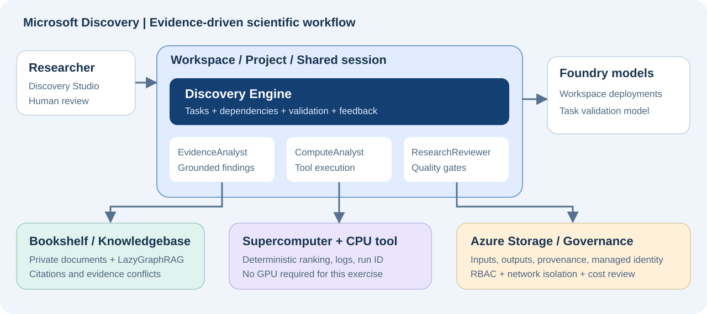

# Microsoft Discovery Core Capabilities Hands-on Guide

**English · Execution-informed revision 2026-10-01 · Azure cloud service**

[한국어](MICROSOFT-DISCOVERY-LAB.ko.md) · [English browser edition](https://junwoojeong100.github.io/microsoft-discovery-labs/docs/labs/MICROSOFT-DISCOVERY-LAB.en.html)

**One goal: build a research workflow that finds evidence, verifies it with real computation, and evaluates the results again when a human changes the constraints.**

> **Validation boundary:** This revision incorporates prerequisites, failures, and recovery steps observed during real Azure deployment. See the [execution report](../reports/EXECUTION-REPORT.ko.md) for current status and incomplete steps, and the [read-only readiness evidence](../../artifacts/discovery-readiness.json) for service access/model quota. Resource creation, data-plane access, Bookshelf indexing, and research execution have separate pass criteria. Neither local reference results nor ARM `Succeeded` prove an end-to-end lab run.

<a id="s00"></a>
## S00 — Start here

Microsoft Discovery cloud became **generally available on 2026-06-02**. The separate **Discovery desktop app and unified Workbench are in Preview** and are not required for this guide. Use the **Discovery Engine**, not deprecated static `kind: workflow` agents. Documentation may retain `(Preview)` after it disappears from the subscription's role display names. Automation uses verified role GUIDs; a display-name change does not prove a permission change.[S01][] [S03][] [S10][] [S28][]

| Audience | Route |
|---|---|
| Administrator preparing an environment | L00 → L01 → L02 → L03, then L05 steps 1–5 to prepare the tool |
| Researcher using a prepared environment | Confirm H01–H06 below → L04 → L05 steps 6–8 → L06 → L07 → L09 |
| Team verifying collaboration and access | Add L08. Actual verification requires another test user |
| Developer extending tools | Add E01 and E02 |

**Role boundary:** Bookshelf, node-pool, Registry, tool creation, and indexing preparation belong to administrators or explicitly authorized resource operators. Project Contributor alone does not authorize all these actions. Coordinate with an administrator rather than granting every researcher subscription Owner for convenience. [S20][]

**Researcher entry check:** Start at L04 without repeating infrastructure creation when the administrator supplies these actual values and readiness evidence. Example names or a verbal assurance are not sufficient.

| ID | Handoff and readiness evidence |
|---|---|
| H01 | Actual Workspace/Project URLs and resource IDs, successful `thermalhol`, correct tenant |
| H02 | Existing, usable `gpt-5-4` deployment |
| H03 | `thermal-evidence` version `1`, four TXT sources, indexing `Succeeded` |
| H04 | Actual `thermaldata`, `evidencepack`/`candidatecsv` Asset IDs, eight source CSV rows |
| H05 | `thermal-ranking` Tool ID, definition version/image digest, full `cpulab` Node pool ID |
| H06 | Researcher's project/model/tool/KB permissions and Blob/network access to inputs and outputs |

Allow separate time for access approval, deployment, and indexing. Plan **approximately 2–3 hours** for the researcher exercises, not a guaranteed completion time. Every lab follows **Goal → Steps → Pass criteria**. Advance only after the relevant prerequisites pass.

**Keep the concepts separate.** A Workspace is the shared infrastructure boundary, a Project is the research and access boundary, and a Shared session groups related research tasks. Documentation and APIs also use *investigation* for the associated research container. A Discovery Storage Container is a **storage-reference resource**, not the Azure Blob container itself.[S02][] [S12][] [S16][]



<a id="s01"></a>
## S01 — Core capability coverage

The core route covers the four central capabilities—**agents, graph-based knowledge, computation, and the Discovery Engine**—plus their data, security, and collaboration requirements. E01/E02 extend the same platform and require separate checks of permissions and connected-service availability.

| ID | Capability | Lab | Evidence to inspect |
|---|---|---|---|
| C01 | Studio, Workspace, Project, Shared session | L01, L04 | Resource IDs, successful state, session |
| C02 | Storage Container/Asset; reading, writing, sharing files | L02, L04, L06 | Source path, output Asset ID, file content |
| C03 | Bookshelf, GraphRAG, indexing, citations and evidence comparison | L03, L04 | Successful index and actual source citations |
| C04 | Prompt Agents, models, structured responses, versions and reuse | L04 | Deployment name, JSON fields, agent version |
| C05 | Supercomputer, node pools, Action Tools, execution and logs | L05 | Operation ID, success state, actual JSON |
| C06 | Cognition, task dependencies, validation and retries | L06 | Task hierarchy, execution history, validation comments |
| C07 | Hypothesis/constraint changes, human feedback and resume | L07 | Before/after results and a new operation ID |
| C08 | Collaboration, project RBAC, linked-resource access | L08 | Allowed and denied operations by another user |
| C09 | Traceability, retained artifacts and reproducibility | L06, L09 | Evidence/input/version/computation/output chain |
| C10 | Managed identity, networking, encryption, cost and shutdown | L00, L01, L09 | Access settings, remaining jobs/resources/cost |
| C11 | Code-environment and Hybrid Tools | E01 | Generated code, actual run logs and output |
| C12 | External MCP/OpenAPI and scientific-model integration patterns | E02 | MCP call evidence and integration-pattern selection |

**Out of scope:** installing the desktop app, enabling Preview Workbench, evaluating every partner model, physical experiments or robotics, and GPU benchmarking. Do not present these as outcomes of this lab.

<a id="s02"></a>
## S02 — Scenario and expected results

**Question:** Recommend the top two of eight fictional heat-sink materials that meet every hard constraint. Resolve conflicting documents using the latest correction, and never invent missing evidence.

All data was authored specifically for this exercise and is **synthetic**. It is not real supplier information, published research, measurements, or safety certification. Both editions use the same English source corpus; the guide and requested agent-response language differ.

| File | Purpose |
|---|---|
| `data/bookshelf/01_requirements.txt` | REQ-001: requirements and scoring formula |
| `data/bookshelf/02_candidate_catalog.txt` | CAT-001: initial candidate values |
| `data/bookshelf/03_screening_results.txt` | TEST-001: corrosion status and missing evidence |
| `data/bookshelf/04_revision_notes.txt` | REV-001: GAMMA correction and follow-up constraint |
| `data/materials.csv` | Resolved computational input; not independent additional evidence |
| `scripts/score_materials.py` | Reference calculator using only the standard library |
| `scripts/verify_ranking.py` | Validates the complete downloaded raw ranking-file contract, not its execution location |
| `tools/thermal-ranking/` | CPU-tool Dockerfile and definition template |
| `config/lab.json` | Account, subscription, and region for this lab |

| Property | Hard requirement |
|---|---|
| Thermal conductivity | ≥ 180 W/(m·K) |
| Density | ≤ 3.00 g/cm³ |
| Material cost | ≤ 5.00 USD/kg |
| Recycled content | ≥ 50% |
| Corrosion screening | `pass`; `unknown` is not a pass |

Score only eligible candidates. `recycled_pct` is a value from 0 to 100. Round the final score to one decimal place and break ties by candidate ID in ascending order.

```text
score = 50 * min(conductivity_w_mk / 250, 1)
      + 30 * max(0, 1 - cost_usd_kg / 5)
      + 20 * min(recycled_pct / 100, 1)
```

| Candidate | Baseline decision | Score / reason |
|---|---|---|
| ALPHA | eligible | 67.8 |
| BETA | excluded | Density and cost are too high; recycled content is too low |
| GAMMA | excluded | Use 175 from REV-001; conductivity is too low |
| DELTA | eligible | 68.6 |
| EPSILON | excluded | Cost exceeds the limit |
| ZETA | needs_review | No corrosion evidence |
| ETA | excluded | Recycled content is too low |
| THETA | eligible | 60.8 |

**Baseline:** DELTA → ALPHA → THETA; recommend DELTA/ALPHA. **Follow-up:** lower only the cost ceiling to 3.00; DELTA is the sole eligible candidate, still scoring 68.6. Keep the cost-normalization denominator at **5**.

**Decision order:** Any known hard-constraint failure means `excluded`; otherwise missing evidence means `needs_review`; the remaining candidates are `eligible`. Under the follow-up ceiling, ZETA is therefore `excluded` on cost while its corrosion evidence remains missing.

<a id="l00"></a>
## L00 — Prepare access, cost and roles

**Goal:** Treat service approval, Azure permissions, networking, and spending approval as separate prerequisites.

**Steps:**

1. Match the signed-in account to `config/lab.json`. This lab targets `junwoojeong@MngEnvMCAP757124.onmicrosoft.com`, subscription `51531604-2337-4c05-bc05-3c3d4ff154e5`, and tenant `46e9cdaa-fed3-4131-aa28-c1fc8a8a043a`. Do not rely on a different default subscription.
2. Confirm with your Microsoft representative that the subscription is **enabled for Discovery**. Spending approval and Contributor permissions do not replace the service allow-list.[S03][] [S04][]
3. In Azure Portal → Subscriptions → your subscription → Resource providers, check/register `Microsoft.Discovery` and the dependencies listed in the official guide. Registration requires appropriate subscription permissions. The following command is read-only.

```bash
az provider show --namespace Microsoft.Discovery \
  --subscription 51531604-2337-4c05-bc05-3c3d4ff154e5 \
  --query "{state:registrationState,types:resourceTypes[].resourceType}"
```

4. Check the actual `workspaces`/`supercomputers`/`bookshelves` types and a successful Workspace listing API, not just `Registered`. **Do not fail access solely because `DefaultFeature=Pending`.** On 2026-10-01 it remained Pending while `DiscoveryEnabled`/`DiscoveryPreview`/`PublicPreview` were Registered and the listing API succeeded. Conversely, provider registration does not prove quota, deployment, or execution readiness. Do not register arbitrary development features.
5. Have an administrator prepare the Platform Administrator persona and the managed identity's least-privilege roles. **Permission to assign roles is separate.** Verify the actual Owner/RBAC Administrator/User Access Administrator or equivalent authority. Researcher and reviewer project roles are covered in L08.
6. The administrator reviews/configures the subscription-level **Discovery NSP Perimeter Joiner + Reader** assignments for the Discovery control-plane service App (`92c174ac-8e41-4815-a1b7-d81b19ab03ce`) using the official procedure. Do not assume ordinary Contributor includes role-assignment authority.[S18]
7. Choose a supported production region: **East US / Sweden Central / UK South**. This guide uses `swedencentral`. Check model/VM quota and always-on costs in A01.
8. Complete normal MFA/security-key sign-in. For private access, prepare VPN/ExpressRoute and Blob connectivity. Verify Portal sign-in, Studio access, and opening Blob outputs separately.

**Separate LoadBalancer network prerequisite:** Check `Microsoft.Network/AllowBringYourOwnPublicIpAddress` using the [official troubleshooting guidance](https://learn.microsoft.com/azure/microsoft-discovery/troubleshoot-microsoft-discovery#supercomputer-deployment-stalls-because-a-required-public-ip-feature-isnt-registered). Discovery enablement and `Microsoft.Network=Registered` do not substitute for this feature registration.

```bash
az feature show --namespace Microsoft.Network \
  --name AllowBringYourOwnPublicIpAddress \
  --subscription 51531604-2337-4c05-bc05-3c3d4ff154e5 \
  --query "{name:name,state:properties.state}"
```

Only when it is `NotRegistered`, an administrator with subscription feature-registration permissions runs these **mutation commands**. Verify the feature is `Registered` before re-registering the provider. Do not treat `Pending` as approval.

```bash
az feature register --namespace Microsoft.Network \
  --name AllowBringYourOwnPublicIpAddress \
  --subscription 51531604-2337-4c05-bc05-3c3d4ff154e5
az provider register --namespace Microsoft.Network \
  --subscription 51531604-2337-4c05-bc05-3c3d4ff154e5 --wait
```

During the afternoon follow-up on 2026-10-01, the current account's inherited Owner role allowed immediate registration. Provider re-registration and independent read-back also completed; this subscription required no separate Microsoft approval wait. User consent alone does not grant RBAC permissions or guarantee approval in another subscription. This feature is separate from AKS regional capacity and model quota increases.

Run the following read-only checks without a browser. They verify the account, tenant, and subscription in `config/lab.json` without saving tokens. Exit `0` means the selected access/model-quota checks passed, `2` means a prerequisite is blocked, and `1` means a lookup/authentication error.

```bash
npm run readiness
npm run readiness -- --require core
```

The default includes Bookshelf. `--require core` separately checks the Workspace's GPT-5.4 requirement without hiding Bookshelf shortfalls. This conservative precheck measures **unallocated quota for new allocations**. When reusing deployed models, inspect their existing allocations instead of creating duplicates. Neither command proves VM, role, network, or Studio readiness.

If only Bookshelf quota is insufficient, prepare the L01 foundation/core separately, leave L03 and H03 incomplete, and do not claim the full research lab passed.

**Pass criteria:** The selected phase's service access, providers, roles, quota, client connectivity, and spending approval are ready. Do not deploy a blocked phase or its dependents.

<a id="l01"></a>
## L01 — Create the Workspace and Project

**Goal:** Prepare shared infrastructure for the researcher labs. For an existing environment, verify the pass criteria instead of redeploying.[S03][] [S18][]

**Steps:**

1. Use the dedicated RG **`rg-discovery-hol-20260930`**, matching `config/lab.json`. Do not mix it with the historical report's `20260925` RG. Check global uniqueness of Workspace, storage-account, and Bookshelf names. The Workspace uses lowercase letters; Project `thermalhol` is lowercase and at most 12 characters. Confirm actual creation of the names below using the execution report and live Azure GETs.
2. Create VNet `vnet-discovery-hol`. `10.80.0.0/16` is illustrative; replace it with an approved range if it overlaps existing networks.

| Subnet | Example CIDR | Configuration |
|---|---|---|
| `supercomputerNodepoolSubnet` | `10.80.1.0/24` | Microsoft.Storage service endpoint |
| `aksSubnet` | `10.80.2.0/24` | Microsoft.Storage service endpoint |
| `workspaceSubnet` | `10.80.3.0/24` | Microsoft.App/environments delegation + Storage endpoint |
| `privateEndpointSubnet` | `10.80.4.0/24` | Dedicated to the Workspace |
| `agentSubnet` | `10.80.5.0/24` | Microsoft.App/environments delegation + Storage endpoint |
| `searchSubnet` | `10.80.6.0/24` | Dedicated to Bookshelf; Microsoft.App/environments delegation + Storage endpoint |
| `bookshelfPeSubnet` | `10.80.7.0/24` | Dedicated to Bookshelf |
| `storagePeSubnet` | `10.80.8.0/24` | Dedicated customer Blob Storage Private Endpoint for the enforced organizational policy |
| `blobClientSubnet` | `10.80.9.0/24` | Optional administrator-only private Blob client VM; inbound traffic denied |

3. Create or reuse UAMI `id-discovery-hol`. Grant Discovery Platform Contributor on the RG, Storage Blob Data Contributor on the data account, and AcrPull on the Registry. Because this lab uses one UAMI for the Supercomputer cluster/kubelet/workload identities, also prepare Network Contributor on the VNet and Managed Identity Operator on that UAMI. The operator needs a separate Blob data role; Owner does not replace it. Do not share subnets with other Workspaces/Bookshelves.
4. Create a Standard LRS storage account and Blob containers `discoveryinputs` and `discoveryoutputs`. **This subscription's organizational policy disables public Storage access.** The template now explicitly sets `publicNetworkAccess=Disabled` with shared keys/anonymous blobs disabled. Use the Private Endpoint/DNS stage below and an approved client path inside the VNet; an allowed public IP cannot override this policy. CORS uses `https://studio.discovery.microsoft.com`, `https://vscode.dev`, `https://*.vscode-cdn.net`; GET/HEAD/PUT/DELETE/OPTIONS; headers `*`; Max age 200. CORS replaces neither authentication nor private connectivity.
5. In **Microsoft Discovery Supercomputers → Create**, configure the VNet, `aksSubnet`, system SKU `Standard_D4s_v6`, and Cluster/Kubelet/Workload identity. The template explicitly uses `outboundType=LoadBalancer` for egress. Subnet `defaultOutboundAccess=false` does not block every outbound path. Then use **Settings → Node pool → Create** to create `cpulab`: min 0 / max 1 and GPU 0 for the user tool pool, separate from the always-on system pool.
6. In **Microsoft Discovery Workspaces → Create**, connect the subnets, UAMI, and Supercomputer. This lab uses **`NetworkIsolation=true` + `publicNetworkAccess=Enabled`**: managed resources remain isolated while Studio/REST uses the authenticated service endpoint. This is neither `NetworkIsolation=false` nor anonymous access. A private-only Workspace instead requires its own Discovery private endpoint, DNS, and VPN/ExpressRoute first. Do not add Preview Workbench tags. Use MMK by default; CMK requires separate Key Vault and permission configuration.
7. In Workspace **Settings → Chat Model Deployments**, verify that the validation deployment **`gpt-5-4` / model `gpt-5.4`** actually exists. Create it if missing. Distinguish it from the automatically provisioned cognition deployment. Do not replace it arbitrarily when adding other agent models.
   **Final allocation for this lab:** automatic cognition `gpt-5.4` **250,000 TPM** plus validation `gpt-5-4` **250,000 TPM**, both **Global Standard**, totaling **500,000 TPM**. Enter **250** each when the field uses kTPM or `sku.capacity`. Verify model `gpt-5.4` and version `2026-03-05` separately from the deployment name. Reserve 250,000 TPM for validation rather than assigning all remaining quota to cognition. Data Zone is not used in this final configuration.
8. In Studio <https://studio.discovery.microsoft.com> → **Data → Storage Containers (new) → Create Container**, create `thermaldata` and link the storage account. This registers a reference; it does not copy data.
9. In **Workspaces → your Workspace → Create Project**, create `thermalhol` and link the Storage Container. An administrator checks actual data-plane access on the Workspace managed resource group (MRG), granting Foundry User only where needed. In this run the service had already granted the operator Foundry Owner on that MRG, so no redundant Foundry User assignment was added. This differs from having only management-plane Owner.
10. Record resource IDs and MRGs. Wait for **`Succeeded`**, not merely `Accepted`. Finalize Discovery-resource tags before creation because the documentation states they cannot be changed afterward.

### Executable CLI path from the existing foundation

**Evening cross-region run on 2026-10-01:** The default commands below target the previous single-region Sweden Central environment. The current request uses **home=`swedencentral`, target compute=`koreacentral`** with [separate parameters and staged resumption notes](../deployment-reference/06-resume-runbook.ko.md). Do not change Discovery's `location` to Korea Central or try to migrate an existing Workspace by adding a tag. Create separate support resources and apply `discovery.overridemrgregion` at creation, preserving existing data and models. Do not run the default commands unchanged against the new `-kc` environment.

Templates are separated by stage. **Do not use deletion/Complete mode.** Only a new environment needs initial provisioning through `infra/main.bicep` and `infra/identity.bicep`; the current RG/VNet/UAMI already exist. A full VNet PUT involving the three existing subnets failed actual validation with `IncompatibleDelegations`, so the expansion now creates only four child subnet resources. Do not redeploy the old three-subnet VNet template after expansion.

| Order | Template | Expected result |
|---|---|---|
| 1 | `infra/access.bicep` | Official control-plane SP gets NSP Joiner + Reader. If the role exists under another GUID, reuse it with the administrator rather than creating a duplicate |
| 2 | `infra/expand-network.bicep` | Add only four subnets; preserve the original three |
| 3 | `infra/lab-foundation.bicep` | LRS Storage, two Blob containers, Basic ACR, and scoped roles |
| 4 | `infra/discovery-core.bicep` | Supercomputer, cpulab, Workspace, model, Storage Container/Assets, and Project |
| 5 | `infra/storage-private-access.bicep` | Dedicated eighth subnet, Blob Private Endpoint, and private DNS; reuse an existing matching DNS zone/VNet link |

Verify the values below. Keep subscription and region consistent; for another environment, change the Bicep resource-name parameters as well.

```bash
SUBSCRIPTION_ID='51531604-2337-4c05-bc05-3c3d4ff154e5'
RESOURCE_GROUP='rg-discovery-hol-20260930'
LOCATION='swedencentral'
az account set --subscription "$SUBSCRIPTION_ID"
az account show --query "{subscription:id,tenant:tenantId,user:user.name}"
CONTROL_PLANE_OBJECT_ID=$(az ad sp show \
  --id 92c174ac-8e41-4815-a1b7-d81b19ab03ce \
  --query id -o tsv)
ADMIN_OBJECT_ID=$(az ad signed-in-user show --query id -o tsv)
```

`az ad` uses Microsoft Graph and does not accept `--subscription`. Explicitly select the CLI subscription context above, then compare the displayed tenant/account with L00. Continue passing `--subscription` to ARM commands.

Run each stage's `what-if` first and inspect its scope. Then **replace `what-if` with `create` in that same command** to apply it. Finish each stage before the next; retain the default Incremental mode for RG deployments.

```bash
az deployment sub what-if --name discovery-access-20261001 \
  --subscription "$SUBSCRIPTION_ID" --location "$LOCATION" \
  --template-file infra/access.bicep \
  --parameters discoveryControlPlaneObjectId="$CONTROL_PLANE_OBJECT_ID"

az deployment group what-if --name discovery-network-expansion-20261001 \
  --subscription "$SUBSCRIPTION_ID" --resource-group "$RESOURCE_GROUP" \
  --template-file infra/expand-network.bicep

az deployment group what-if --name discovery-foundation-20261001 \
  --subscription "$SUBSCRIPTION_ID" --resource-group "$RESOURCE_GROUP" \
  --template-file infra/lab-foundation.bicep \
  --parameters administratorObjectId="$ADMIN_OBJECT_ID"

az deployment group what-if --name discovery-core-20261001 \
  --subscription "$SUBSCRIPTION_ID" --resource-group "$RESOURCE_GROUP" \
  --template-file infra/discovery-core.bicep
```

**Policy lesson:** The first Storage what-if showed a public endpoint with a selected IP, but management-group policy `StorageAccount_PublicNetwork_Modify` changed it to Disabled during creation. An empty RG-level policy listing does not mean there are no inherited management-group policies. Inspect Activity Log's `Microsoft.Authorization/policies/modify/action` and the actual GET response. The template now matches policy; do not disable policy or firewall controls.

Inspect the `privatelink.blob.core.windows.net` zone and target VNet link. If absent, create them with the following template. If present, verify that the zone is linked to this VNet and pass its real ID as `existingBlobPrivateDnsZoneId`. Do not link competing zones for the same namespace. This stage depends only on Storage/VNet and can be prepared independently while core regional capacity is unavailable.

```bash
az deployment group what-if --name discovery-storage-private-20261001 \
  --subscription "$SUBSCRIPTION_ID" --resource-group "$RESOURCE_GROUP" \
  --template-file infra/storage-private-access.bicep
```

After review, run with `create`, then verify private-IP resolution and Entra-authenticated Blob access **from inside the VNet or an approved VPN/ExpressRoute client**. Creating a Private Endpoint does not connect a local laptop to a VPN. Downstream provisioning can still fail after model, subnet, and role checks; preserve actual errors.

```bash
az deployment group show --name discovery-core-20261001 \
  --subscription "$SUBSCRIPTION_ID" --resource-group "$RESOURCE_GROUP" \
  --query "{state:properties.provisioningState,error:properties.error}"
az deployment operation group list --name discovery-core-20261001 \
  --subscription "$SUBSCRIPTION_ID" --resource-group "$RESOURCE_GROUP" \
  --query "[?properties.provisioningState=='Failed'].properties"
```

**Limits of Workspace-only preparation:** The GA Workspace schema makes `supercomputerIds` optional, so this path can separate preparation from compute. **It does not bypass regional capacity limits.** In the actual run, even without a Supercomputer, the Workspace's managed Container Apps environment failed with `ManagedEnvironmentCapacityHeavyUsageError` caused by `AKSCapacityHeavyUsage`. Resolve regional capacity first. Avoid overlapping writes; if cancellation is necessary, retain state/errors and cancel only the specific deployment. Cancellation neither deletes created resources nor guarantees immediate cancellation of provider child operations.

```bash
az deployment group what-if --name discovery-workspace-20261001 \
  --subscription "$SUBSCRIPTION_ID" --resource-group "$RESOURCE_GROUP" \
  --template-file infra/discovery-core.bicep --parameters deployCompute=false
```

Outputs explicitly say `computeIncluded=false` and compute IDs are `null`. Use this **only for a new Workspace or one without linked Supercomputers**; applying it to a linked environment could clear its links. It does not pass all of L01, L03 indexing, or L05 computation. Once capacity is resolved, confirm actual Supercomputer/node-pool success and attach them through the default path. An alternate region requires planning VNet, Storage, and Workspace together, not indiscriminately mixing the existing stack across regions.

**Terminal-failure recovery limit:** Successful `validate`/`what-if` results do not prove that the create/update API accepts a resource in terminal `Failed` state. Stop repeated PUTs on `Conflict` or an equivalent state error. The [official recovery procedure](https://learn.microsoft.com/azure/microsoft-discovery/troubleshoot-microsoft-discovery#a-discovery-resource-is-stuck-in-a-terminal-failed-state) is to resolve the cause, obtain deletion approval, and delete **only the failed Discovery resource** before recreating it with a new name. Preserve the healthy RG, Storage, and data; do not directly repair the managed AKS/Container Apps resources.

**Pass criteria:** Workspace, Supercomputer, CPU pool, Storage Container, and Project are ready; the required model exists. You can open the project in Studio, and both the user and managed identity have their respective required Blob access.

<a id="l02"></a>
## L02 — Register data and move files through the workflow

**Goal:** Register Blob files and Discovery references, preparing the inputs that agents will use later.[S15][] [S16][] [S17][]

**Steps:**

1. Use Azure Portal's Storage account → Containers or an approved storage tool to upload the four TXT files to `discoveryinputs/bookshelf/` and the CSV to `discoveryinputs/compute/`. **Current documentation does not support directly uploading local files through Studio.**
2. Under Discovery Storage Container `thermaldata`, register Storage Assets `evidencepack` and `candidatecsv`. Use Data paths `discoveryinputs/bookshelf/` and `discoveryinputs/compute/materials.csv`, respectively. Verify the RG, region, and backing account.
3. Use the creation form's Storage Asset tab or the [official Storage Asset registration procedure][S17]. The resource-group-level Storage Container/Assets are **referenced** by the project. Check the backing account and both Assets' paths/states.
4. Download the actual source CSV to verify eight candidates and GAMMA=175; record the Asset IDs for later attachment. Copy returned `discovery://` URIs and Asset IDs; do not invent them.
5. Agent reading/writing/sharing occurs in L04, and Task-input attachment in L06. Typing a path in a prompt alone does not establish a data connection.

CLI uploads also use **the private access path verified in L01** and Entra sign-in rather than shared keys. On a rerun, compare existing files and hashes before deciding to overwrite. The asset template creates path references, not the underlying uploaded files.

```bash
az storage blob upload-batch --account-name stdiscoveryholjunwoosc \
  --destination discoveryinputs --destination-path bookshelf \
  --source data/bookshelf --auth-mode login \
  --subscription "$SUBSCRIPTION_ID"
az storage blob upload --account-name stdiscoveryholjunwoosc \
  --container-name discoveryinputs --name compute/materials.csv \
  --file data/materials.csv --auth-mode login \
  --subscription "$SUBSCRIPTION_ID"
```

### Administrator input preparation without a local VPN

This environment has **`vm-discovery-blob-client`**, deployed from `infra/blob-client.bicep`. It has no public IP or inbound SSH, and its own managed identity has only Blob Data Contributor on the lab Storage account, not Discovery platform roles. It uses the Storage service endpoint on `blobClientSubnet` and the existing Blob Private Endpoint/DNS.

The following performs **real Azure operations** and requires an administrator with VM management permissions. Project Contributor alone does not authorize VM Run Command. Start the client, transfer the five original files, then deallocate it.

```bash
az vm start --name vm-discovery-blob-client \
  --resource-group "$RESOURCE_GROUP" --subscription "$SUBSCRIPTION_ID"
npm run blob:sync
az vm deallocate --name vm-discovery-blob-client \
  --resource-group "$RESOURCE_GROUP" --subscription "$SUBSCRIPTION_ID"
```

`blob:sync` sends only the four synthetic TXT files and one CSV through Azure Run Command. Python's standard library and an IMDS token on the VM check that Blob DNS resolves inside `10.80.8.0/24`, upload the files, read them back, and compare source SHA-256 hashes. No keys, SAS, or tokens are saved. Existing matching files are reused; different contents cause an error instead of an overwrite. Verify `outcome=verified`, all five read request IDs, and hashes in `artifacts/discovery-private-blob-sync.json`.

Both the actual upload and a rerun were verified on 2026-10-01. **This proves private access from the remote VM, not that a laptop browser is connected to the VNet.** Storage public access and organizational policy remain unchanged. The VM was deallocated after verification; its OS disk remains billable. For a new environment, verify SKU/image/quota and `what-if` first, and never put the bootstrap SSH private key in the repository.

| Data path | Support and constraints |
|---|---|
| Bookshelf indexing | Use only the four supported TXT files in this lab. Do not put CSV/Python computation inputs into the knowledge index |
| Built-in file tools | Text such as TXT/MD/CSV/JSON/PY/YAML. `PreviewResource` returns only the **first 30 KB** |
| Binary files such as PDF/images | Support for some Bookshelf document ingestion is **separate** from native `PreviewResource`, which cannot read these binaries. Use a suitable custom tool |
| User opening an output | Managed-identity write access does not give the user Blob data permissions, firewall access, or CORS |

**Pass criteria:** Source Blob files/content, the Storage Container's backing account, and both input Assets' actual IDs, paths, and successful state are verified. This lab can finish without an agent or computation tool.

<a id="l03"></a>
## L03 — Index a Bookshelf knowledgebase

**Goal:** Build the knowledge index for cross-document reasoning. Actual retrieval and citation verification follow in L04, after the index is ready.[S06][] [S07][]

**Steps:**

1. In **Microsoft Discovery Bookshelves → Create**, choose the same subscription/RG/region, dedicated `searchSubnet`/`bookshelfPeSubnet`, and UAMI. Set `indexSize=small` at creation. The current documented limit is **one Knowledgebase per Bookshelf**.
2. In Studio → **Resources → Knowledge → select Bookshelf → Create new**, create `thermal-evidence`, version `1`. Describe it in Description/Copilot instruction as evidence for synthesizing fictional heat-sink requirements, candidate claims, gaps, and authoritative corrections.
3. Connect `thermaldata`, `evidencepack`, and the same UAMI.
4. Prepare the memory-intensive **indexing pool `indexlab`** using the requirements confirmed in A01. Do not reuse the small D4 computation pool as if it met indexing requirements.
5. In Knowledgebase Details, verify Provisioning State=`Succeeded` and Status=`NotStarted`. Select **Index → Project `thermalhol` → `indexlab` → Start Indexing**.
6. Wait for the actual indexing Status=`Succeeded`. This is separate from the Azure resource's Provisioning State.
7. Record KB name/version, the linked source Asset, indexing operation, and successful state. Attach the querying agent in the next lab.

**Pass criteria:** The actual source link points to all four TXT files and KB indexing reports `Succeeded`. Indexing success alone does not verify retrieval quality or citations.

**Updating the index:** Only the initial full index is required. Official indexing/update guidance conflicts; follow A01. Do not assume deleting a Blob removes the corresponding KB document.

<a id="l04"></a>
## L04 — Specialist agents, models and versions

**Goal:** Create Prompt Agents with explicit roles, models, tools, and KBs, then interact with them directly.[S08][] [S09][] [S10][] [S25][]

**Steps:**

1. In the project → **Resources → + beside Agents → Create new agent**, create the three agents below. Use type Agent/Prompt Agent and Chat model deployment **`gpt-5-4`**.
2. Add the role instructions below. The default Discovery agent is for product guidance, not a substitute for these research agents.
3. Under **Knowledge Bases**, attach `thermal-evidence` to EvidenceAnalyst and ResearchReviewer. Prepare only ComputeAnalyst's model and instructions here; its first tool attachment/run occurs in L05.
4. Create a **New shared session** and attach L02's actual input Assets using the data controls. Invoke EvidenceAnalyst/ResearchReviewer through `@AgentName` or the agent selector.
5. Have an agent discover the CSV through `GetResourceContext`, read it through `PreviewResource`, and use `WriteResource` to create `data-check.md` confirming eight candidates and GAMMA=175. Use `ShareResource` when needed, then open the actual output Asset.

**EvidenceAnalyst instructions**

```text
You analyze evidence for fictional heat-sink materials.
Use connected thermal-evidence and attach actual source citations to every
quantitative claim and decision. Follow REQ-001; prefer GAMMA=175 from REV-001.
Never turn ZETA's unknown corrosion status into a pass or invent measurements.
Separate synthetic inputs, computations, interpretation, and unexecuted work.
Reply in English.
```

**ComputeAnalyst instructions**

```text
You execute the thermal-ranking tool.
Use rank_baseline for the original case and rank_cost_revision for the 3 USD/kg case.
Report the actual operation ID, terminal state, logs, and output JSON Asset.
Never substitute mental arithmetic or local reference results for cloud execution.
If the tool is missing or fails, state the blocker. Reply in English.
```

**ResearchReviewer instructions**

```text
You independently compare documentary evidence with actual computation JSON when available.
Without computation results, review evidence only and mark arithmetic verification incomplete.
Check all eight candidates, constraints, the GAMMA correction, ZETA's missing
evidence, rankings, and scores. Produce a report with method, recommendation,
exclusion reasons, evidence gaps, and limitations.
Discover files with GetResourceContext and read them with PreviewResource.
Never claim real experiments or safety certification. Reply in English.
```

6. Send the following to EvidenceAnalyst. Ask about **relationships and implications across the corpus**, rather than isolated values, to exercise Bookshelf's strengths.

```text
@EvidenceAnalyst
Synthesize all documents in thermal-evidence to explain the tradeoffs among
performance, cost, recycled content, and missing evidence that affect selection.
Include a decision table for all eight candidates and information that could
change the conclusions. Resolve GAMMA using REV-001 and retain ZETA as unknown.
Link every quantitative claim and decision to an actual retrievable source citation.
Defer final arithmetic ranking verification until the separate computation tool returns.
```

7. Ask ResearchReviewer to return the evidence checks as JSON. This is the **expected shape of the agent's evidence summary**, not the computation tool's `ranking.json`. Compare the actual response with the sources; do not copy the example and present it as execution evidence.

```json
{
  "candidate_count": 8,
  "gamma_conductivity_w_mk": 175,
  "missing_evidence": [
    {
      "candidate_id": "ZETA",
      "source_field": "corrosion_status",
      "observed_value": "unknown"
    }
  ],
  "synthetic_data": true,
  "arithmetic_verified": false
}
```

**Requesting JSON is not enforcing JSON Schema.** Configure schema-constrained output explicitly if the model/UI supports it, and record which method was used. No computation has run at this stage, so do not set `arithmetic_verified` to `true`.

8. Improve and save the instructions once, then record the new version. Versions are immutable; distinguish history from the version actually used. Use **Copy from project** when reusing an agent in another accessible project. This creates an independent copy, not a live synchronized reference.

**Pass criteria:** Verify all three agents' models/instructions, both evidence agents' KB bindings, actual file reading/writing, at least three source citations, a structured evidence response, and a new version. ComputeAnalyst's tool run is the next lab's criterion. Do not set unsupported `temperature`/`top_p` for reasoning models. Chat and Task contexts are separate; repeat important inputs and constraints in the Task.

<a id="l05"></a>
## L05 — Run the actual CPU tool

**Goal:** Verify results using a real Supercomputer execution, logs, and files—not an LLM's statement that it calculated them.[S21][] [S22][] [S23][] [S32][]

**Steps:**

**Steps 1–5 are administrator preparation; steps 6–8 are the researcher run.**

1. These commands produce **local reference results**, not evidence of an Azure run.

```bash
python3 scripts/score_materials.py --input data/materials.csv \
  --output artifacts/reference-ranking.json
python3 scripts/score_materials.py --input data/materials.csv --max-cost 3 \
  --output artifacts/reference-ranking-cost3.json
```

2. Use an approved existing ACR or have an administrator create one for the lab. Builder/push permissions differ from the Supercomputer identity's pull permissions. Use roles appropriate to the Registry's RBAC/ABAC mode.
3. From the repository root, replace `<acr-name>` and run the following. **`az acr build` uploads the context and performs a billable cloud build in Azure ACR Tasks; it is not a local build.** It does not require a local Docker daemon.

```bash
az acr build --registry '<acr-name>' \
  --subscription 51531604-2337-4c05-bc05-3c3d4ff154e5 \
  --file tools/thermal-ranking/Dockerfile \
  --image thermal-ranking:1.0.0 .
```

4. Verify that `.dockerignore` allows only the calculator, synthetic CSV, and Dockerfile. Record successful build status and the Registry image/digest. A version tag can still be overwritten; its name alone does not guarantee immutability.
5. Copy `tools/thermal-ranking/tool-definition.template.json` and replace `<acr-login-server>` with its real value. In Portal → **Microsoft Discovery Tools → Create → Basics**, set Name=`thermal-ranking`, Region=`swedencentral`, **Definition content file**=the edited JSON, and **Definition content version**=`1.0.0`. Leave Environment variables empty. Retain `worker`, both actions, and `/outputs`; verify `Succeeded` and the Tool ID. **GA API `2026-06-01` takes the definition object in `properties.definitionContent` and the resource version in `properties.version`.** The definition's internal `version` is separate. Copying `properties.definitionContentVersion` from S33's Preview example into the GA request fails actual ARM preflight validation.[S33]
6. Attach the registered tool under ComputeAnalyst's **Tools**. For the first manual conversation, **Confirm before running tool** can demonstrate the approval pause. Before Engine exercises, explicitly choose the approval policy for the two reviewed synthetic actions so unattended approval does not stall execution. Do not silently disable an approval requirement. Then request one actual `rank_baseline` run on `cpulab`. **This tool uses the synthetic CSV baked into its image.** It does not automatically mount the L02 Blob CSV; input changes require a rebuilt image or an explicit tool change.
7. Inspect the operation ID, `Succeeded`, actual `nodepoolId`, logs, and `ranking.json` Asset. `nodepoolId` must match the full `cpulab` ID from H05; putting a pool name in a prompt is not verification. `auto_promote: true` configures output sharing. Do not count a Foundry Code Interpreter run as a Supercomputer run.[S32]
8. Download the **original tool-produced file** and run the following check. Replace `<downloaded-ranking.json>` with its actual path. Do not substitute an agent's summary JSON or the local reference file.

```bash
python3 scripts/verify_ranking.py \
  --input '<downloaded-ranking.json>' --case baseline
```

The checker compares all eight candidates, decisions/reasons/gaps/sources, ranking/scores, constraints, and JSON structure. Missing/extra fields, incorrect order, duplicate keys, and invalid numbers fail. Success reports `content_verified: true` and **`execution_verified: false`**. File content cannot establish where execution occurred; separately verify the Azure operation, pool, logs, and Asset.

Instead of the UI, administrators can register the same tool with this Bicep, **pinned to the actual image digest**. Review `what-if`, then run with `create`. ACR build success, tool registration, and Supercomputer execution success are separate states.

```bash
IMAGE_DIGEST=$(az acr repository show --name acrdiscoveryholjunwoosc \
  --image thermal-ranking:1.0.0 --subscription "$SUBSCRIPTION_ID" \
  --query digest -o tsv)
az deployment group what-if --name discovery-tool-20261001 \
  --subscription "$SUBSCRIPTION_ID" --resource-group "$RESOURCE_GROUP" \
  --template-file infra/tool.bicep --parameters imageDigest="$IMAGE_DIGEST"
```

**Pass criteria:** Require the actual cloud operation ID, `cpulab`, logs/Asset, and a passing raw-JSON content check. Values must be `candidate_count=8`, `eligible_count=3`, and DELTA 68.6 → ALPHA 67.8 → THETA 60.8. `Accepted`, `NotStarted`, failure, and cancellation are not success. The first tool call may incur additional cold-start time.

<a id="l06"></a>
## L06 — Discovery Engine and the validation loop

**Goal:** Execute a research workflow with dependencies, independent validation, and file inheritance.[S11][] [S12][] [S13][] [S14][] [S15][]

**Steps:**

1. Create a new Shared session in the same project. **Do not start the Engine yet.**
2. Create all Tasks below. Put the synthetic-data restriction, input Assets/KB/tool, output filenames, and validation requirements in each Description. Do not assume the Task knows earlier chat content.

| Task | Parent | Depends on | Output and required validation |
|---|---|---|---|
| R0 | — | — | `baseline-summary.md`: synthesize child results, recommend DELTA/ALPHA, include limitations |
| T1 | R0 | — | `evidence-map.md`: eight candidates, actual citations, GAMMA=175, ZETA=unknown |
| T2 | R0 | T1 | Actual `rank_baseline` operation ID, logs, and JSON; eight candidates, three eligible, exact scores |
| T3 | R0 | T1, T2 | `research-report.md`: compare sources with actual JSON; eight decisions, recommendation, gaps, method, limitations |

3. **Parent expresses decomposition; Depends on expresses prerequisites.** Do not make R0 a dependency of T1 and create a cycle. Select an agent if the UI offers that control; otherwise add a Task comment naming the appropriate agent and why. Check the actual selection in history.
4. Attach inputs to the Task or its parent. Parent inputs flow to children; dependency outputs flow to downstream Tasks. Siblings do not share outputs merely by being siblings, and files do not automatically cross Shared sessions.
5. Start the Discovery Engine. Inspect `New → Executing → Validating → Complete` and validation comments. Failed validation can lead to `Incomplete`, retries, or `Needs User Attention`.
6. Confirm that T3 actually discovers and reads inherited files through `GetResourceContext`/`PreviewResource`. File contents are not automatically injected into its prompt. Root-level output aggregation and downstream input inheritance are also different mechanisms.
7. Validate file **content**, not just `Complete` or an Asset ID. Required Tasks that fail, remain on hold, or need human attention do not pass the lab. The Engine ending a session does not prove that all research succeeded.

**Pass criteria:** Relationships, actual execution, validation comments, and input/output Asset links are verified for R0/T1/T2/T3. Required outputs match S02, and the T3 and R0 reports are readable.

**Autonomy extension:** After the baseline passes, optionally give one bounded objective to a separate session and observe cognition create subtasks. Permit only the eight synthetic candidates; prohibit additional cloud deployments and physical experiments. This contrasts structured execution, guided exploration, and autonomous research without promising identical outcomes, duration, or cost.[S29]

<a id="l07"></a>
## L07 — Change constraints and provide human feedback

**Goal:** Preserve evidence and history while testing a new hypothesis and re-evaluating the result.

**Steps:**

1. **Stop the Engine after all baseline Tasks finish.** Inspect remaining executions and let them finish or normally cancel the intended operation when necessary. Preserve the baseline once no work is still running.
2. Test “lowering the cost ceiling to 3.00 leaves only DELTA.” With the **Engine off**, configure all follow-up Tasks, dependencies, and validation requirements below in the same Shared session. Do not overwrite the baseline. This is constraint testing on synthetic data, not a real materials experiment.

| Task | Depends on | Output and required validation |
|---|---|---|
| T4 | T3 | Actual `rank_cost_revision` run, new operation ID, `ranking-cost3.json`, only DELTA eligible at 68.6 |
| T5 | T3, T4 | `comparison.md`: explain three → one eligible, retain denominator 5, preserve ZETA's unresolved gap |

3. Put the following in the Task Description and comments.

```text
Lower only the hard cost ceiling from 5.00 to 3.00 USD/kg.
Keep all other constraints and the cost-normalization denominator at 5.
Actually run thermal-ranking's rank_cost_revision and save a separate result.
Preserve prior evidence and outputs. Do not invent corrosion results or measurements.
Distinguish the hypothesis result from evidence that still needs to be acquired.
```

4. Check the completed configuration and absence of duplicate running work, then **Start the Engine**. Confirm that earlier files/history persist and the new Tasks execute. Restart rebuilds working memory. **Stop does not cancel already-running agents/tools.** Do not arbitrarily change an executing Task's state or submit the same work again.[S13]
5. After T4/T5 finish, Stop the Engine and inspect remaining work. Download the original `ranking-cost3.json` and run:

```bash
python3 scripts/verify_ranking.py \
  --input '<downloaded-ranking-cost3.json>' --case cost3
```

6. If file checks or Task validation fail, fix the cause. Use **Stop → inspect remaining executions → edit → Start** for corrections/retries as well. Do not remove correct GAMMA/ZETA requirements merely to obtain a pass.

**Pass criteria:** A separate operation ID, `cpulab`, original file, and passing `cost3` check confirm only DELTA at 68.6. ZETA is `excluded` on cost but retains its missing-evidence record. Preserve baseline results/history and do not present counterfactual assumptions as observations.

<a id="l08"></a>
## L08 — Collaboration and project access control

**Goal:** Verify collaboration within a project and boundaries around other projects and linked resources.[S19][] [S20][]

**Steps:**

1. An administrator prepares actual test users/groups and an unassigned comparison project for denial checks. **Without another user or comparison project, defer the corresponding verification.** Two browser windows using the same identity do not verify multi-user authorization. Obtain approval for the scope/cost before creating an additional comparison project.
2. Assign roles at the exact ARM scope of existing project `thermalhol`. Also inspect inherited Workspace/RG/subscription permissions.

| Persona | Project role | Linked-resource roles as needed |
|---|---|---|
| Authoring/running researcher | Microsoft Discovery Project Contributor (Preview) | Tools Reader and Chat Model Reader for authoring; required Storage Container/Blob and Bookshelf roles |
| Results reviewer | Microsoft Discovery Project Reader (Preview) | Storage Container Reader + Storage Blob Data Reader; optionally Bookshelf Index Data Reader |

3. Scope each assignment to approved resources. **Project Contributor does not create new Projects or assign roles.** Storage Container metadata access does not replace Blob-content access.
4. Verify that the researcher can open the same project's Shared session, Tasks, and outputs and make permitted changes. Verify that the reviewer can read but cannot create, change, or run work.
5. Verify denial of access to an unassigned project. If the test user inherits broad access, do not claim isolation passed; correct the test scope.
6. Distinguish running an existing agent from authoring one. Tools Reader/Chat Model Reader are not always required solely to run an administrator-created agent. Running the Engine with its platform `gpt-5-4` does not necessarily need a separate Chat Model Reader assignment.
7. Linked tool/model access is checked when an agent is created or updated. Do not assume revoking the user's linked-resource role immediately prevents an existing agent from using that resource; review/update affected agents.

**Pass criteria:** Another user's allowed/denied outcomes and assignment scopes are recorded. Some Workbench status operations require Workspace access even for project-only users; do not resolve every error by granting broad Platform roles.

<a id="l09"></a>
## L09 — Preserve results, review cost and shut down

**Goal:** Leave an auditable result and distinguish running work from always-on costs when ending the lab.

**Steps:**

1. Retain `research-report.md`, `baseline-summary.md`, `comparison.md`, both actual computation JSON files, and content-check results. Keep them separate from local reference JSON, and distinguish content validation from Azure execution evidence.
2. Complete the reproducibility record.

| Category | Record |
|---|---|
| Scope | Workspace/Project/Shared session/Task IDs |
| Inputs | Document IDs/versions, CSV, KB name/version/index status |
| Configuration | Model deployment, actual agent version, tool-definition version/image digest, node pool |
| Actual execution | Operation ID, time, terminal state, logs |
| Outputs | Storage Asset IDs, downloaded files, decisions/scores, validation comments |
| Limitations | Synthetic data, unperformed experiments, missing evidence, variable model responses |

3. Stop the Engine and separately inspect running agents/tools. Cancel only the intended operations if needed. **Cancellation itself can be a billable runtime action.**
4. In Cost Management, inspect the lab RG, each MRG, **Microsoft Discovery - User Messages**, models, compute, and storage. Do not estimate the bill from user-prompt count alone.[S24]
5. When retention ends, agree deletion scope with the administrator. Exclude shared resources and first check running work and files to preserve.
6. Distinguish **reference deletion** in Storage Asset → Storage Container order from actual Blob deletion. Removing references does not delete the backing Blob data/account. Clean up Bookshelf, Workspace, Supercomputer, and MRGs according to documented lifecycle and actual dependencies.[S16][] [S17][]
7. Record Engine state, remaining operations, node state, always-on resources, and retention/deletion outcomes separately. Closing the browser or setting min=0 does not make all costs zero.
8. To reuse reviewed knowledge in another session, explicitly attach the Assets or follow a supported KB creation/update procedure. Do not assume a successful Task automatically reindexes the existing Bookshelf.

**After partial failure:** Successfully created Storage, ACR, Private Endpoints, and MRG Log Analytics/NSP resources can remain even when deployment fails. Deleting an RG does not remove subscription-scoped NSP Joiner/Reader assignments or the custom role. Other Discovery environments may share those service roles; do not remove them without administrator review. This guide does not execute automatic deletion commands.

**This subscription's central diagnostics:** A follow-up applied the existing organizational policy to create `McapsGovernance/mcaps4c05bc053c3d4ff154e5-la` in West US 2 and connect Discovery diagnostics. It is a shared pay-as-you-go resource with 30-day retention and a `Do Not Delete` tag. Exclude it from lab-RG cleanup and review log ingestion/retention costs separately. This did not move the working Blob data, but diagnostics are not guaranteed to remain exclusively in Sweden Central.

**Pass criteria:** The evidence→execution→output chain is retained and remaining work, resources, and cost exposure are clear. Do not claim collaboration verification if L08 was not performed.

<a id="e01"></a>
## E01 — Code-environment and Hybrid Tools

**Goal:** Compare a fixed Action with agent-generated code in the same compute environment. This is an optional developer extension after the core route.[S21][] [S22][]

**Steps:**

1. Copy the existing Action-only definition instead of overwriting it. Name it `thermal-hybrid`, version `1.1.0`, and retain the validated image and CPU limits.
2. Add this top-level `code_environments` array to the JSON definition. If using YAML, convert it to the corresponding JSON when registering.

```json
{
  "code_environments": [
    {
      "language": "python",
      "command": "python \"/{{scriptName}}\"",
      "description": "Python standard library only. Analyze original synthetic training data; no network access or new package installation is requested.",
      "infra_node": "worker"
    }
  ]
}
```

3. This is an **addition, not a complete tool definition**. Retain `infra` and `actions`. Combining fixed Actions with a Code-environment makes a Hybrid Tool.
4. Attach it to a separate test agent. Ask it to write and execute code on `/app/materials.csv` that calculates GAMMA's margin against the conductivity requirement and reads ZETA's `corrosion_status`. Do not request network access or package installation. Instructions are not a network control; enforce actual restrictions through operational policy.
5. Verify generated code, the actual operation ID/logs, `175 - 180 = -5`, and `corrosion_status = "unknown"`. **The CSV column exists; its value is unknown.** `corrosion_result` in the computation JSON's `missing_evidence` is a derived missing-evidence label, not a CSV column name.

**Pass criteria:** A new Hybrid definition and actual generated-code execution evidence exist. Do not conflate Code-environment, Foundry Code Interpreter, and remote MCP execution runtimes.

<a id="e02"></a>
## E02 — External tools and scientific-model integration

**Goal:** Verify an extension through a public-documentation MCP example, then choose the appropriate integration pattern for scientific models. Separately verify connected-service feature status, model support, and organizational policy.[S10][] [S22][] [S26][]

**Steps:**

1. Create a separate `DocsConnector` agent in the same Discovery project, isolated from research-data agents.
2. Open advanced settings for **the Foundry project/agent backing that Discovery agent**. Do not create an unrelated Foundry project.
3. In Foundry Tools → Add a new tool → Custom → MCP, configure name `MicrosoftLearnPublic`, endpoint `https://learn.microsoft.com/api/mcp`, and Authentication `Unauthenticated`. This setting is specific to the public Learn server, not a template for authenticating private MCP services.
4. Ask only the public question “How do Storage Containers and Storage Assets differ in Microsoft Discovery?” Do not send lab documents, tenant/subscription details, or research data. Follow normal user-approval prompts for tool use.
5. Verify **actual MCP call logs and official source URLs**. Confirm the same agent's connection is reflected in Discovery. If the UI, permissions, or connection feature is unavailable, defer this extension only.

| Asset to integrate | Appropriate pattern |
|---|---|
| Existing computational binary/simulator | Container Action → Supercomputer |
| Agent-authored analysis code | Code-environment / Hybrid → Supercomputer |
| Already-hosted REST model | OpenAPI schema + approved authentication/connection |
| Tools exposed by an MCP server | Foundry MCP connection + approval/policy |
| LLM used for agent reasoning | Select a Workspace Chat Model Deployment; distinguish Engine validation |

Property prediction by scientific/large quantitative models (LQMs) is different from LLM language reasoning. Integrate scientific models through the Container/OpenAPI/MCP patterns above as appropriate. This lab's Python scorer is not a physical simulator or a trained scientific model. If adding public-literature search, use approved search/scientific-database connections and verify sources, publication dates, and usage rights.

**Pass criteria:** Actual calls and sources demonstrate MCP use, not just a verbal claim. Reading the pattern table does not mean every OpenAPI integration or partner model was deployed and evaluated.

<a id="a01"></a>
## A01 — Cost, quota and conflicting documentation

**There are two cost layers:** Discovery **runtime User Messages** and separate Azure resource/model consumption. GET/list/status/log operations are not billed as Discovery runtime actions, but always-on infrastructure can keep accruing cost while you read. Azure Budgets generally alert; they are not hard spending caps.[S24]

| Preparation item | Planning baseline |
|---|---|
| GPT-5.4 | Check at least **500,000 TPM total**, following the documentation's Important note; verify allocations per deployment |
| Bookshelf models | Use GPT-5.2 **200,000 TPM**, GPT-5 Mini **2,000,000 TPM**, and text-embedding-3-small **2,000,000 TPM** as preparation baselines, then confirm actual creation/search requirements |
| Always-on Bookshelf infrastructure | The indexing how-to specifies Search S1 with 2 replicas, SQL Hyperscale Gen5 with 20 vCores, and ACA Small E4. Four documents still incur fixed cost |
| Indexing memory | Resolve the difference between Small E20s_v6 (160 GB) in the how-to and D48s_v6 (192 GB) in the quota page before deployment |
| Computation pool | D4s_v6-family CPU tool; no GPU needed. Separate from the indexing pool |
| Other costs | Workspace/Project Cosmos DB, Storage, Registry/ACR Tasks, networking, and managed infrastructure |

Check model quota for the subscription, region, model, and deployment type together. The documented default is Global Standard. If residency requirements lead to Data Zone Standard or another type, recheck support and the corresponding quota. [S05][]

**Observed pre-deployment example (2026-10-01, Sweden Central / Global Standard):**

| Model | Total limit TPM | Already allocated TPM | Remaining TPM | Required for this phase TPM | Result |
|---|---|---|---|---|---|
| gpt-5.4 | 3,000,000 | 0 | 3,000,000 | 500,000 | Core precheck passed |
| gpt-5.2 | 3,000,000 | 10,000 | 2,990,000 | 200,000 | This Bookshelf model alone passed |
| gpt-5-mini | 1,000,000 | 10,000 | 990,000 | 2,000,000 | Insufficient |
| text-embedding-3-small | 1,000,000 | 220,000 | 780,000 | 2,000,000 | Insufficient |

This is a **pre-deployment snapshot**, not a promise of current remaining capacity. Rerun `npm run readiness`. When the Azure usage description says `One Thousand Tokens Per Minute` or `Tokens Per Minute (thousands)`, **multiply by 1,000 and subtract existing allocations**. Do not interpret the `Count` unit alone as 1,000 TPM or combine Global Standard with Data Zone Standard.

In this example, preserving existing usage requires a total limit of at least **2,010,000 TPM** for the mini model and **2,220,000 TPM** for embeddings to allocate another 2,000,000 TPM each. Requesting exactly 2,000,000 total may still leave a shortfall. Agree on additional headroom with the administrator. If `az quota list` on the Cognitive Services scope returns `BadRequest`, use the documented Foundry quota-increase process rather than interpreting it as unlimited or unused quota. Do not delete another project's deployments to free capacity for this lab.

### Which quota and which project

**AKS quota is not actual regional capacity.** The observed error was `AKSCapacityHeavyUsage`, not `QuotaExceeded`. Regional/Dsv6 quotas were each 0/100 vCPUs and Container Apps environments were 1/50, so increasing those limits is not an established fix. Ask Azure support to check this subscription's Sweden Central AKS/Container Apps creation capacity.

Bookshelf needs **Global Standard TPM for `gpt-5-mini` and `text-embedding-3-small`**. The recommended requested total for this lab is **3,000,000 TPM each**, not an additional amount. Enter `3000` if the field is measured in thousands of TPM. Do not confuse `gpt-5.4-mini`, PTU, or another deployment type with these quotas. Verify submission, approval, and actual reflected limits separately.

Do not immediately create another project just because the portal list appears empty. ARM confirmed **`Discovery Default Project`** (`discoverydefaultprojectym5ffvaa`) under `aif-dwsp-foundry-ym5ffvaa` in `Succeeded` state. It is **separate from the uncreated Discovery lab Project `thermalhol`**. Select the lab account's directory/subscription, then follow the [official Foundry steps](https://learn.microsoft.com/azure/foundry/how-to/quota): **New Foundry → the project → Manage → Quota → Token per minute → Request quota**. Creating a project does not create an independent quota pool; quota belongs to the subscription/model/deployment-type scope.

The following are **observed documentation differences** and this guide's treatment. Do not copy contradictory statements into a single supposedly deterministic setup.

| Topic | Documentation difference | Guide decision |
|---|---|---|
| GPT-5.4 quota | Summary 450,000 vs Important note 500,000 [S05] | Use 500,000 as a conservative preparation baseline; verify actual deployment quotas |
| Indexing SKU | E20s_v6 vs D48s_v6 [S05][] [S06][] | Confirm supported SKU/memory with the administrator/product team; do not substitute the small computation pool |
| Reindexing | Concept page says delete/reindex; how-to describes incremental enrichment plus a full graph rebuild [S06][] [S07][] | Require the first full index only. Confirm the deployed version before update/deletion decisions |
| Model response controls | Temperature recommendations in model selection vs unsupported reasoning-model controls [S09][] [S10][] [S25][] | Leave temperature/top_p unset for this reasoning-model route |
| Automatic model creation | Default automatic-model wording vs manual-deployment quickstart [S03][] [S13][] | Check actual `gpt-5-4`; create only if missing |
| Tool version field | Portal's Definition content version, Preview REST's `definitionContentVersion`, and the actual GA schema differ [S33] | Use verified GA `2026-06-01` field `properties.version`; keep the object in `properties.definitionContent` |
| Billing unit | User Message/operation wording conflicts with the 10-operation conversion example [S24] | Do not multiply raw API-call count directly by a unit price. Confirm the regional meter, contract and actual bill |
| Storage hierarchy | Workspace-child wording in a concept table vs actual RG-level resource IDs [S16][] [S17][] | Use RG-level Storage Container/Assets referenced by the project |
| Regional scope | Infrastructure quickstart's production-region list differs in scope from the tool-deployment page including East US 2 [S03][] [S33][] | Use Sweden Central, present in both. Do not infer full-stack availability from a single tool resource |

Before deployment, review actual region, SKUs, quantities, retention time, and subscription terms in the [Azure Pricing Calculator](https://azure.microsoft.com/pricing/calculator/). Product/model GA does not make every model, SDK, API, or connection feature GA. Preserve `preview` status when it appears in an example API version.

<a id="a02"></a>
## A02 — Troubleshooting and completion

| Symptom | Check |
|---|---|
| Provider is Registered but resource types are unavailable | Service enablement, supported types/API; separate from spending/RBAC approval |
| Access appears enabled despite `DefaultFeature=Pending` | Check real features such as `DiscoveryEnabled`, required resource types, and Workspace GET together; do not reject access on Pending alone |
| VNet expansion fails with `IncompatibleDelegations` | Deploy only new child subnet resources instead of rewriting existing delegated subnets; do not reapply the old three-subnet VNet template |
| Supercomputer remains Accepted/Running | Inspect Activity Log under the same correlation ID and MRG child deployments, not just parent ARM state. `AKSCapacityHeavyUsage` is regional AKS capacity, not something vCPU quota increases or provider registration fix |
| Workspace fails at `containerAppsEnvironment` | Inspect the MRG Managed Environment error. `ManagedEnvironmentCapacityHeavyUsageError` with AKSCapacityHeavyUsage means Workspace-only cannot avoid the same capacity gate. Do not repeatedly resubmit; resolve regional capacity/support or plan the complete stack in another region |
| Blob roles and an allowed client IP exist, but Storage returns 403 | GET actual `publicNetworkAccess`. An inherited Azure Policy `modify` may set Disabled. Inspect Activity Log and prepare Private Endpoint/DNS/approved VNet connectivity; do not disable the policy |
| MRG `PolicyDeployment_*` fails with `ResourceNotFound` | Have the administrator verify the central Log Analytics target referenced by diagnostic policy. Distinguish the failed policy child deployment from the Discovery resource's own state; do not arbitrarily create or change shared governance resources |
| Engine cannot start | `gpt-5-4`, actual model quota, specialist agents and tools |
| Task stays New | Dependencies, Engine state, execution capacity. Do not force Complete |
| Repeated Incomplete / Needs User Attention | Validation comments, missing tools/inputs, impossible requirements; fix the cause |
| Output link returns 403 | User Blob data role, firewall/VPN and CORS; independent of managed-identity success |
| Model/tool unavailable during agent creation | Reader access on that linked resource; project access alone can be insufficient |
| Indexing fails | Format, source path, managed identity, memory pool, model quota |
| Tool creation or image pull fails | Definition content file/version, actual image reference, Registry connectivity and managed-identity pull role |
| Ranking JSON check fails | Original tool file vs summary, baseline/cost3 selection, data/tool version, candidate/decision/score mismatch. Do not overwrite it with the local answer |
| Agent lacks earlier chat context | Chat/Task separation; specify Task inputs and Description |
| Restart triggers another warmup | Working memory rebuild; verify retained results/history |
| Costs continue after computation | Running jobs, system pool, always-on Bookshelf/Workspace infrastructure |

**Core completion:** Evidence exists for L00–L07 and L09, with matching values and citations. L08 passes only with another user's authorization checks. Record E01/E02 separately. **Label an unexecuted capability “explained/prepared only.”**

Local checks of the supplied package do not change Azure.

```bash
npm ci
npm run build:guide
npm test
```

Use `npm run check:guides` for browser rendering checks. The supplied script uses **an installed Google Chrome in headless mode**. If Chrome is missing, follow an approved installation process; installing Chromium alone does not satisfy `channel: chrome`.

<a id="a03"></a>
## A03 — Official sources

Original sources checked on 2026-09-25; deployment, networking, quota, and storage references rechecked on 2026-10-01. Both editions use identical Source IDs/URLs, Lab IDs, data, and expected results. Product UI labels remain in English for discoverability.

| ID | Official documentation |
|---|---|
| S01 | [GA announcement][S01] |
| S02 | [Service architecture][S02] |
| S03 | [Infrastructure quickstart][S03] |
| S04 | [Provider registration][S04] |
| S05 | [Quota reservations][S05] |
| S06 | [Create Bookshelf and index a Knowledgebase][S06] |
| S07 | [Bookshelf concepts][S07] |
| S08 | [Agents and shared sessions quickstart][S08] |
| S09 | [Create agents][S09] |
| S10 | [Agent types][S10] |
| S11 | [Discovery Engine][S11] |
| S12 | [Tasks and shared sessions][S12] |
| S13 | [Cognition][S13] |
| S14 | [Build shared sessions with cognition][S14] |
| S15 | [Files and storage assets][S15] |
| S16 | [Storage containers and assets][S16] |
| S17 | [Manage storage containers][S17] |
| S18 | [Configure network security][S18] |
| S19 | [Project RBAC concepts][S19] |
| S20 | [Configure project access][S20] |
| S21 | [Create a tool definition][S21] |
| S22 | [Tools and model integration][S22] |
| S23 | [Publish a tool image to ACR][S23] |
| S24 | [Discovery billing][S24] |
| S25 | [Select models for agents][S25] |
| S26 | [Microsoft Learn MCP in Foundry][S26] |
| S27 | [Debug task execution][S27] |
| S28 | [Discovery cloud and Discovery app][S28] |
| S29 | [Advanced shared-session patterns][S29] |
| S30 | [Discovery Studio][S30] |
| S31 | [Discovery agents and versioning][S31] |
| S32 | [Supercomputer job submission, status and cancellation][S32] |
| S33 | [Deploy a tool to Discovery: Portal fields and REST envelope][S33] |

[S01]: https://azure.microsoft.com/en-us/blog/announcing-microsoft-discovery-general-availability-and-microsoft-discovery-app-preview/
[S02]: https://learn.microsoft.com/en-us/azure/microsoft-discovery/overview-service-architecture
[S03]: https://learn.microsoft.com/en-us/azure/microsoft-discovery/quickstart-infrastructure
[S04]: https://learn.microsoft.com/en-us/azure/microsoft-discovery/concept-resource-provider-registration
[S05]: https://learn.microsoft.com/en-us/azure/microsoft-discovery/concept-quota-reservation
[S06]: https://learn.microsoft.com/en-us/azure/microsoft-discovery/how-to-index-bookshelf-knowledgebase
[S07]: https://learn.microsoft.com/en-us/azure/microsoft-discovery/concept-bookshelf-knowledge-bases
[S08]: https://learn.microsoft.com/en-us/azure/microsoft-discovery/quickstart-agents-studio
[S09]: https://learn.microsoft.com/en-us/azure/microsoft-discovery/how-to-agent-creation
[S10]: https://learn.microsoft.com/en-us/azure/microsoft-discovery/concept-discovery-agent-types
[S11]: https://learn.microsoft.com/en-us/azure/microsoft-discovery/concept-discovery-engine
[S12]: https://learn.microsoft.com/en-us/azure/microsoft-discovery/concept-tasks-investigations
[S13]: https://learn.microsoft.com/en-us/azure/microsoft-discovery/concept-cognition-overview
[S14]: https://learn.microsoft.com/en-us/azure/microsoft-discovery/how-to-build-investigations-cognition
[S15]: https://learn.microsoft.com/en-us/azure/microsoft-discovery/concept-files-storage-assets
[S16]: https://learn.microsoft.com/en-us/azure/microsoft-discovery/concept-storage-containers-assets
[S17]: https://learn.microsoft.com/en-us/azure/microsoft-discovery/how-to-manage-storage-containers
[S18]: https://learn.microsoft.com/en-us/azure/microsoft-discovery/how-to-configure-network-security
[S19]: https://learn.microsoft.com/en-us/azure/microsoft-discovery/concept-project-rbac
[S20]: https://learn.microsoft.com/en-us/azure/microsoft-discovery/how-to-configure-project-rbac
[S21]: https://learn.microsoft.com/en-us/azure/microsoft-discovery/how-to-create-tool-definition
[S22]: https://learn.microsoft.com/en-us/azure/microsoft-discovery/concept-tools-model-integration
[S23]: https://learn.microsoft.com/en-us/azure/microsoft-discovery/how-to-publish-tool-to-acr
[S24]: https://learn.microsoft.com/en-us/azure/microsoft-discovery/concept-discovery-billing
[S25]: https://learn.microsoft.com/en-us/azure/microsoft-discovery/how-to-select-models-for-agents
[S26]: https://learn.microsoft.com/training/support/mcp-get-started-foundry
[S27]: https://learn.microsoft.com/en-us/azure/microsoft-discovery/how-to-debug-task-execution
[S28]: https://learn.microsoft.com/en-us/azure/microsoft-discovery/concept-discovery-and-discovery-app
[S29]: https://learn.microsoft.com/en-us/azure/microsoft-discovery/concept-advanced-investigation-patterns
[S30]: https://learn.microsoft.com/en-us/azure/microsoft-discovery/concept-studio
[S31]: https://learn.microsoft.com/en-us/azure/microsoft-discovery/concept-discovery-agent
[S32]: https://learn.microsoft.com/en-us/azure/microsoft-discovery/how-to-run-jobs-supercomputer-rest-api
[S33]: https://learn.microsoft.com/en-us/azure/microsoft-discovery/how-to-deploy-tool-to-discovery
