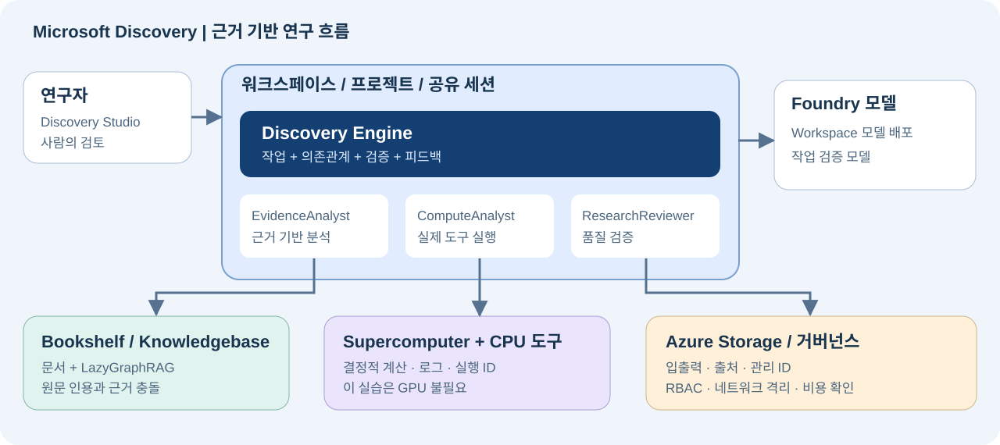

# Microsoft Discovery 핵심 기능 실습 가이드

**한국어 · 2026-10-01 실행 기반 개정 · Azure 클라우드 서비스**

[English](MICROSOFT-DISCOVERY-LAB.en.md) · [브라우저용 국문](MICROSOFT-DISCOVERY-LAB.ko.html)

**목표는 하나다. 근거를 찾고, 실제 계산으로 검증하고, 사람이 조건을 바꿨을 때 다시 평가하는 연구 흐름을 만든다.**

> **검증 범위:** 실제 Azure 배포에서 확인한 선행조건·오류·재개 절차를 반영한다. 최신 상태와 미완료 항목은 [실행 보고서](../reports/EXECUTION-REPORT.ko.md), 접근·모델 quota는 [읽기 전용 점검 결과](../../artifacts/discovery-readiness.json)를 확인한다. 리소스 생성, 데이터 평면 접근, Bookshelf 색인, 연구 실행은 각각 다른 완료 기준이다. 로컬 정답이나 ARM `Succeeded`만으로 전체 실습 성공을 주장하지 않는다.

<a id="s00"></a>
## S00 — 시작하기

Microsoft Discovery 클라우드 서비스는 **2026-06-02 GA**되었다. 별도 **Discovery 데스크톱 앱과 unified Workbench는 Preview**이며, 이 가이드의 필수 경로가 아니다. 정적 `kind: workflow` 에이전트 대신 **Discovery Engine**을 사용한다. 문서의 역할 이름에 `(Preview)`가 남아 있어도 실제 구독의 표시 이름에서는 빠질 수 있다. 자동화는 검증한 역할 GUID를 사용하며 이름 변경을 권한 변경으로 추정하지 않는다.[S01][] [S03][] [S10][] [S28][]

| 대상 | 따라갈 경로 |
|---|---|
| 환경을 준비하는 관리자 | L00 → L01 → L02 → L03, 이어서 L05의 1–5단계로 도구 준비 |
| 준비된 환경을 사용하는 연구자 | 아래 H01–H06 확인 → L04 → L05의 6–8단계 → L06 → L07 → L09 |
| 협업·권한까지 확인하는 팀 | L08 추가. 실제 검증에는 별도 테스트 사용자가 필요하다 |
| 도구 확장까지 실습하는 개발자 | E01과 E02 추가 |

**역할 경계:** Bookshelf·노드 풀·Registry·도구 생성과 색인 준비는 관리자 또는 해당 자원의 명시적 권한 보유자가 담당한다. Project Contributor만으로 이 모든 작업이 허용되는 것은 아니다. 필요한 단계에서 관리자와 협업하며, 실습 편의를 위해 모든 연구자에게 구독 Owner를 부여하지 않는다. [S20][]

**연구자 시작 체크:** 관리자가 아래 실제 값과 준비 상태를 전달하면 인프라 생성 단계를 반복하지 않고 L04부터 시작한다. 이름 예시나 구두 확인만으로 준비 완료로 보지 않는다.

| ID | 전달·확인할 항목 |
|---|---|
| H01 | 실제 Workspace/Project URL·리소스 ID, `thermalhol`의 성공 상태와 올바른 테넌트 |
| H02 | `gpt-5-4` 배포 존재·사용 가능 상태 |
| H03 | `thermal-evidence` version `1`, TXT 4개 연결, 색인 `Succeeded` |
| H04 | `thermaldata`, `evidencepack`/`candidatecsv`의 실제 Asset ID, 원본 CSV 8행 |
| H05 | `thermal-ranking` Tool ID·정의 버전·image digest, `cpulab`의 전체 Node pool ID |
| H06 | 연구자의 프로젝트·모델·도구·KB 권한, 입력/출력 파일에 대한 Blob·네트워크 접근 |

환경 승인·배포·색인 대기는 별도다. 연구자 실습은 **약 2–3시간의 계획 범위**로 잡되 완료 시간을 보장하지 않는다. 실습당 공통 순서는 **목표 → 실행 → 완료 기준**이다. 뒤의 Lab은 앞의 완료 기준을 통과한 뒤 진행한다.

**용어를 먼저 구분한다.** Workspace는 공용 인프라 경계, Project는 연구·접근 경계, Shared session은 관련 작업을 묶는 연구 세션이다. 문서/API의 *investigation*은 Shared session과 연관된 연구 컨테이너 용어다. Discovery Storage Container는 Azure Blob 컨테이너 자체가 아닌 **저장소 참조 리소스**다.[S02][] [S12][] [S16][]



<a id="s01"></a>
## S01 — 핵심 기능 커버리지

기본 실습은 네 가지 중심 기능인 **에이전트, 지식 그래프, 계산, Discovery Engine**과 이를 운영하는 데이터·보안·협업을 다룬다. E01/E02는 같은 플랫폼의 확장 기능을 다루며 추가 권한·연결 기능의 가용성을 확인해야 한다.

| ID | 기능 | 실습 | 확인할 증거 |
|---|---|---|---|
| C01 | Studio, Workspace, Project, Shared session | L01, L04 | 리소스 ID, 성공 상태, 세션 |
| C02 | Storage Container/Asset, 파일 읽기·쓰기·공유 | L02, L04, L06 | 원본 경로, 출력 Asset ID, 파일 내용 |
| C03 | Bookshelf, GraphRAG, 색인, 인용·근거 비교 | L03, L04 | 색인 성공, 실제 원문 인용 |
| C04 | Prompt Agent, 모델 선택, 구조화 응답, 버전·재사용 | L04 | 모델 배포 이름, JSON 필드, 버전 |
| C05 | Supercomputer, 노드 풀, Action Tool, 실행·로그 | L05 | operation ID, 성공 상태, 실제 JSON |
| C06 | Cognition, 작업 의존관계, 검증·재시도 | L06 | 작업 트리, 실행 이력, 검증 의견 |
| C07 | 가설·조건 수정, 사람의 피드백, 재개 | L07 | 수정 전후 결과와 새 실행 ID |
| C08 | 협업, 프로젝트 RBAC, 연결 자원 권한 | L08 | 다른 사용자의 허용·거부 결과 |
| C09 | 추적성, 산출물 보존, 재현성 | L06, L09 | 인용·입력·버전·계산·출력 연결 |
| C10 | 관리 ID, 네트워크, 암호화, 비용·종료 | L00, L01, L09 | 접근 설정, 잔여 작업·자원·비용 |
| C11 | Code-environment 및 Hybrid Tool | E01 | 생성 코드, 실제 실행 로그, 출력 |
| C12 | 외부 MCP/OpenAPI·과학 모델 연동 방식 | E02 | MCP 호출 증거, 통합 방식 선택 |

**범위 밖:** 데스크톱 앱 설치, Preview Workbench 활성화, 모든 파트너 모델의 평가, 실제 물리 실험·로봇 제어, GPU 성능 벤치마크. 이런 항목을 이 실습의 실행 성과로 주장하지 않는다.

<a id="s02"></a>
## S02 — 시나리오와 정답 기준

**질문:** 가상의 방열판 소재 8개에서 모든 제약조건을 만족하는 상위 2개를 추천하라. 문서 충돌은 최신 정정으로 해결하고, 누락된 근거를 만들어내지 마라.

데이터는 전부 이 실습을 위해 작성한 **합성 데이터**다. 실제 공급업체 정보·논문·측정·안전 인증이 아니다. 두 언어판은 같은 영문 원본 코퍼스를 사용하며, 가이드와 에이전트 응답 언어를 달리한다.

| 파일 | 역할 |
|---|---|
| `data/bookshelf/01_requirements.txt` | REQ-001: 요구조건·점수식 |
| `data/bookshelf/02_candidate_catalog.txt` | CAT-001: 초기 후보 값 |
| `data/bookshelf/03_screening_results.txt` | TEST-001: 부식 결과·결측 |
| `data/bookshelf/04_revision_notes.txt` | REV-001: GAMMA 정정·후속 조건 |
| `data/materials.csv` | 정정 반영 계산 입력. 독립된 추가 증거는 아님 |
| `scripts/score_materials.py` | 표준 라이브러리만 사용하는 기준 계산기 |
| `scripts/verify_ranking.py` | 내려받은 원본 계산 JSON의 전체 계약 검증. 실행 위치는 증명하지 않음 |
| `tools/thermal-ranking/` | CPU 도구 Dockerfile·정의 템플릿 |
| `config/lab.json` | 이번 실습의 계정·구독·리전 설정 |

| 항목 | 반드시 만족할 조건 |
|---|---|
| 열전도율 | ≥ 180 W/(m·K) |
| 밀도 | ≤ 3.00 g/cm³ |
| 원가 | ≤ 5.00 USD/kg |
| 재활용 함량 | ≥ 50% |
| 부식 평가 | `pass`; `unknown`은 통과가 아님 |

적격 후보만 점수를 계산한다. `recycled_pct`는 0–100 값이다. 최종 점수는 소수 첫째 자리로 반올림하고 동점은 candidate ID 오름차순으로 정렬한다.

```text
score = 50 * min(conductivity_w_mk / 250, 1)
      + 30 * max(0, 1 - cost_usd_kg / 5)
      + 20 * min(recycled_pct / 100, 1)
```

| 후보 | 기본 조건 판정 | 점수 / 이유 |
|---|---|---|
| ALPHA | eligible | 67.8 |
| BETA | excluded | 밀도·원가 초과, 재활용 함량 미달 |
| GAMMA | excluded | REV-001의 175 적용; 열전도율 미달 |
| DELTA | eligible | 68.6 |
| EPSILON | excluded | 원가 초과 |
| ZETA | needs_review | 부식 근거 없음 |
| ETA | excluded | 재활용 함량 미달 |
| THETA | eligible | 60.8 |

**기본 정답:** DELTA → ALPHA → THETA, 추천 상위 2개는 DELTA/ALPHA. **후속 정답:** 원가 상한만 3.00으로 바꾸면 DELTA 1개만 적격, 점수는 68.6이다. 점수식의 원가 분모 **5는 그대로** 둔다.

**판정 순서:** 확실한 제약조건 위반이 하나라도 있으면 `excluded`, 위반은 없지만 근거가 빠졌으면 `needs_review`, 나머지는 `eligible`이다. 따라서 후속 조건의 ZETA는 원가 초과로 `excluded`이지만 부식 근거는 여전히 미확보다.

<a id="l00"></a>
## L00 — 접근·비용·역할 준비

**목표:** 사용 승인, Azure 권한, 네트워크, 비용을 서로 다른 선행조건으로 확인한다.

**실행:**

1. `config/lab.json`과 로그인 계정을 대조한다. 이번 대상은 `junwoojeong@MngEnvMCAP757124.onmicrosoft.com`, 구독 `51531604-2337-4c05-bc05-3c3d4ff154e5`, 테넌트 `46e9cdaa-fed3-4131-aa28-c1fc8a8a043a`다. 다른 구독의 기본값에 의존하지 않는다.
2. Microsoft 담당자를 통해 **Discovery 사용이 활성화된 구독**인지 확인한다. 비용 동의나 Contributor 권한은 서비스 allow-list 승인을 대체하지 않는다.[S03][] [S04][]
3. Azure Portal → Subscriptions → 대상 구독 → Resource providers에서 `Microsoft.Discovery`와 공식 문서의 의존 Provider를 확인·등록한다. 등록에는 적절한 구독 권한이 필요하다. 아래 명령은 읽기 전용이다.

```bash
az provider show --namespace Microsoft.Discovery \
  --subscription 51531604-2337-4c05-bc05-3c3d4ff154e5 \
  --query "{state:registrationState,types:resourceTypes[].resourceType}"
```

4. `Registered`뿐 아니라 `workspaces`/`supercomputers`/`bookshelves` 유형과 실제 Workspace 목록 API의 성공을 확인한다. **`DefaultFeature=Pending`만으로 접근 실패를 판정하지 않는다.** 2026-10-01에는 이 값이 Pending인 채 `DiscoveryEnabled`/`DiscoveryPreview`/`PublicPreview`가 Registered이고 목록 API가 정상 응답했다. 반대로 Provider 등록만으로 quota·배포·실행 성공을 판정하지 않는다. 개발용 feature를 임의 등록하지 않는다.
5. 관리자는 Platform Administrator persona와 관리 ID의 최소 역할을 준비한다. **역할을 부여할 권한**은 별도다. Owner/RBAC Administrator/User Access Administrator 등 실제 할당 권한을 확인한다. 연구자·검토자의 프로젝트 역할은 L08에서 다룬다.
6. 관리자는 공식 절차에 따라 Discovery control-plane service App(`92c174ac-8e41-4815-a1b7-d81b19ab03ce`)의 **Discovery NSP Perimeter Joiner + Reader** 구독 역할을 검토·구성한다. 일반 Contributor만으로 역할 할당까지 된다고 가정하지 않는다.[S18]
7. 지원 생산 리전 **East US / Sweden Central / UK South** 중 하나를 선택한다. 이 실습은 `swedencentral`을 사용한다. A01의 모델·VM quota와 상시 인프라 비용을 확인한다.
8. 정상 MFA·보안 키 로그인을 완료한다. 사설 접근 경로라면 VPN/ExpressRoute와 Blob 접근 경로를 준비한다. Portal 로그인, Studio 접근, Blob 파일 열기는 각각 확인한다.

**LoadBalancer의 별도 네트워크 선행조건:** [공식 문제 해결 문서](https://learn.microsoft.com/azure/microsoft-discovery/troubleshoot-microsoft-discovery#supercomputer-deployment-stalls-because-a-required-public-ip-feature-isnt-registered)에 따라 `Microsoft.Network/AllowBringYourOwnPublicIpAddress`를 확인한다. Discovery 사용 활성화나 `Microsoft.Network=Registered`만으로 이 feature 등록을 대신할 수 없다.

```bash
az feature show --namespace Microsoft.Network \
  --name AllowBringYourOwnPublicIpAddress \
  --subscription 51531604-2337-4c05-bc05-3c3d4ff154e5 \
  --query "{name:name,state:properties.state}"
```

`NotRegistered`일 때만 구독의 feature 등록 권한을 가진 관리자가 다음 **변경 명령**을 실행한다. Feature가 `Registered`인 것을 확인한 뒤 Provider를 다시 등록한다. `Pending`이면 승인 완료로 간주하지 않는다.

```bash
az feature register --namespace Microsoft.Network \
  --name AllowBringYourOwnPublicIpAddress \
  --subscription 51531604-2337-4c05-bc05-3c3d4ff154e5
az provider register --namespace Microsoft.Network \
  --subscription 51531604-2337-4c05-bc05-3c3d4ff154e5 --wait
```

2026-10-01 오후에는 현재 계정의 상속 Owner 권한으로 즉시 `Registered` 응답을 받았으며 Provider 재등록과 독립 재조회도 완료했다. 이 구독에서는 별도 Microsoft 승인 대기가 없었다. 사용자 동의만으로 RBAC 권한이 생기거나 다른 구독의 승인이 보장되는 것은 아니다. 이 feature 등록은 AKS 지역 용량이나 모델 quota 증액과도 별개다.

브라우저 없이 다음 읽기 전용 점검을 실행한다. `config/lab.json`의 계정·테넌트·구독을 검증하며 토큰은 저장하지 않는다. 반환 코드 `0`은 선택한 접근·모델 quota 검사 통과, `2`는 선행조건 차단, `1`은 조회/인증 오류다.

```bash
npm run readiness
npm run readiness -- --require core
```

기본 명령은 Bookshelf까지 포함한다. `--require core`는 Workspace용 GPT-5.4만 별도 판정하며 Bookshelf의 부족한 quota를 숨기지 않는다. 신규 할당에 필요한 **미할당 quota**를 보는 보수적 사전 점검이다. 이미 배포한 모델을 재사용할 때는 실제 배포별 할당도 확인하고 같은 모델을 중복 생성하지 않는다. 두 명령 모두 VM·역할·네트워크·Studio 실습 성공을 증명하지 않는다.

Bookshelf quota만 부족하면 L01 기반/코어를 별도 준비할 수 있지만 L03과 H03을 미완료로 남기고 전체 연구 실습을 통과시키지 않는다.

**완료 기준:** 선택한 단계의 서비스 접근·Provider·권한·quota·클라이언트 연결·비용 확인이 끝났다. 막힌 단계와 그 의존 단계는 배포하지 않는다.

<a id="l01"></a>
## L01 — Workspace와 Project 만들기

**목표:** 연구자 실습에서 공통으로 사용할 인프라를 만든다. 이미 준비된 환경이면 마지막 완료 기준만 확인한다.[S03][] [S18][]

**실행:**

1. `config/lab.json`과 같은 전용 RG **`rg-discovery-hol-20260930`**를 사용한다. 과거 보고서의 `20260925` RG와 섞지 않는다. Workspace·저장소·Bookshelf 이름은 전역 고유성을 확인한다. Workspace는 소문자 영문, Project `thermalhol`은 소문자·최대 12자다. 아래 이름의 실제 생성 여부는 실행 보고서와 Azure GET으로 확인한다.
2. VNet `vnet-discovery-hol`을 만든다. `10.80.0.0/16`은 예시이며 기존 네트워크와 겹치면 승인된 대역으로 바꾼다.

| 서브넷 | 예시 CIDR | 설정 |
|---|---|---|
| `supercomputerNodepoolSubnet` | `10.80.1.0/24` | Microsoft.Storage 서비스 엔드포인트 |
| `aksSubnet` | `10.80.2.0/24` | Microsoft.Storage 서비스 엔드포인트 |
| `workspaceSubnet` | `10.80.3.0/24` | Microsoft.App/environments 위임 + Storage 엔드포인트 |
| `privateEndpointSubnet` | `10.80.4.0/24` | Workspace 전용 |
| `agentSubnet` | `10.80.5.0/24` | Microsoft.App/environments 위임 + Storage 엔드포인트 |
| `searchSubnet` | `10.80.6.0/24` | Bookshelf 전용, Microsoft.App/environments 위임 + Storage 엔드포인트 |
| `bookshelfPeSubnet` | `10.80.7.0/24` | Bookshelf 전용 |
| `storagePeSubnet` | `10.80.8.0/24` | 조직 정책에 맞춘 고객 Blob Storage Private Endpoint 전용 |
| `blobClientSubnet` | `10.80.9.0/24` | 선택적 관리자용 사설 Blob 클라이언트 VM, 인바운드 차단 |

3. UAMI `id-discovery-hol`을 만들거나 재사용한다. RG에 Discovery Platform Contributor, 데이터 계정에 Storage Blob Data Contributor, Registry에 AcrPull을 부여한다. Supercomputer의 cluster/kubelet/workload에 같은 UAMI를 사용하므로 VNet의 Network Contributor와 해당 UAMI의 Managed Identity Operator도 준비한다. 실행 사용자에게도 Blob 데이터 역할이 필요하며 Owner는 이를 대체하지 않는다. 서브넷은 다른 Workspace/Bookshelf와 공유하지 않는다.
4. Standard LRS Storage account와 `discoveryinputs`, `discoveryoutputs` 컨테이너를 만든다. **이 구독의 조직 정책은 Storage 공개 네트워크를 비활성화한다.** 템플릿도 `publicNetworkAccess=Disabled`, 공유 키·익명 Blob 비활성으로 맞추고, 아래 Private Endpoint/DNS 단계와 승인된 VNet 내 클라이언트 경로를 사용한다. IP 허용 규칙만으로 이 정책을 통과할 수 없다. CORS는 `https://studio.discovery.microsoft.com`, `https://vscode.dev`, `https://*.vscode-cdn.net`, GET/HEAD/PUT/DELETE/OPTIONS, 헤더 `*`, Max age 200이다. CORS는 인증이나 사설 연결을 대체하지 않는다.
5. Portal → **Microsoft Discovery Supercomputers → Create**에서 VNet, `aksSubnet`, 시스템 SKU `Standard_D4s_v6`, Cluster/Kubelet/Workload identity를 설정한다. 템플릿은 `outboundType=LoadBalancer`로 명시적 egress를 사용한다. 서브넷의 `defaultOutboundAccess=false`가 모든 아웃바운드를 막는다는 뜻은 아니다. 이후 **Settings → Node pool → Create**에서 `cpulab`을 만든다. 도구용 사용자 풀은 min 0 / max 1, GPU 0이며 상시 시스템 풀과 다르다.
6. **Microsoft Discovery Workspaces → Create**에서 서브넷·UAMI·Supercomputer를 연결한다. 이 실습은 **`NetworkIsolation=true` + `publicNetworkAccess=Enabled`**다. 관리 리소스의 격리는 유지하면서 Studio/REST의 인증된 서비스 진입점을 사용한다. 이를 `NetworkIsolation=false` 또는 익명 접근과 혼동하지 않는다. Workspace 자체를 private-only로 만들려면 별도 Discovery private endpoint·DNS·VPN/ExpressRoute를 먼저 준비한다. Preview Workbench 태그는 추가하지 않는다. 기본 MMK를 사용하며 CMK는 별도 Key Vault·권한 구성이 필요하다.
7. Workspace의 **Settings → Chat Model Deployments**에서 검증용 배포 **`gpt-5-4` / 모델 `gpt-5.4`**가 실제 존재하는지 확인한다. 없으면 만든다. cognition용 자동 배포와 구분한다. 다른 에이전트 모델을 추가하더라도 이 배포를 임의로 대체하지 않는다.
   **이 실습의 확정 할당:** 자동 cognition `gpt-5.4` **250,000 TPM** + 검증 `gpt-5-4` **250,000 TPM**, 둘 다 **Global Standard**, 합계 **500,000 TPM**다. kTPM/`sku.capacity` 입력은 각 **250**이다. 모델은 `gpt-5.4`, 버전은 `2026-03-05`로 구분해 확인한다. cognition에 남은 quota 전체를 할당하면 검증 배포가 차단되므로 250,000 TPM를 남겨 둔다. Data Zone은 이번 최종 구성에 사용하지 않는다.
8. Studio <https://studio.discovery.microsoft.com> → **Data → Storage Containers (new) → Create Container**에서 `thermaldata`를 만들고 Storage account를 연결한다. 이것은 Blob 계정의 참조이며 데이터 복사가 아니다.
9. **Workspaces → 대상 Workspace → Create Project**에서 `thermalhol`과 Storage Container를 연결한다. 관리자는 Workspace managed resource group(MRG)의 실제 데이터 권한을 확인하고, 없을 때 필요한 사용자에게 Foundry User를 부여한다. 이번 실행에서는 서비스가 사용자에게 MRG 범위 Foundry Owner를 이미 부여했으므로 중복 Foundry User를 추가하지 않았다. 관리 plane Owner만 있는 경우와 구분한다.
10. 생성된 리소스 ID와 MRG 목록을 기록한다. `Accepted`가 아닌 **`Succeeded`**를 기다린다. Discovery 리소스의 태그는 생성 후 변경 불가하다는 문서 제약이 있으므로 생성 전에 확정한다.

### 기존 기반에서 재개하는 CLI 경로

**2026-10-01 저녁 교차 리전 실행:** 아래 기본 명령은 이전 Sweden Central 단일 리전 환경용이다. 현재 요청은 **home=`swedencentral`, target compute=`koreacentral`**이며 [별도 매개변수와 단계별 재개 절차](../deployment-reference/06-resume-runbook.ko.md)를 따른다. Discovery의 `location`을 한국 중부로 바꾸거나 기존 Workspace에 태그만 덧붙여 이동시키지 않는다. 새 지원 자원과 생성 시 `discovery.overridemrgregion` 태그를 사용하고, 기존 데이터·모델은 보존한다. 아래 기본 명령을 새 `-kc` 환경에 그대로 실행하지 않는다.

템플릿은 단계별로 분리했다. **삭제 모드/Complete 모드를 사용하지 않는다.** 신규 환경만 `infra/main.bicep`과 `infra/identity.bicep`으로 초기 기반을 만든다. 이 저장소의 현재 RG/VNet/UAMI는 이미 있으므로 재생성하지 않는다. 기존 3개 서브넷에 대한 전체 VNet PUT은 실제 검증에서 `IncompatibleDelegations`로 실패했으며, 추가 4개만 child resource로 생성하도록 수정했다. 확장 후 예전 3개짜리 VNet 템플릿을 다시 배포하지 않는다.

| 순서 | 템플릿 | 확인할 결과 |
|---|---|---|
| 1 | `infra/access.bicep` | 공식 control-plane SP의 NSP Joiner + Reader. 해당 역할이 이미 다른 GUID로 존재하면 중복 생성하지 말고 관리자와 재사용 |
| 2 | `infra/expand-network.bicep` | 새 서브넷 4개만 추가, 기존 3개 유지 |
| 3 | `infra/lab-foundation.bicep` | LRS Storage·Blob 컨테이너 2개·Basic ACR·범위를 제한한 역할 |
| 4 | `infra/discovery-core.bicep` | Supercomputer·cpulab·Workspace·모델·Storage Container/Asset·Project |
| 5 | `infra/storage-private-access.bicep` | 전용 8번째 서브넷·Blob Private Endpoint·Private DNS. 기존 동일 DNS zone/VNet link가 있으면 재사용 |

아래 값을 확인한다. 구독·리전이 다른 이름을 섞지 말고, 다른 환경에서는 Bicep의 이름 매개변수도 함께 변경한다.

```bash
SUBSCRIPTION_ID='51531604-2337-4c05-bc05-3c3d4ff154e5'
RESOURCE_GROUP='rg-discovery-hol-20260930'
LOCATION='swedencentral'
az account set --subscription "$SUBSCRIPTION_ID"
az account show --query "{subscription:id,tenant:tenantId,user:user.name}"
CONTROL_PLANE_OBJECT_ID=$(az ad sp show \
  --id 92c174ac-8e41-4815-a1b7-d81b19ab03ce \
  --query id -o tsv)
ADMIN_OBJECT_ID=$(az ad signed-in-user show --query id -o tsv)
```

`az ad`는 Microsoft Graph 명령이라 `--subscription`을 받지 않는다. 위에서 CLI 구독 문맥을 명시적으로 선택한 후 표시된 테넌트·계정을 L00과 대조한다. ARM 명령에는 계속 `--subscription`을 명시한다.

먼저 각 단계의 `what-if`를 실행해 예상 범위만 변경되는지 확인한 뒤 **같은 명령의 `what-if`를 `create`로 바꿔** 실행한다. 단계가 끝나면 다음 단계로 진행한다. RG 배포는 기본 Incremental 모드를 유지한다.

```bash
az deployment sub what-if --name discovery-access-20261001 \
  --subscription "$SUBSCRIPTION_ID" --location "$LOCATION" \
  --template-file infra/access.bicep \
  --parameters discoveryControlPlaneObjectId="$CONTROL_PLANE_OBJECT_ID"

az deployment group what-if --name discovery-network-expansion-20261001 \
  --subscription "$SUBSCRIPTION_ID" --resource-group "$RESOURCE_GROUP" \
  --template-file infra/expand-network.bicep

az deployment group what-if --name discovery-foundation-20261001 \
  --subscription "$SUBSCRIPTION_ID" --resource-group "$RESOURCE_GROUP" \
  --template-file infra/lab-foundation.bicep \
  --parameters administratorObjectId="$ADMIN_OBJECT_ID"

az deployment group what-if --name discovery-core-20261001 \
  --subscription "$SUBSCRIPTION_ID" --resource-group "$RESOURCE_GROUP" \
  --template-file infra/discovery-core.bicep
```

**정책 교훈:** 최초 Storage 배포의 what-if는 공개 진입점과 선택 IP를 표시했지만, 실제 생성 중 관리 그룹 정책 `StorageAccount_PublicNetwork_Modify`가 이를 Disabled로 바꿨다. RG 수준 정책 목록이 비어 있어도 상위 관리 그룹 정책이 없다는 뜻이 아니다. Activity Log의 `Microsoft.Authorization/policies/modify/action`과 실제 GET을 확인한다. 템플릿을 정책에 맞춰 고쳤으며 정책·방화벽을 해제하지 않는다.

`privatelink.blob.core.windows.net` zone과 대상 VNet link를 확인한다. 없으면 다음 템플릿으로 생성한다. 이미 있으면 그 zone이 이 VNet에 연결된 것을 확인하고 `existingBlobPrivateDnsZoneId` 매개변수로 실제 ID를 넘긴다. 동일 namespace의 DNS zone을 중복 연결하지 않는다. 이 단계는 Storage/VNet에만 의존하므로 코어의 지역 용량을 기다리는 동안 별도로 준비할 수 있다.

```bash
az deployment group what-if --name discovery-storage-private-20261001 \
  --subscription "$SUBSCRIPTION_ID" --resource-group "$RESOURCE_GROUP" \
  --template-file infra/storage-private-access.bicep
```

확인 후 `create`로 실행하고, **VNet 내부 또는 승인된 VPN/ExpressRoute 클라이언트에서** Blob FQDN의 사설 IP 해석과 Entra 기반 파일 접근을 검사한다. Private Endpoint를 만든 것만으로 로컬 노트북에 VPN이 생기지는 않는다. 모델·서브넷·역할이 준비되어도 하위 서비스 배포는 실패할 수 있으므로 실제 오류를 보존한다.

```bash
az deployment group show --name discovery-core-20261001 \
  --subscription "$SUBSCRIPTION_ID" --resource-group "$RESOURCE_GROUP" \
  --query "{state:properties.provisioningState,error:properties.error}"
az deployment operation group list --name discovery-core-20261001 \
  --subscription "$SUBSCRIPTION_ID" --resource-group "$RESOURCE_GROUP" \
  --query "[?properties.provisioningState=='Failed'].properties"
```

**Workspace-only 분리 준비의 한계:** GA Workspace 스키마의 `supercomputerIds`는 선택 항목이라 다음 경로로 컴퓨트와 별도 준비를 검증할 수 있다. **지역 용량 문제의 우회책은 아니다.** 이번 실제 실행에서는 Supercomputer를 제외해도 Workspace의 내부 Container Apps가 `ManagedEnvironmentCapacityHeavyUsageError` → `AKSCapacityHeavyUsage`로 실패했다. 먼저 지역 용량을 해결한다. 진행 중인 배포와 겹치는 쓰기는 피하고, 취소가 필요하면 상태/오류를 보존한 뒤 해당 배포만 정상 취소한다. 취소는 이미 만든 리소스를 삭제하거나 RP 하위 작업을 즉시 중단한다고 보장하지 않는다.

```bash
az deployment group what-if --name discovery-workspace-20261001 \
  --subscription "$SUBSCRIPTION_ID" --resource-group "$RESOURCE_GROUP" \
  --template-file infra/discovery-core.bicep --parameters deployCompute=false
```

이 경로의 출력은 `computeIncluded=false`, 컴퓨트 ID는 `null`이다. **새 Workspace 또는 연결된 Supercomputer가 없는 경우에만** 사용한다. 이미 연결된 환경에 적용하면 연결 목록을 비울 수 있다. 이 모드는 L01 전체, L03 색인, L05 실제 계산을 통과시키지 않는다. 용량 문제 해결 후 실제 Supercomputer/노드 풀의 성공을 확인하고 기본 경로로 연결한다. 다른 리전을 선택할 때는 VNet·Storage·Workspace를 함께 계획하며 기존 환경과 무작정 혼합하지 않는다.

**종료된 실패 상태의 재개 제한:** `validate`/`what-if`가 성공해도 실제 생성·갱신 API가 terminal `Failed` 상태를 거부할 수 있다. `Conflict` 또는 같은 의미의 상태 오류가 나오면 반복 PUT을 중단한다. [공식 복구 절차](https://learn.microsoft.com/azure/microsoft-discovery/troubleshoot-microsoft-discovery#a-discovery-resource-is-stuck-in-a-terminal-failed-state)는 원인을 해결한 뒤 **삭제 승인을 받은 실패 Discovery 리소스만** 삭제하고 새 이름으로 다시 만드는 것이다. 정상 RG·Storage·데이터를 함께 삭제하거나 관리 AKS/Container Apps를 직접 고치지 않는다.

**완료 기준:** Workspace·Supercomputer·CPU 풀·Storage Container·Project가 준비되고 필수 모델이 존재한다. Studio에서 프로젝트를 열고, 사용자와 관리 ID가 각각 필요한 Blob 경로에 접근할 수 있다.

<a id="l02"></a>
## L02 — 데이터 등록과 파일 전달

**목표:** Blob 파일과 Discovery 참조를 등록하고 이후 에이전트에 전달할 입력을 준비한다.[S15][] [S16][] [S17][]

**실행:**

1. Azure Portal의 Storage account → Containers 또는 승인된 Storage 도구로 TXT 4개를 `discoveryinputs/bookshelf/`, CSV를 `discoveryinputs/compute/`에 업로드한다. **현재 문서상 Studio에서 로컬 파일을 직접 업로드하는 흐름은 지원되지 않는다.**
2. Discovery Storage Container `thermaldata` 아래에 Storage Asset `evidencepack`과 `candidatecsv`를 등록한다. Data path는 각각 `discoveryinputs/bookshelf/`, `discoveryinputs/compute/materials.csv`다. 같은 RG/리전과 backing account를 확인한다.
3. 등록 화면의 Storage Asset 탭 또는 [공식 Storage Asset 등록 절차][S17]를 사용한다. 리소스 그룹 수준의 Storage Container/Asset이 프로젝트에 **참조**되는 구조다. 연결한 backing account와 두 Asset의 경로·상태를 확인한다.
4. 실제 원본 CSV를 내려받아 후보 8개와 GAMMA=175를 확인하고, 이후 연결할 Asset ID를 기록한다. `discovery://` URI와 Asset ID는 실제 반환값을 복사하며 추측해 만들지 않는다.
5. 에이전트의 읽기·쓰기·공유는 L04, Task에 대한 입력 연결은 L06에서 수행한다. 문자열 경로를 프롬프트에 쓰는 것만으로 데이터가 연결되는 것은 아니다.

CLI로 업로드할 때도 **L01에서 검증한 사설 접근 경로**와 공유 키 대신 Entra 로그인을 사용한다. 재실행 시 파일이 이미 있으면 원본·해시를 대조한 뒤 덮어쓰기 여부를 결정한다. 자산 템플릿은 경로 참조만 만들며 실제 파일을 업로드하지 않는다.

```bash
az storage blob upload-batch --account-name stdiscoveryholjunwoosc \
  --destination discoveryinputs --destination-path bookshelf \
  --source data/bookshelf --auth-mode login \
  --subscription "$SUBSCRIPTION_ID"
az storage blob upload --account-name stdiscoveryholjunwoosc \
  --container-name discoveryinputs --name compute/materials.csv \
  --file data/materials.csv --auth-mode login \
  --subscription "$SUBSCRIPTION_ID"
```

### 로컬 VPN 없이 입력을 준비하는 관리자 경로

이 환경에는 `infra/blob-client.bicep`으로 배포한 **`vm-discovery-blob-client`**가 있다. 공개 IP와 SSH 인바운드가 없고, 자체 관리 ID에 실습 Storage 계정의 Blob Data Contributor만 부여했다. 별도 Discovery 플랫폼 역할은 없다. `blobClientSubnet`의 Storage 서비스 엔드포인트와 기존 Blob Private Endpoint/DNS를 이용한다.

다음은 **실제 Azure 작업**이며 VM 관리 권한이 있는 관리자가 수행한다. Project Contributor만으로 VM Run Command를 실행할 수 있다고 가정하지 않는다. VM을 시작하고 5개 원본 파일을 전송한 뒤 할당 해제한다.

```bash
az vm start --name vm-discovery-blob-client \
  --resource-group "$RESOURCE_GROUP" --subscription "$SUBSCRIPTION_ID"
npm run blob:sync
az vm deallocate --name vm-discovery-blob-client \
  --resource-group "$RESOURCE_GROUP" --subscription "$SUBSCRIPTION_ID"
```

`blob:sync`는 Azure Run Command로 합성 TXT 4개와 CSV 1개만 전달한다. VM 내부 Python 표준 라이브러리와 IMDS 토큰을 사용해 Blob DNS가 `10.80.8.0/24`의 사설 IP인지 확인하고, 업로드 후 다시 읽어 원본 SHA-256을 비교한다. 키/SAS/토큰은 저장하지 않는다. 기존 파일은 해시가 같으면 재사용하고, 다르면 덮어쓰지 않고 오류를 반환한다. `artifacts/discovery-private-blob-sync.json`의 `outcome=verified`와 파일 5개의 읽기 request ID·해시를 확인한다.

2026-10-01 실제 업로드와 재실행을 모두 확인했다. **이는 원격 VM의 사설 데이터 접근 성공이며 노트북의 브라우저가 VNet에 연결됐다는 뜻은 아니다.** Storage 공개 접근과 조직 정책은 그대로 유지한다. 검증 후 VM은 할당 해제했으며 OS 디스크 비용은 남는다. 새 환경에서 클라이언트를 만들 때는 SKU/image/quota와 `what-if`를 먼저 검증하고, SSH 부트스트랩 개인 키를 저장소에 넣지 않는다.

| 데이터 경로 | 지원·주의점 |
|---|---|
| Bookshelf 색인 | 이 실습에서는 지원 형식인 TXT 4개만 사용. CSV/Python 코드를 지식 색인용으로 넣지 않음 |
| 기본 파일 도구 | TXT/MD/CSV/JSON/PY/YAML 등 텍스트. `PreviewResource`는 **처음 30 KB**까지만 반환 |
| PDF·이미지 등 바이너리 | Bookshelf의 일부 문서 색인 지원과 **별개**로, 기본 `PreviewResource`는 읽지 못함. 적절한 커스텀 도구 필요 |
| 사용자의 파일 열기 | 관리 ID가 파일을 만들 수 있어도 사용자는 별도 Blob 데이터 역할·방화벽·CORS가 필요 |

**완료 기준:** 원본 Blob 파일과 내용, Storage Container의 backing account, 입력 Asset 2개의 실제 ID·경로·성공 상태가 확인된다. 이 Lab은 에이전트나 계산 도구가 없어도 완료할 수 있다.

<a id="l03"></a>
## L03 — Bookshelf 지식 색인

**목표:** 여러 문서를 종합하는 근거 검색에 사용할 지식 색인을 만든다. 실제 검색·인용 확인은 색인이 준비된 다음 L04에서 수행한다.[S06][] [S07][]

**실행:**

1. Portal → **Microsoft Discovery Bookshelves → Create**에서 동일 구독·RG·리전, 전용 `searchSubnet`/`bookshelfPeSubnet`, UAMI를 지정한다. 생성 시 `indexSize=small`을 설정한다. **Bookshelf당 Knowledgebase 1개**가 현재 문서의 제한이다.
2. Studio → **Resources → Knowledge → Bookshelf 선택 → Create new**에서 `thermal-evidence`, version `1`을 만든다. Description/Copilot instruction에는 “합성 방열판 후보의 제약조건·카탈로그·결측·최신 정정을 근거로 종합 판단하는 자료”라고 적는다.
3. `thermaldata`와 `evidencepack`, 동일 UAMI를 연결한다.
4. A01에서 확인한 메모리 집약적 **색인 전용 풀 `indexlab`**을 준비한다. 작은 계산용 D4 풀을 그대로 색인에 사용하지 않는다.
5. Knowledgebase Details에서 Provisioning State=`Succeeded`, Status=`NotStarted`를 확인한다. **Index → Project `thermalhol` → `indexlab` → Start Indexing**을 실행한다.
6. 실제 색인 Status=`Succeeded`를 확인한다. 이 상태와 Azure 리소스의 Provisioning State는 별개다.
7. KB 이름·버전, 연결된 원본 Asset, 색인 작업과 성공 상태를 기록한다. 검색용 에이전트는 다음 Lab에서 연결한다.

**완료 기준:** TXT 4개를 가리키는 실제 원본 연결과 KB의 색인 `Succeeded`를 확인했다. 색인 성공만으로 검색 품질이나 인용까지 검증했다고 표시하지 않는다.

**갱신 주의:** 이 실습은 첫 전체 색인만 필수로 한다. 증분/재색인에 관한 공식 문서가 상충하므로 A01을 따른다. Blob 삭제가 KB에서 해당 문서를 제거한다고 가정하지 않는다.

<a id="l04"></a>
## L04 — 전문 에이전트와 모델·버전

**목표:** 역할·모델·도구·KB를 명시한 Prompt Agent를 만들고 직접 대화한다.[S08][] [S09][] [S10][] [S25][]

**실행:**

1. 프로젝트 → **Resources → Agents 옆 + → Create new agent**에서 아래 3개 에이전트를 만든다. Type은 Agent/Prompt Agent, Chat model은 배포 이름 **`gpt-5-4`**다.
2. Instructions에 아래 역할 지시문을 넣는다. 기본 Discovery 에이전트는 제품 안내용이므로 연구 에이전트를 대신하지 않는다.
3. **Knowledge Bases**에서 `thermal-evidence`를 EvidenceAnalyst와 ResearchReviewer에 연결한다. ComputeAnalyst는 이 단계에서 모델·지시문까지만 준비한다. 실제 도구 연결·호출은 L05에서 처음 수행한다.
4. **New shared session**을 만들고 L02의 입력 Asset을 실제 데이터 연결 UI로 연결한다. `@AgentName` 또는 agent selector로 EvidenceAnalyst/ResearchReviewer를 호출한다.
5. 연결한 CSV를 `GetResourceContext`로 찾고 `PreviewResource`로 읽게 한다. `WriteResource`로 후보 8개와 GAMMA=175를 확인한 `data-check.md`를 만들고, 필요하면 `ShareResource`로 공유하도록 요청한다. 실제 출력 Asset을 열어 내용을 확인한다.

**EvidenceAnalyst 지시문**

```text
당신은 합성 방열판 후보의 근거 분석가다.
연결된 thermal-evidence를 사용하고 모든 수치와 판정에 실제 원문 인용을 붙인다.
REQ-001의 조건을 따르고, GAMMA는 REV-001의 175를 우선한다.
ZETA의 부식 unknown을 통과로 바꾸거나 빠진 측정을 만들어내지 않는다.
합성 입력, 계산, 해석, 미실행 작업을 구분한다. 한국어로 답한다.
```

**ComputeAnalyst 지시문**

```text
당신은 thermal-ranking 도구를 실행하는 계산 담당자다.
기본 조건은 rank_baseline, 원가 상한 3 USD/kg 조건은 rank_cost_revision을 호출한다.
실제 실행 ID, 최종 상태, 로그와 출력 JSON Asset을 보고한다.
암산이나 로컬 기준값을 클라우드 실행 결과로 대체하지 않는다.
도구가 없거나 실패하면 차단 원인을 명시한다. 한국어로 답한다.
```

**ResearchReviewer 지시문**

```text
당신은 독립 검토자다. 실제 계산 JSON이 제공되면 문서 근거와 대조한다.
계산 결과가 아직 없으면 근거만 검토하고 산술 검증은 미완료로 기록한다.
8개 후보, 제약조건, GAMMA 정정, ZETA 결측, 순위와 점수를 확인한다.
방법, 추천, 탈락 이유, 부족한 근거, 한계를 가진 보고서를 만든다.
자료를 읽기 전에 GetResourceContext로 찾고 PreviewResource로 확인한다.
실제 실험·안전 인증을 수행했다고 주장하지 않는다. 한국어로 답한다.
```

6. EvidenceAnalyst에게 다음 질문을 보낸다. Bookshelf의 장점을 보기 위해 단순 숫자 조회보다 **문서 전체의 관계와 함의**를 묻는다.

```text
@EvidenceAnalyst
thermal-evidence의 문서 전체를 종합해 후보 선정에 영향을 주는
성능·원가·재활용 함량의 상충관계와 부족한 근거를 설명해줘.
8개 후보의 판정 표와, 결론을 바꿀 수 있는 정보가 무엇인지 제시해줘.
GAMMA의 충돌하는 값은 REV-001로 해결하고 ZETA의 unknown을 유지해줘.
모든 수치·판정의 근거를 실제로 열 수 있는 원문 인용으로 연결해줘.
최종 순위의 산술 검증은 별도 계산 도구 결과가 오기 전까지 보류해줘.
```

7. ResearchReviewer에게 같은 근거 확인 결과를 JSON으로 반환하게 한다. 다음은 **에이전트 근거 요약의 기대 형태**이며 계산 도구의 `ranking.json`이 아니다. 실제 응답과 원문을 대조하며, 예시를 복사해 성공 증거로 사용하지 않는다.

```json
{
  "candidate_count": 8,
  "gamma_conductivity_w_mk": 175,
  "missing_evidence": [
    {
      "candidate_id": "ZETA",
      "source_field": "corrosion_status",
      "observed_value": "unknown"
    }
  ],
  "synthetic_data": true,
  "arithmetic_verified": false
}
```

**JSON 요청과 JSON Schema 강제는 다르다.** 지원 모델/UI에서 schema-constrained 출력이 제공되면 명시적으로 구성하고 사용한 방식을 기록한다. 이 단계에서는 계산을 실행하지 않았으므로 `arithmetic_verified`를 `true`로 바꾸지 않는다.

8. 지시문을 한 번 개선해 저장하고 새 버전을 기록한다. 버전은 immutable이며 과거 기록과 실제 사용 버전을 구분한다. 접근 가능한 다른 프로젝트로 재사용할 때는 **Copy from project**를 사용한다. 이는 독립된 복사본이며 실시간 동기화가 아니다.

**완료 기준:** 에이전트 3개의 모델·지시문, 두 근거 에이전트의 KB 연결, 실제 파일 읽기·쓰기, 최소 3개 원문 인용, 구조화 근거 응답, 새 버전을 확인했다. ComputeAnalyst의 도구 실행은 다음 Lab의 기준이다. reasoning 모델에 지원되지 않는 `temperature`/`top_p`를 설정하지 않는다. Chat과 Task는 문맥이 분리되므로 중요한 조건·입력은 Task에도 명시한다.

<a id="l05"></a>
## L05 — 실제 CPU 도구 실행

**목표:** LLM의 설명이 아닌 Supercomputer의 실제 계산·로그·파일로 결과를 확인한다.[S21][] [S22][] [S23][] [S32][]

**실행:**

**관리자 준비는 1–5단계, 연구자 실행은 6–8단계다.**

1. 다음은 **로컬 정답 기준**을 만드는 명령이다. Azure 실행 증거가 아니다.

```bash
python3 scripts/score_materials.py --input data/materials.csv \
  --output artifacts/reference-ranking.json
python3 scripts/score_materials.py --input data/materials.csv --max-cost 3 \
  --output artifacts/reference-ranking-cost3.json
```

2. 기존 승인된 ACR을 사용하거나 관리자가 실습용 ACR을 만든다. 빌드·push 수행자 권한과 Supercomputer 관리 ID의 pull 권한은 다르다. Registry의 RBAC/ABAC 모드에 맞는 역할을 확인한다.
3. 저장소 루트에서 `<acr-name>`을 실제 이름으로 바꾸고 다음을 실행한다. **`az acr build`는 로컬 빌드가 아니라, 컨텍스트를 업로드해 Azure ACR Tasks에서 실행하는 유료 클라우드 빌드 경로**다. 로컬 Docker daemon은 필요하지 않다.

```bash
az acr build --registry '<acr-name>' \
  --subscription 51531604-2337-4c05-bc05-3c3d4ff154e5 \
  --file tools/thermal-ranking/Dockerfile \
  --image thermal-ranking:1.0.0 .
```

4. `.dockerignore`가 계산기·합성 CSV·Dockerfile만 허용하는지 확인한다. 빌드 성공, Registry의 실제 이미지와 digest를 기록한다. 버전 태그도 덮어쓸 수 있으므로 이름만으로 불변성을 보장하지 않는다.
5. `tools/thermal-ranking/tool-definition.template.json`의 복사본을 만들고 `<acr-login-server>`를 실제 값으로 교체한다. Portal → **Microsoft Discovery Tools → Create → Basics**에서 Name=`thermal-ranking`, Region=`swedencentral`, **Definition content file**=수정한 JSON, **Definition content version**=`1.0.0`을 지정한다. Environment variables는 비운다. `worker`, 두 액션, `/outputs`를 유지하고 `Succeeded`와 Tool ID를 확인한다. **GA API `2026-06-01`은 정의 객체를 `properties.definitionContent`, 리소스 버전을 `properties.version`으로 받는다.** 내부 JSON의 `version`과 리소스 버전은 별도다. S33의 Preview 예제에 있는 `properties.definitionContentVersion`을 GA 요청에 그대로 넣으면 실제 ARM 사전 검증이 실패한다.[S33]
6. ComputeAnalyst의 **Tools**에서 등록한 도구를 연결한다. 첫 수동 대화에는 **Confirm before running tool**로 승인 대기를 확인할 수 있다. Engine 실습 전에는 검토한 두 합성 액션의 승인 정책을 명시적으로 정해 자율 실행의 승인 대기를 방지한다. 비밀리에 승인 요구를 해제하지 않는다. 이후 `cpulab`에서 `rank_baseline`을 한 번 실제 실행하도록 요청한다. **이 도구는 이미지 안의 합성 CSV를 사용한다.** L02의 Blob CSV를 자동 마운트하지 않으므로 입력 변경 시 이미지 재빌드 또는 명시적 도구 변경이 필요하다.
7. operation ID와 `Succeeded`, 실제 `nodepoolId`, 로그, `ranking.json` Asset을 확인한다. `nodepoolId`는 H05에서 받은 `cpulab`의 ID와 같아야 한다. 프롬프트에 풀 이름을 적었다는 사실만으로 선택을 확인한 것은 아니다. `auto_promote: true`가 출력 공유를 설정한다. Foundry Code Interpreter 실행을 Supercomputer 실행으로 간주하지 않는다.[S32]
8. **도구가 만든 원본 파일**을 로컬에 내려받아 다음 검사를 실행한다. `<downloaded-ranking.json>`은 실제 파일 경로로 바꾼다. 에이전트의 요약 JSON이나 로컬 reference 파일을 대신 넣지 않는다.

```bash
python3 scripts/verify_ranking.py \
  --input '<downloaded-ranking.json>' --case baseline
```

검사기는 후보 8개, 모든 판정·사유·결측·출처, 순위·점수, 제약조건과 JSON 구조를 대조한다. 누락·추가 필드, 잘못된 순서, 중복 키, 유효하지 않은 숫자는 실패다. 통과 시 `content_verified: true`, **`execution_verified: false`**가 출력된다. 파일 내용 검사는 실행 위치를 증명할 수 없으므로 Azure 실행 ID·풀·로그·Asset을 별도로 확인해야 한다.

관리자는 UI 대신 다음 Bicep으로 **실제 이미지 digest에 고정한** 같은 도구를 등록할 수 있다. `what-if` 확인 후 `create`로 실행한다. ACR build 성공·도구 등록·Supercomputer 실행 성공은 서로 다른 상태다.

```bash
IMAGE_DIGEST=$(az acr repository show --name acrdiscoveryholjunwoosc \
  --image thermal-ranking:1.0.0 --subscription "$SUBSCRIPTION_ID" \
  --query digest -o tsv)
az deployment group what-if --name discovery-tool-20261001 \
  --subscription "$SUBSCRIPTION_ID" --resource-group "$RESOURCE_GROUP" \
  --template-file infra/tool.bicep --parameters imageDigest="$IMAGE_DIGEST"
```

**완료 기준:** 실제 클라우드 실행 ID·`cpulab`·로그·Asset, 원본 JSON 검사 통과가 모두 필요하다. `candidate_count=8`, `eligible_count=3`, 순위 DELTA 68.6 → ALPHA 67.8 → THETA 60.8이어야 한다. `Accepted`, `NotStarted`, 실패, 취소는 성공이 아니다. 첫 도구 실행은 cold start로 추가 시간이 걸릴 수 있다.

<a id="l06"></a>
## L06 — Discovery Engine과 검증 루프

**목표:** 작업 의존관계, 독립 검증, 파일 상속을 가진 연구 흐름을 실행한다.[S11][] [S12][] [S13][] [S14][] [S15][]

**실행:**

1. 같은 프로젝트에 새 Shared session을 만든다. **Engine은 아직 시작하지 않는다.**
2. 아래 Task를 모두 만든다. 각 Description에 합성 데이터라는 점, 입력 Asset/KB/도구, 출력 파일, 검증 요건을 명시한다. 채팅 내용을 알고 있다고 가정하지 않는다.

| Task | Parent | Depends on | 산출물·필수 검증 요건 |
|---|---|---|---|
| R0 | — | — | `baseline-summary.md`: 하위 결과를 종합하고 DELTA/ALPHA 추천, 한계 포함 |
| T1 | R0 | — | `evidence-map.md`: 8개 후보, 실제 인용, GAMMA=175, ZETA=unknown |
| T2 | R0 | T1 | `rank_baseline`의 실제 실행 ID·로그·JSON. 후보 8, 적격 3, 정확한 점수 |
| T3 | R0 | T1, T2 | `research-report.md`: 원문과 실제 JSON 대조, 8개 판정, 추천·결측·방법·한계 |

3. **Parent는 분해 관계, Depends on은 선행 조건**이다. R0를 T1의 dependency로 넣어 순환을 만들지 않는다. UI가 agent 선택을 제공하면 지정하고, 아니면 Task 의견에 적합한 에이전트와 이유를 적는다. 실제 선택 결과는 이력으로 확인한다.
4. 입력 Asset을 Task 또는 부모에 연결한다. 부모 입력은 하위 Task로, dependency의 출력은 후속 Task로 상속된다. 형제 관계만으로 출력이 공유되지 않으며, 다른 Shared session으로 자동 전달되지 않는다.
5. Discovery Engine을 시작한다. `New → Executing → Validating → Complete`와 validation comments를 확인한다. 검증 실패는 `Incomplete`와 재시도 또는 `Needs User Attention`으로 이어질 수 있다.
6. T3가 `GetResourceContext`/`PreviewResource`로 상속 파일을 실제 읽는지 확인한다. 파일 내용이 프롬프트에 자동 주입되는 것은 아니다. 루트의 출력 모음과 후속 에이전트의 입력 상속도 서로 다른 메커니즘이다.
7. `Complete` 표시만 보지 말고 파일 **내용**을 검증한다. 필수 Task가 실패·보류·사람 검토 필요 상태이면 실습을 통과시키지 않는다. Engine이 세션을 종료한 것이 전체 연구 성공을 보장하지 않는다.

**완료 기준:** R0/T1/T2/T3의 관계, 실제 실행, 검증 의견, 입력·출력 Asset 연결을 확인했다. 필수 결과가 S02와 일치하고, T3와 R0의 보고서를 열 수 있다.

**자율성 확장:** 기본 경로가 끝난 뒤 원하면 별도 세션에 범위가 제한된 목표 1개를 주어 cognition의 하위 작업 생성을 관찰한다. 8개 합성 후보만 허용하고 추가 클라우드 배포·물리 실험을 금지한다. 이는 고정 절차, guided exploration, autonomous research의 차이를 보는 선택 실습이며 결과·시간·비용이 같다고 보장하지 않는다.[S29]

<a id="l07"></a>
## L07 — 조건 수정과 사람의 피드백

**목표:** 근거·실행 이력을 보존한 채 새 가설을 검증하고 재평가한다.

**실행:**

1. **기본 Task가 모두 완료된 뒤 Engine을 Stop**한다. 남아 있는 실행을 확인해 완료를 기다리거나, 필요한 경우 정확한 operation을 정상 취소한다. 실행 중 작업이 없는 상태에서 기존 결과를 보존한다.
2. 검증할 가설은 “원가 상한을 3.00으로 낮추면 DELTA만 남는다”다. 같은 Shared session에서 **Engine이 꺼진 상태로** 아래 후속 Task와 의존관계·검증 요건을 모두 구성한다. 완료된 기본 결과를 덮어쓰지 않는다. 이는 실제 물성 실험이 아닌 합성 데이터 조건 검증이다.

| Task | Depends on | 산출물·필수 검증 요건 |
|---|---|---|
| T4 | T3 | `rank_cost_revision` 실제 실행, 새 operation ID, `ranking-cost3.json`, 적격 DELTA 1개·68.6 |
| T5 | T3, T4 | `comparison.md`: 3개 → 1개 변화 이유, 분모 5 유지, 해결되지 않은 ZETA 결측 |

3. Task Description과 의견에 다음을 넣는다.

```text
원가 상한만 5.00에서 3.00 USD/kg으로 바꾼다.
다른 제약조건과 점수식의 분모 5는 유지한다.
thermal-ranking의 rank_cost_revision을 실제 실행하고 별도 결과를 저장한다.
이전 근거와 결과를 보존하며, 빠진 부식 결과나 새로운 측정값을 만들지 않는다.
비교 보고서에는 가설의 검증 결과와 실제로 추가 확보해야 할 근거를 구분한다.
```

4. 구성과 실행 대기 상태를 확인한 뒤 **Engine을 Start**한다. 기존 파일·이력이 보존되고 새 작업이 실행되는지 확인한다. 재시작 시 working memory는 재구성된다. **Stop은 이미 실행 중인 에이전트/도구를 모두 취소하지 않는다.** 실행 중인 Task의 상태를 임의로 바꾸거나 같은 작업을 다시 제출하지 않는다.[S13]
5. T4/T5 완료 후 Engine을 Stop하고 잔여 작업을 확인한다. `ranking-cost3.json` 원본을 내려받아 다음을 실행한다.

```bash
python3 scripts/verify_ranking.py \
  --input '<downloaded-ranking-cost3.json>' --case cost3
```

6. 검사나 Task 검증이 실패하면 원인을 수정한다. 수정·재시도도 **Stop → 잔여 실행 확인 → 수정 → Start** 순서를 따른다. GAMMA 정정이나 ZETA 결측 같은 올바른 기준을 없애 단순히 통과시키지 않는다.

**완료 기준:** 별도 실행 ID·`cpulab`·원본 파일과 `cost3` 검사 통과로 DELTA 1개·68.6을 확인했다. ZETA는 원가 초과로 `excluded`이되 결측 기록이 남는다. 기본 결과·이력을 보존하고 반사실적 가정을 실제 관측으로 바꾸지 않는다.

<a id="l08"></a>
## L08 — 협업과 프로젝트 접근 제어

**목표:** 같은 프로젝트의 협업과 다른 프로젝트·연결 자원의 접근 경계를 확인한다.[S19][] [S20][]

**실행:**

1. 관리자가 실제 테스트 사용자/그룹과 접근 거부를 확인할 미할당 비교 프로젝트를 준비한다. **별도 사용자나 비교 프로젝트가 없으면 해당 검증은 보류**다. 같은 계정의 두 브라우저 창은 다중 사용자 권한 검증이 아니다. 비교 프로젝트를 새로 만들려면 추가 비용·범위를 먼저 승인받는다.
2. 기존 프로젝트 `thermalhol`의 정확한 ARM scope에 역할을 부여한다. 부모 Workspace/RG/구독의 상속 권한도 확인한다.

| 대상 | 프로젝트 역할 | 필요한 연결 자원 역할 |
|---|---|---|
| 작성·실행 연구자 | Microsoft Discovery Project Contributor (Preview) | 작성 시 Tools Reader·Chat Model Reader, 필요한 Storage Container/Blob·Bookshelf 역할 |
| 결과 검토자 | Microsoft Discovery Project Reader (Preview) | Storage Container Reader + Storage Blob Data Reader, 필요 시 Bookshelf Index Data Reader |

3. 역할은 각각 승인된 자원에만 부여한다. **Project Contributor는 새 Project 생성이나 역할 할당 권한이 아니다.** Storage Container 메타데이터 권한은 Blob 내용 읽기 권한을 대신하지 않는다.
4. 연구자가 같은 프로젝트의 Shared session·Task·산출물을 확인하고 허용된 변경을 하는지 검증한다. 검토자는 읽기만 가능하고 작업 생성·수정·실행은 거부되어야 한다.
5. 다른 프로젝트 접근 거부를 확인한다. 테스트 사용자에게 광범위한 상속 권한이 있으면 “격리 성공”을 주장하지 말고 테스트 범위를 다시 설정한다.
6. 기존 agent 실행과 agent 작성 권한을 구분한다. 관리자가 만든 에이전트의 실행만을 위해 Tools Reader/Chat Model Reader가 항상 필요한 것은 아니다. 기본 `gpt-5-4`를 쓰는 Engine에도 별도 Chat Model Reader가 반드시 필요한 것은 아니다.
7. 도구/모델 연결 권한 회수는 에이전트의 생성·수정 시 확인되는 접근과 관련된다. 역할만 회수하면 기존 에이전트의 실행까지 즉시 막힌다고 가정하지 말고 영향받는 에이전트를 검토·수정한다.

**완료 기준:** 다른 사용자의 허용·거부 결과와 역할 scope가 기록된다. Project-only 사용자의 일부 Workbench 상태 조회는 Workspace 권한을 요구할 수 있으므로, 모든 오류를 광범위한 Platform 역할 부여로 해결하지 않는다.

<a id="l09"></a>
## L09 — 결과 보존·비용 확인·종료

**목표:** 다른 사람이 결과를 추적할 수 있게 남기고, 실행 중인 작업과 상시 비용을 구분해 종료한다.

**실행:**

1. `research-report.md`, `baseline-summary.md`, `comparison.md`, 두 실제 계산 JSON과 내용 검사 결과를 보관한다. 제공된 로컬 reference JSON과 별도 폴더에 두며, 내용 검사 통과와 Azure 실행 증거를 구분한다.
2. 아래 재현 기록을 채운다.

| 항목 | 기록할 값 |
|---|---|
| 범위 | Workspace/Project/Shared session/Task ID |
| 입력 | 문서 ID·버전, CSV, KB 이름·버전·색인 상태 |
| 실행 설정 | 모델 배포, 실제 agent 버전, 도구 정의 버전·image digest, 노드 풀 |
| 실제 실행 | operation ID, 시간, 최종 상태, 로그 |
| 출력 | Storage Asset ID, 다운로드 파일, 판정·점수, 검증 의견 |
| 한계 | 합성 데이터, 미실행 실험, 결측, 모델 응답의 변동 가능성 |

3. Engine을 Stop하고 실행 중인 agent/tool을 별도로 확인한다. 취소가 필요하면 정확한 operation을 선택한다. **작업 취소 자체도 runtime 과금 대상일 수 있다.**
4. Cost Management에서 실습 RG와 각 MRG, **Microsoft Discovery - User Messages**, 모델, 계산·스토리지 비용을 확인한다. 사용자 프롬프트 수만으로 청구액을 계산하지 않는다.[S24]
5. 필요 기간이 끝나면 관리자와 삭제 범위를 확정한다. 공유 리소스는 제외한다. 현재 실행 중인 작업과 백업할 파일을 먼저 확인한다.
6. Storage Asset → Storage Container 순의 **참조 삭제**와 실제 Blob 삭제를 구분한다. 참조를 삭제해도 Blob 데이터·계정이 사라지는 것은 아니다. Bookshelf·Workspace·Supercomputer와 MRG의 정리는 공식 수명주기와 실제 의존관계를 확인하며 수행한다.[S16][] [S17][]
7. Engine 정지, 작업 종료, 노드 상태, 상시 인프라 잔존, 보존·삭제 결과를 각각 기록한다. 브라우저를 닫거나 min=0을 설정했다고 모든 비용이 0이 되지 않는다.
8. 검토된 지식을 다른 세션에서 재사용하려면 Asset을 명시적으로 연결하거나 지원되는 KB 생성·갱신 절차를 따른다. Task 성공이 곧 기존 Bookshelf의 자동 재색인을 의미한다고 가정하지 않는다.

**부분 실패 후에도 확인할 항목:** 배포가 실패해도 이미 성공한 Storage·ACR·Private Endpoint·관리 RG의 Log Analytics/NSP는 남을 수 있다. RG를 지웠다는 이유로 구독 scope의 NSP Joiner/Reader 역할과 커스텀 역할까지 삭제됐다고 가정하지 않는다. 다른 Discovery 환경이 이 서비스 역할을 공유할 수 있으므로 구독 역할은 관리자 확인 없이 제거하지 않는다. 이 가이드는 자동 삭제 명령을 실행하지 않는다.

**이 구독의 중앙 진단 저장소:** 후속 복구에서 기존 조직 정책대로 `McapsGovernance/mcaps4c05bc053c3d4ff154e5-la`를 West US 2에 생성하고 Discovery 진단을 연결했다. 종량제·보존 30일의 공유 자원이며 `Do Not Delete` 태그를 유지한다. 실습 RG 삭제 범위에서 제외하고 로그 수집·보관 비용을 별도로 확인한다. Blob 작업 데이터를 옮긴 것은 아니지만 진단 로그까지 Sweden Central에만 머문다고 보장하지 않는다.

**완료 기준:** 근거→실행→출력 연결이 보존되고, 실행 중인 작업과 잔여 자원·비용의 상태가 명확하다. L08을 수행하지 않았다면 협업 검증까지 완료했다고 표시하지 않는다.

<a id="e01"></a>
## E01 — Code-environment와 Hybrid Tool

**목표:** 고정 Action과 에이전트 생성 코드가 같은 계산 환경에서 어떻게 다른지 확인한다. 기본 경로 이후 선택하는 개발자 확장이다.[S21][] [S22][]

**실행:**

1. 기존 Action-only 도구를 덮어쓰지 않고 정의를 복사한다. 이름을 `thermal-hybrid`, 버전을 `1.1.0`으로 바꾸고 같은 검증된 이미지·CPU 한도를 사용한다.
2. JSON 정의 최상위에 다음 `code_environments` 배열을 추가한다. YAML을 사용하는 경우 등록 시 대응 JSON으로 변환한다.

```json
{
  "code_environments": [
    {
      "language": "python",
      "command": "python \"/{{scriptName}}\"",
      "description": "Python standard library only. Analyze original synthetic training data; no network access or new package installation is requested.",
      "infra_node": "worker"
    }
  ]
}
```

3. 이 블록은 **전체 도구 정의가 아닌 추가 조각**이다. 기존 `infra`와 `actions`를 유지한다. 고정 Action과 Code-environment가 공존하면 Hybrid Tool이다.
4. 별도 테스트 에이전트에 연결하고 `/app/materials.csv`에서 “GAMMA의 열전도율 기준 대비 차이”와 “ZETA의 `corrosion_status` 값”을 확인하는 코드를 작성·실행하게 한다. 외부 네트워크·패키지 설치는 요청하지 않는다. 지시문은 네트워크 차단 장치가 아니므로 실제 제한은 운영 정책으로 적용한다.
5. 생성 코드, 실제 실행 ID·로그, `175 - 180 = -5`와 `corrosion_status = "unknown"`을 확인한다. **CSV 컬럼이 누락된 것이 아니라 값이 unknown인 것이다.** 계산 JSON의 `missing_evidence`에 나오는 `corrosion_result`는 파생된 결측 라벨이며 CSV 컬럼 이름이 아니다.

**완료 기준:** 새로운 Hybrid 정의와 실제 코드 실행 증거가 있다. Code-environment, Foundry Code Interpreter, 외부 MCP 실행을 같은 런타임으로 혼동하지 않는다.

<a id="e02"></a>
## E02 — 외부 도구와 과학 모델 연결

**목표:** 공개 문서용 MCP를 예로 확장 연결을 확인하고, 과학 모델에 맞는 통합 방식을 선택한다. 연결 서비스의 기능 상태·모델 지원·조직 정책을 별도로 확인한다.[S10][] [S22][] [S26][]

**실행:**

1. 별도 에이전트 `DocsConnector`를 같은 Discovery 프로젝트에 만든다. 연구 데이터용 에이전트와 분리한다.
2. **그 Discovery 에이전트가 연결된 Foundry 프로젝트/에이전트**의 고급 설정을 연다. 관련 없는 새 Foundry 프로젝트를 만들지 않는다.
3. Foundry의 Tools → Add a new tool → Custom → MCP에서 이름 `MicrosoftLearnPublic`, endpoint `https://learn.microsoft.com/api/mcp`, Authentication `Unauthenticated`를 구성한다. 이는 공개 Learn 서버의 설정이며 사내 MCP에 그대로 적용할 인증 방식이 아니다.
4. 공개 질문 “Microsoft Discovery의 Storage Container와 Storage Asset은 어떻게 다른가?”만 보낸다. 문서·테넌트·구독 정보 같은 실습 데이터는 보내지 않는다. 사용자 도구 승인이 나오면 정상 승인 절차를 따른다.
5. **실제 MCP 호출 로그와 공식 URL 응답**을 확인한다. 같은 에이전트의 연결 설정이 Discovery에도 반영되는지 확인한다. UI·권한·연결 기능이 없으면 이 확장만 보류한다.

| 연결하려는 자산 | 적합한 방식 |
|---|---|
| 기존 계산 바이너리·시뮬레이터 | Container Action → Supercomputer |
| 에이전트가 작성하는 분석 코드 | Code-environment / Hybrid → Supercomputer |
| 이미 호스팅된 REST 모델 | OpenAPI 스키마 + 승인된 인증·연결 |
| MCP 서버의 도구 | Foundry MCP 연결 + 호출 승인·정책 |
| 에이전트 추론용 LLM | Workspace Chat Model Deployment 선택; Engine 검증 모델과 구분 |

과학·정량 모델(LQM)의 물성 예측과 LLM의 언어 추론은 다르다. 과학 모델은 위 Container/OpenAPI/MCP 경로 등으로 통합한다. 이 실습의 Python 점수 계산기는 물리 시뮬레이터나 학습된 과학 모델이 아니다. 공개 문헌 검색을 추가할 때는 승인된 검색/과학 DB 연결을 사용하고 출처·발행 시점·사용권을 확인한다.

**완료 기준:** MCP 도구 사용을 말로 주장하는 것이 아니라 실제 호출과 출처가 남는다. 위 통합 방식 표를 읽은 것이 모든 OpenAPI·파트너 모델을 배포·검증한 것은 아니다.

<a id="a01"></a>
## A01 — 비용·quota와 문서 상충 처리

**비용은 두 층이다:** Discovery의 **runtime User Messages**와 별도 Azure 자원·모델 사용료다. GET/list/status/log 조회는 Discovery runtime 과금 대상이 아니지만, 조회하는 동안 상시 인프라 비용은 계속 발생할 수 있다. Azure Budget은 보통 알림이며 하드 지출 한도가 아니다.[S24]

| 준비 항목 | 계획 기준 |
|---|---|
| GPT-5.4 | 공식 중요 안내에 맞춰 총 **500,000 TPM 이상**을 확인. 실제 배포별 할당도 확인 |
| Bookshelf 모델 | GPT-5.2 **200,000 TPM**, GPT-5 Mini **2,000,000 TPM**, text-embedding-3-small **2,000,000 TPM**을 준비 기준으로 삼고 실제 생성·검색 요구량 확인 |
| Bookshelf 상시 인프라 | 색인 how-to는 Search S1 2 replicas, SQL Hyperscale Gen5 20 vCore, ACA Small E4를 명시. 문서 4개라도 고정비 발생 |
| 색인 메모리 | How-to의 Small E20s_v6(160 GB)와 quota 문서의 D48s_v6(192 GB) 차이를 배포 전에 확인 |
| 계산 풀 | 기본 CPU 도구는 D4s_v6 계열, GPU 불필요. 색인 풀과 별도 |
| 기타 | Workspace/Project Cosmos DB, Storage, Registry·ACR Tasks, 네트워크, 관리 인프라 비용 포함 |

모델 quota는 구독·리전·모델·배포 유형을 함께 확인한다. 공식 기본 경로는 Global Standard이며, 데이터 상주 요구로 Data Zone Standard 등을 선택하면 지원 여부와 별도 quota를 다시 확인한다. [S05][]

**실제 사전 점검 예시 (2026-10-01, Sweden Central / Global Standard):**

| 모델 | 전체 한도 TPM | 기존 할당 TPM | 남은 TPM | 이번 단계의 필요 TPM | 판정 |
|---|---|---|---|---|---|
| gpt-5.4 | 3,000,000 | 0 | 3,000,000 | 500,000 | 코어 사전 점검 통과 |
| gpt-5.2 | 3,000,000 | 10,000 | 2,990,000 | 200,000 | Bookshelf 모델 중 이 항목만 통과 |
| gpt-5-mini | 1,000,000 | 10,000 | 990,000 | 2,000,000 | 부족 |
| text-embedding-3-small | 1,000,000 | 220,000 | 780,000 | 2,000,000 | 부족 |

이 표는 **배포 전 스냅샷**이지 보장된 현재 잔여량이 아니다. `npm run readiness`로 다시 조회한다. Azure usage 응답의 설명이 `One Thousand Tokens Per Minute` 또는 `Tokens Per Minute (thousands)`이면 값에 **1,000을 곱하고 기존 할당을 뺀다**. `Count`라는 unit 필드만 보고 1,000 TPM으로 해석하거나 Global Standard와 Data Zone Standard를 합산하지 않는다.

이 예시는 미니 모델 최소 총한도 **2,010,000 TPM**, 임베딩 최소 총한도 **2,220,000 TPM**가 있어야 기존 사용량을 유지하며 2,000,000 TPM씩 추가할 수 있다. 다른 배포가 없는 것으로 가정해 한도를 정확히 2,000,000으로만 요청하면 부족할 수 있다. 여유분을 포함한 요청값은 관리자와 정한다. Cognitive Services scope의 `az quota list`가 `BadRequest`이면 무제한/미사용으로 판정하지 말고 Foundry의 공식 quota 증가 절차를 사용한다. 이 실습을 위해 다른 프로젝트의 배포를 삭제하지 않는다.

### 무엇을 증액하고 어느 프로젝트를 선택하는가

**AKS quota와 실제 지역 용량은 다르다.** 실제 오류는 `QuotaExceeded`가 아니라 `AKSCapacityHeavyUsage`였다. 당시 지역/Dsv6 quota는 각각 0/100 vCPU, Container Apps 환경은 1/50이었으므로 이 한도들을 올려 해결된다고 주장하지 않는다. Azure 지원에 해당 구독의 Sweden Central AKS/Container Apps 생성 용량을 확인한다.

Bookshelf는 **`gpt-5-mini`와 `text-embedding-3-small`의 Global Standard TPM**을 증액한다. 이 실습의 권장 요청 총한도는 **각 3,000,000 TPM**이며 추가량이 아니다. 입력 단위가 천 TPM이면 `3000`이다. `gpt-5.4-mini`, PTU 또는 다른 배포 유형과 혼동하지 않는다. 신청·승인·실제 한도 반영은 별도로 확인한다.

Foundry 프로젝트가 안 보인다고 곧바로 새 프로젝트를 만들지 않는다. 이번 환경의 ARM 조회에서는 `aif-dwsp-foundry-ym5ffvaa` 아래 **`Discovery Default Project`**(`discoverydefaultprojectym5ffvaa`)가 `Succeeded`였다. 이것은 아직 생성되지 못한 **Discovery 실습 Project `thermalhol`과 별개**다. 실습 계정의 디렉터리와 구독을 선택한 다음, [공식 Foundry 안내](https://learn.microsoft.com/azure/foundry/how-to/quota)에 따라 **New Foundry → 해당 프로젝트 → Manage → Quota → Token per minute → Request quota**를 사용한다. 모델 quota는 프로젝트마다 별도로 새로 생기는 용량이 아니라 구독·모델·배포 유형의 quota다.

다음은 **확인된 문서 차이**와 이 가이드의 처리 방식이다. 공식 문구를 그대로 옮겨 서로 모순되는 설치 지시를 만들지 않는다.

| 항목 | 문서 차이 | 이 가이드의 기준 |
|---|---|---|
| GPT-5.4 quota | 요약 450,000 vs 중요 안내 500,000 [S05] | 500,000을 보수적 준비 기준으로 사용; 실제 배포 quota 확인 |
| 색인 SKU | E20s_v6 vs D48s_v6 [S05][] [S06][] | 지원 SKU·메모리를 관리자/제품팀에 확인; 작은 계산 풀로 대체하지 않음 |
| 재색인 | 개념 문서는 삭제·재색인, how-to는 증분 enrichment + 전체 그래프 재구성 [S06][] [S07][] | 첫 전체 색인만 필수. 갱신·삭제는 배포 버전 확인 후 결정 |
| 모델 응답 제어 | 모델 선택 문서의 temperature 권장 vs reasoning 모델 미지원 안내 [S09][] [S10][] [S25][] | 본 reasoning 모델 경로에서는 temperature/top_p를 지정하지 않음 |
| 모델 자동 생성 | 자동 기본 모델 설명 vs 수동 배포 Quickstart [S03][] [S13][] | 실제 `gpt-5-4` 존재 확인, 없을 때만 생성 |
| Tool 버전 필드 | Portal의 Definition content version, Preview REST 예제의 `definitionContentVersion`, GA 실제 스키마가 다름 [S33] | GA `2026-06-01`에서 검증한 `properties.version` 사용; 정의는 `properties.definitionContent` |
| 과금 단위 | User Message/operation 설명과 10 operations 환산 예제가 불일치 [S24] | API 호출 수에 단가를 바로 곱하지 않음. 해당 리전 meter·계약·실제 청구로 확인 |
| Storage 계층 | 개념 표의 Workspace child 표현 vs 실제 RG 수준 리소스 ID [S16][] [S17][] | RG 수준 Storage Container/Asset을 프로젝트가 참조하는 운영 경로 사용 |
| 리전 범위 | 인프라 Quickstart의 생산 리전 목록과 Tool 배포 문서의 East US 2 포함 목록은 범위가 다름 [S03][] [S33][] | 공통 지원 리전인 Sweden Central 사용. Tool 한 종류의 가용성으로 전체 스택 가용성을 추정하지 않음 |

배포 전 실제 리전·SKU·수량·보유 시간으로 [Azure Pricing Calculator](https://azure.microsoft.com/pricing/calculator/)와 구독 조건을 확인한다. 모델·제품 GA가 모든 모델/SDK/API/연결 기능의 GA를 의미하지 않는다. 예제 API에 `preview`가 붙으면 그 상태를 그대로 취급한다.

<a id="a02"></a>
## A02 — 문제 해결과 완료 판정

| 증상 | 확인할 것 |
|---|---|
| Provider는 Registered인데 리소스 유형이 안 보임 | 서비스 사용 승인, 실제 지원 유형·API. 비용/RBAC 동의와 구분 |
| `DefaultFeature=Pending`인데 사용 가능해 보임 | `DiscoveryEnabled` 등 실제 feature와 필수 리소스 유형, Workspace GET을 함께 확인. Pending 하나만으로 거부하지 않음 |
| VNet 확장이 `IncompatibleDelegations`로 실패 | 기존 위임 서브넷을 재작성하지 말고 추가 서브넷만 child resource로 배포. 기존 VNet에 옛 3개짜리 템플릿을 재적용하지 않음 |
| Supercomputer가 Accepted/Running에 오래 머묾 | 상위 ARM 상태뿐 아니라 같은 correlation ID의 Activity Log와 MRG 하위 배포를 확인. `AKSCapacityHeavyUsage`는 리전 AKS 용량 문제이며 vCPU quota 증가·Provider 재등록으로 해결되지 않음 |
| Workspace가 `containerAppsEnvironment` 생성 실패 | MRG의 Managed Environment 오류를 확인. `ManagedEnvironmentCapacityHeavyUsageError` 안의 AKSCapacityHeavyUsage이면 Workspace-only도 같은 용량 문제를 피하지 못함. 같은 요청을 반복 제출하지 말고 지역 용량/지원팀 또는 전체 대체 리전 계획을 검토 |
| Storage IP 허용·Blob 역할이 있는데 403 | 실제 `publicNetworkAccess`를 GET. 조직의 Azure Policy `modify`가 Disabled로 바꿀 수 있음. Activity Log를 확인하고 Private Endpoint/DNS/승인된 VNet 경로를 마련; 정책을 해제하지 않음 |
| MRG의 `PolicyDeployment_*`가 `ResourceNotFound` | 진단 설정 정책이 참조하는 중앙 Log Analytics의 실제 존재·scope를 관리자와 확인. 정책 하위 배포 실패와 Discovery 본체 상태를 구분하고, 공통 거버넌스 자원을 임의 생성/변경하지 않음 |
| Engine 시작 불가 | `gpt-5-4`, 실제 모델 quota, 전문 에이전트·도구 구성 |
| Task가 New에 머묾 | dependency, Engine 상태, 실행 capacity. 상태를 강제로 Complete로 바꾸지 않음 |
| 반복 Incomplete / Needs User Attention | 검증 의견, 빠진 도구·입력, 불가능한 기준. 원인 해결 후 재시도 |
| 파일 링크 403 | 사용자 Blob 데이터 역할, 방화벽/VPN, CORS. 관리 ID의 성공과 별개 |
| agent 생성 시 모델/도구가 안 보임 | 해당 연결 자원의 Reader 역할. 프로젝트 역할만으로 부족할 수 있음 |
| 색인 실패 | 형식·원본 경로·관리 ID·메모리 풀·모델 quota |
| 도구 생성/이미지 pull 실패 | Definition content file/version, 실제 image reference, Registry 접근·관리 ID pull 역할 |
| 계산 JSON 검사가 실패함 | 원본 도구 파일인지, baseline/cost3 선택, 데이터·도구 버전, 후보/판정/점수 차이. 로컬 정답으로 덮어쓰지 않음 |
| Agent가 예전 채팅을 모름 | Chat/Task 문맥 분리. Task 입력과 Description에 명시 |
| 재시작 후 다시 준비 시간이 걸림 | working memory 재구성. 기존 결과·이력 보존 여부 확인 |
| 계산은 성공했는데 요금이 계속 발생 | 실행 중 작업, 시스템 풀, Bookshelf·Workspace의 상시 인프라 |

**전체 기본 실습 통과:** L00–L07과 L09의 증거가 있고 수치·출처가 일치해야 한다. L08은 별도 사용자 검증이 있어야 통과한다. E01/E02는 수행 여부를 별도로 표시한다. **실행하지 않은 기능은 “설명/준비만 완료”라고 기록한다.**

제공 파일의 로컬 확인은 Azure를 변경하지 않는다.

```bash
npm ci
npm run build:guide
npm test
```

브라우저 렌더링 확인은 `npm run check:guides`를 사용한다. 제공 스크립트는 **설치된 Google Chrome의 headless 모드**를 사용한다. Chrome이 없는 경우 승인된 설치 절차를 먼저 따르며, Chromium 설치만으로 `channel: chrome` 문제가 해결된다고 가정하지 않는다.

<a id="a03"></a>
## A03 — 공식 출처

원본 출처는 2026-09-25 확인, 배포·네트워크·quota·저장소 문서는 2026-10-01 재확인했다. 두 언어는 같은 Source ID·URL·Lab ID·데이터·정답 기준을 사용한다. UI 명칭은 제품 표시를 찾기 쉽게 영어를 유지했다.

| ID | 공식 문서 |
|---|---|
| S01 | [GA 발표][S01] |
| S02 | [Service architecture][S02] |
| S03 | [Infrastructure quickstart][S03] |
| S04 | [Provider registration][S04] |
| S05 | [Quota reservations][S05] |
| S06 | [Create Bookshelf and index a Knowledgebase][S06] |
| S07 | [Bookshelf concepts][S07] |
| S08 | [Agents and shared sessions quickstart][S08] |
| S09 | [Create agents][S09] |
| S10 | [Agent types][S10] |
| S11 | [Discovery Engine][S11] |
| S12 | [Tasks and shared sessions][S12] |
| S13 | [Cognition][S13] |
| S14 | [Build shared sessions with cognition][S14] |
| S15 | [Files and storage assets][S15] |
| S16 | [Storage containers and assets][S16] |
| S17 | [Manage storage containers][S17] |
| S18 | [Configure network security][S18] |
| S19 | [Project RBAC concepts][S19] |
| S20 | [Configure project access][S20] |
| S21 | [Create a tool definition][S21] |
| S22 | [Tools and model integration][S22] |
| S23 | [Publish a tool image to ACR][S23] |
| S24 | [Discovery billing][S24] |
| S25 | [Select models for agents][S25] |
| S26 | [Microsoft Learn MCP in Foundry][S26] |
| S27 | [Debug task execution][S27] |
| S28 | [Discovery cloud and Discovery app][S28] |
| S29 | [Advanced shared-session patterns][S29] |
| S30 | [Discovery Studio][S30] |
| S31 | [Discovery agents and versioning][S31] |
| S32 | [Supercomputer job submission, status and cancellation][S32] |
| S33 | [Deploy a tool to Discovery: Portal fields and REST envelope][S33] |

[S01]: https://azure.microsoft.com/en-us/blog/announcing-microsoft-discovery-general-availability-and-microsoft-discovery-app-preview/
[S02]: https://learn.microsoft.com/en-us/azure/microsoft-discovery/overview-service-architecture
[S03]: https://learn.microsoft.com/en-us/azure/microsoft-discovery/quickstart-infrastructure
[S04]: https://learn.microsoft.com/en-us/azure/microsoft-discovery/concept-resource-provider-registration
[S05]: https://learn.microsoft.com/en-us/azure/microsoft-discovery/concept-quota-reservation
[S06]: https://learn.microsoft.com/en-us/azure/microsoft-discovery/how-to-index-bookshelf-knowledgebase
[S07]: https://learn.microsoft.com/en-us/azure/microsoft-discovery/concept-bookshelf-knowledge-bases
[S08]: https://learn.microsoft.com/en-us/azure/microsoft-discovery/quickstart-agents-studio
[S09]: https://learn.microsoft.com/en-us/azure/microsoft-discovery/how-to-agent-creation
[S10]: https://learn.microsoft.com/en-us/azure/microsoft-discovery/concept-discovery-agent-types
[S11]: https://learn.microsoft.com/en-us/azure/microsoft-discovery/concept-discovery-engine
[S12]: https://learn.microsoft.com/en-us/azure/microsoft-discovery/concept-tasks-investigations
[S13]: https://learn.microsoft.com/en-us/azure/microsoft-discovery/concept-cognition-overview
[S14]: https://learn.microsoft.com/en-us/azure/microsoft-discovery/how-to-build-investigations-cognition
[S15]: https://learn.microsoft.com/en-us/azure/microsoft-discovery/concept-files-storage-assets
[S16]: https://learn.microsoft.com/en-us/azure/microsoft-discovery/concept-storage-containers-assets
[S17]: https://learn.microsoft.com/en-us/azure/microsoft-discovery/how-to-manage-storage-containers
[S18]: https://learn.microsoft.com/en-us/azure/microsoft-discovery/how-to-configure-network-security
[S19]: https://learn.microsoft.com/en-us/azure/microsoft-discovery/concept-project-rbac
[S20]: https://learn.microsoft.com/en-us/azure/microsoft-discovery/how-to-configure-project-rbac
[S21]: https://learn.microsoft.com/en-us/azure/microsoft-discovery/how-to-create-tool-definition
[S22]: https://learn.microsoft.com/en-us/azure/microsoft-discovery/concept-tools-model-integration
[S23]: https://learn.microsoft.com/en-us/azure/microsoft-discovery/how-to-publish-tool-to-acr
[S24]: https://learn.microsoft.com/en-us/azure/microsoft-discovery/concept-discovery-billing
[S25]: https://learn.microsoft.com/en-us/azure/microsoft-discovery/how-to-select-models-for-agents
[S26]: https://learn.microsoft.com/training/support/mcp-get-started-foundry
[S27]: https://learn.microsoft.com/en-us/azure/microsoft-discovery/how-to-debug-task-execution
[S28]: https://learn.microsoft.com/en-us/azure/microsoft-discovery/concept-discovery-and-discovery-app
[S29]: https://learn.microsoft.com/en-us/azure/microsoft-discovery/concept-advanced-investigation-patterns
[S30]: https://learn.microsoft.com/en-us/azure/microsoft-discovery/concept-studio
[S31]: https://learn.microsoft.com/en-us/azure/microsoft-discovery/concept-discovery-agent
[S32]: https://learn.microsoft.com/en-us/azure/microsoft-discovery/how-to-run-jobs-supercomputer-rest-api
[S33]: https://learn.microsoft.com/en-us/azure/microsoft-discovery/how-to-deploy-tool-to-discovery
